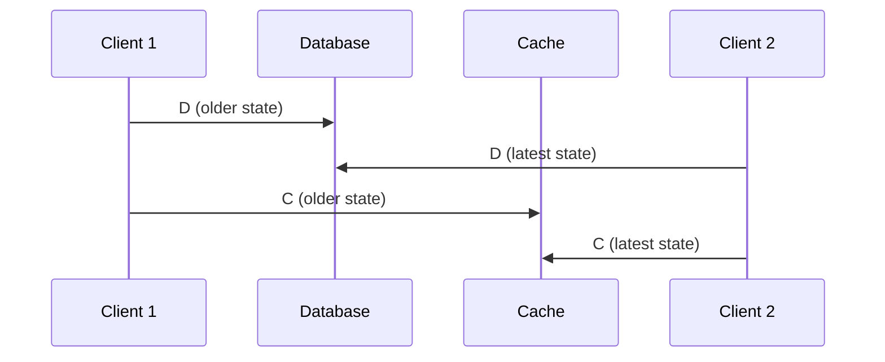
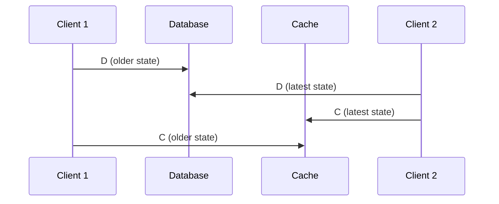
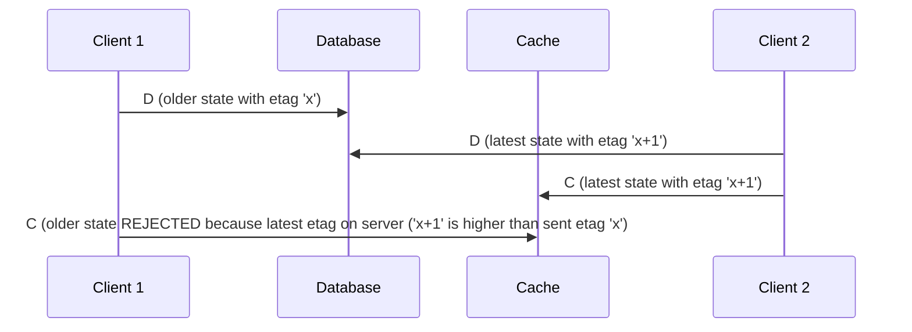
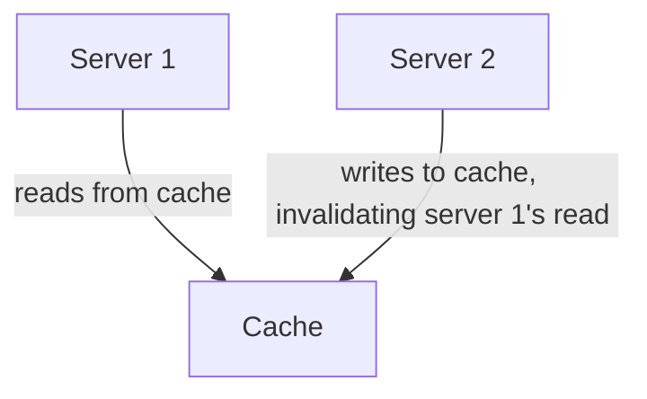
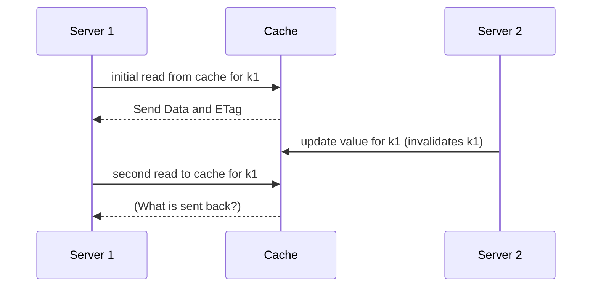

**Garnet recently announced native support for ETag-based commands.**  

Native ETags in a cache-store enable real-world use cases such as maintaining cache consistency, reducing network bandwidth utilization, and avoiding full-blown transactions for several applications.

Garnet provides native ETag support for raw strings (data added and retrieved using operations such as `GET` and `SET`). It is not available for objects (such as sorted-set, hash, list). This feature is available without requiring any migration, allowing your existing key-value pairs to start leveraging ETags immediately. You can find the ETag API documentation [here](/docs/commands/garnet-specific-commands#native-etag-support).

This article explores when and how you can use this new Garnet feature for both your current and future applications.

<!--truncate-->

---

## Why Read This Article?  

If you're looking to:  

1. **Keep your cache consistent with your back-end database**
2. **Reduce network bandwidth utilization for caching.**  
3. **Atomically updating cached records based on client-side update logic.**

We'll cover these scenarios one by one below.


---

## Keeping the Cache Consistent with its Back-end Database

In a distributed environment it is common to have a cache in front of your main _source of truth_ database. Typically, multiple client applications access the cache and the database at the same time. If every client were to access a different set of keys, the caches can easily be maintained consistenty: a client simply writes to the database and then updates the cache.

However, in cases where a key can be updated by multiple clients, the naive approach of first updating the database and then updating the cache can lead to subtle race conditions. Specifically, whichever client writes to the cache last determines the final state of the cache. This cached state may not ever correspond to the final state of the database for the same key!

To make the above scenario clearer, consider a cache-database setup where 2 clients are interacting with the pair. They both follow the same protocol where on writes they first update the database, and then update the cache. We will denote each client by c1 and c2, the request to update the datbase as D, and the request to update the cache as C.

All is good for sequences where the last writer to the database is also the last writer to the cache:



However, if the last writer to the database is NOT the last writer to the case, we introduce a _permanent_ inconsistency between the cache and the database, as the following diagram depicts:


In the above sequencing, note that c2 performs the last write to the database. However, c1 performs the last write to the cache. As a result, the cache and the database have gone out of sync.

For handling such cases we can rely on the newly introduced ETag feature in Garnet to construct a logical clock around the updates that protect establishing cache consistency (*provided your database also supports ETags or some other form of server-side transactions).

In such a scenario the client should use our `SETIFGREATER` API [here](/docs/commands/garnet-specific-commands#setifgreater), when interacting with the cache. `SETIFGREATER` sends a key-value pair along with an etag from the client, and only sets the value if the sent ETag is greater than what is currently set in the cache for that key-value pair.

Every client would now follow the following protocol:
- Database stores a pair of (value, etag) on the server
- Use a transaction (or `SETIFGREATER` or `SETIFMATCH` [API](/docs/commands/garnet-specific-commands#setifmatch)) on the database to atomically update `(oldValue, etag)` to `(newValue, etag+1)`, and return the new etag to the client.
- Use the retrieved ETag from our previous call as an argument for SETIFGREATER to update the cache, so that the cache is updated only if the new tag is greater than what is currently stored in the cache.

If every client follows the above protocol. We can ensure that only the last/latest database write will be reflected in the cache, leading to eventual consistency. The same sequencing of events as before, but with the clients following our new updated protocol, is shown below:




## Reducing Network Bandwidth Utilization for Caching  

Every network call incurs a cost: the amount of data transmitted and the distance over which it travels. In performance-sensitive scenarios, it's beneficial to fetch data only if it has changed in the cache, thereby reducing bandwidth usage and network latency.  

### Scenario: Cache Invalidation 
Consider the following setup:  

#### High-Level Diagram  


#### Sequence Diagram  


In the absence of ETags, the entire payload for `k1` is returned on every read, regardless of whether the value associated with `k1` has changed.  

While this might not matter when transferring small payloads (e.g., 100 bytes of data within a high-bandwidth local network), it becomes significant when you have **multiple machines egressing larger payloads (e.g., 1MB each)** on a cloud provider. You pay the cost of egress, bandwidth usage, and experience delays due to the transmission of larger amounts of data.  

To address this, Garnet provides the `GETIFNOTMATCH` API [here](/docs/commands/garnet-specific-commands#getifnotmatch).
, allowing you to fetch data only if it has changed since your last retrieval. Server 1 can store the ETag received in the initial payload in application memory and use `GETIFNOTMATCH` to refresh the local copy only if the value has changed.

This approach is particularly beneficial in read-heavy systems where data changes infrequently. However, for frequently updated keys, using the regular `GET` API may still be preferable, as updated data will always need to be transmitted.  

Take a look at the ETag caching sample to see the usage of the `GETIFNOTMATCH` API in action.

---

## Avoiding Costly Transactions When Working with Non-Atomic Operations

Cache-stores such as Garnet rely on key-level (or bucket-level) locks on the server to ensure atomic updates by multiple clients to a key-value pair. We often wish to read a remote value, perform some local computations that update the value, and then write the new value back to the server. Due to the cost of the network round-trip and the potential for clients to crash at any time, holding a server-side lock for such a long duration of time is not possible. ETags offer an alternative to transactions when working with such use cases.

### Scenario: Concurrent updates to the same Value  

Imagine multiple clients concurrently modifying an XML document stored in Garnet.  

For example:  
- Client 1 reads the XML, updates Field A, and writes it back.
- Client 2 reads the same XML, updates Field B, and writes it back concurrently.  

Without ETags, the following sequence of events might occur:  
1. Client 1 reads value `v0` for key `k1`.  
2. Client 1 modifies Field A, creating a local copy `v1`.  
3. Client 2 reads the same value `v0` before Client 1 writes `v1`.  
4. Client 2 modifies Field B, creating another local copy `v2`.  
5. Either Client 1 or Client 2 writes its version back to the server, potentially overwriting the other’s changes since `v1` and `v2` both don't have either's changes.

This race condition results in lost updates. With ETags, you can use the `SETIFMATCH` API [here](/docs/commands/garnet-specific-commands#setifmatch) to implement a **compare-and-swap** mechanism which guarantees that no updates are lost.

1. Client 1 reads value `v0` for key `k1`.  
2. Client 1 modifies Field A, creating a local copy `v1`.  
3. Client 2 reads the same value `v0` before Client 1 writes `v1`.  
4. Client 2 modifies Field B, creating another local copy `v2`.  
5. Client 1 does a `SETIFMATCH` to try and install its update, which succeeds.
6. Client 2 does a `SETIFMATCH` to try and install its update, which fails as the server's ETag has now changed.
7. Client 2 retries with the updated value, and eventually succeeds in applying its changes to the value.

---

The following code snippets demonstrate how this can be achieved.

### Example Code  

```csharp
static async Task Client(string userKey)
{
    Random random = new Random();
    using var redis = await ConnectionMultiplexer.ConnectAsync(GarnetConnectionStr);
    var db = redis.GetDatabase(0);

    // Initially read the latest ETag
    var res = await EtagAbstractions.GetWithEtag<ContosoUserInfo>(userKey);
    long etag = res.Item1;
    ContosoUserInfo userInfo = res.Item2;
    
    while (true)
    {
        token.ThrowIfCancellationRequested();
        (etag, userInfo) = await ETagAbstractions.PerformLockFreeSafeUpdate<ContosoUserInfo>(
            db, userKey, etag, userInfo, (ContosoUserInfo info) =>
        {
            info.TooManyCats = info.NumberOfCats % 5 == 0;
        });

        await Task.Delay(TimeSpan.FromSeconds(random.Next(0, 15)), token);
    }
}
```

#### Supporting Methods  

```csharp
public static async Task<(long, T?)> GetWithEtag<T>(IDatabase db, string key)
{
    var executeResult = await db.ExecuteAsync("GETWITHETAG", key);
    if (executeResult.IsNull) return (-1, default(T));

    RedisResult[] result = (RedisResult[])executeResult!;
    long etag = (long)result[0];
    T item = JsonSerializer.Deserialize<T>((string)result[1]!)!;
    return (etag, item);
}

public static async Task<(long, T)> PerformLockFreeSafeUpdate<T>(IDatabase db, string key, long initialEtag, T initialItem, Action<T> updateAction)
{
    // Compare and Swap Updating
    long etag = initialEtag;
    T item = initialItem;
    while (true)
    {
        // perform custom action, since item is updated to it's correct latest state by the server this action is performed exactly once on
        // an item before it is finally updated on the server.
        // NOTE: Based on your application's needs you can modify this method to update a pure function that returns a copy of the data and does not use mutations as side effects.
        updateAction(item);
        var (updatedSuccesful, newEtag, newItem) = await _updateItemIfMatch(db, etag, key, item);
        etag = newEtag;
        if (!updatedSuccesful)
            item = newItem!;
        else
            break;
    }

    return (etag, item);
}

private static async Task<(bool updated, long etag, T?)> _updateItemIfMatch<T>(IDatabase db, long etag, string key, T value)
{
    string serializedItem = JsonSerializer.Serialize<T>(value);
    RedisResult[] res = (RedisResult[])(await db.ExecuteAsync("SETIFMATCH", key, serializedItem, etag))!;
    // successful update does not return updated value so we can just return what was passed for value. 
    if (res[1].IsNull)
        return (true, (long)res[0], value);

    T deserializedItem = JsonSerializer.Deserialize<T>((string)res[1]!)!;

    return (false, (long)res[0], deserializedItem);
}
```

Every read-(extra logic/modify)-write call starts by first reading the latest etag and value for a key using `GETWITHETAG` [here](/docs/commands/garnet-specific-commands#getwithetag), it then wraps it's update logic in a callback action and then calls the `PerformLockFreeSafeUpdate` method in `ETagAbstractions` to safely apply the update.

Internally the `PerformLockFreeSafeUpdate` method runs a loop that retrieves the data that performs your update on the object and sends a `SETIFMATCH` request, the server only then updates the value if your ETag indicates that at the time of your decision you had performed your update on the latest copy of the data. If the server sees that between your read and write there were any updates the value, the server sends the latest copy of the data along with the updated etag, your client code then reapplies the changes on the latest copy and resends the request back to the server for the update, this form of update will guarantees that eventually all changes synchronize themselves on the server one after other.

In a read-heavy system where contention is not high on the same key this update will be performed in the very first loop itself, and be easier to manage than having a custom transaction. However, in a heavy key contention scenario this could result in multiple attempts to write to the latest copy especially if the logic between your read and write is slow.

---

ETags are more of a lower level primitives that you can use to build abstractions that let you build logical clocks, and lock free transactions tailored to your needs. If you find yourself in the above commonly found distributed scenarios, you now have another tool in your toolbag to help overcome your scaling needs.