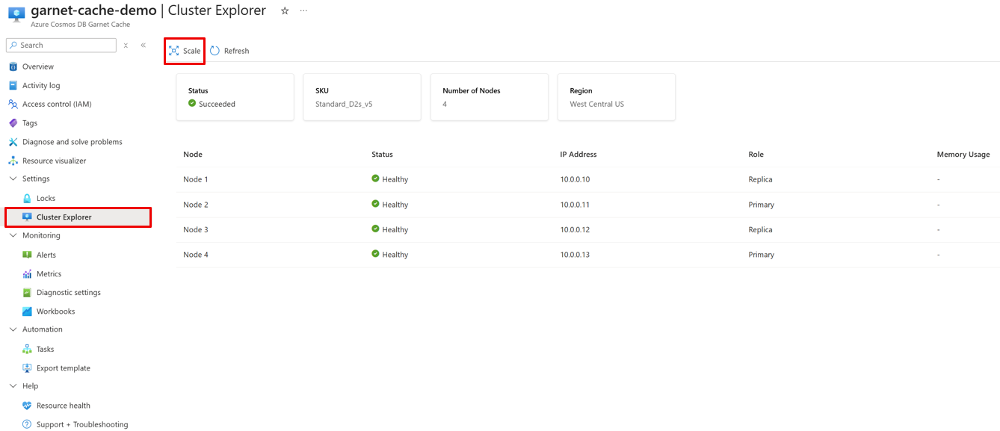

# Cluster Configuration for Azure Cosmos DB Garnet Cache

## Available Tiers

Azure Cosmos DB Garnet Cache lets you choose the underlying [Azure Virtual Machine](https://learn.microsoft.com/azure/virtual-machines/sizes/overview) that your cache nodes will be provisioned on. The specs offered by cache nodes mirror the Azure virtual machine itself. Garnet doesn't limit the number of client connections that can be made on any node for any SKU. When choosing the right tier and SKU for your workload, consider that roughly 30% of memory on each node will be reserved for metadata and processing requests. Smaller SKUs in each tier are classified as [dev/test](#dev-test) while larger SKUs are designed for [production](#production) workloads.

Every node also has a [Premium SSD Managed Disk](https://learn.microsoft.com/azure/virtual-machines/disks-types#premium-ssds) provisioned for [data persistence](./resiliency.md#data-persistence). The disk size is not configurable and represents 2x the total memory of each node. The Managed Disk SKU provisioned for each option is in the table below, and is priced at the [Azure Managed Disk price](https://azure.microsoft.com/pricing/details/managed-disks).

The pricing model for cache nodes is instance-based and there are no licensing fees. For information about pricing for specific SKUs, reach out to [ManagedGarnet@service.microsoft.com](mailto:ManagedGarnet@service.microsoft.com).

### General Purpose

Balanced performance tier suitable for most caching workloads with a good balance of compute, memory, and network resources.

- **Use Cases**: Balanced workloads, general caching, development and testing

|SKU |vCPUs |Memory (GB) |Network bandwidth (MB/s) |Premium SSD Managed Disk |Cluster Type |
|----|------|------------|-------------------------|-------------------------|-------------|
|Standard_B2ls_v2 |2	|4   |6250  |P2  |Dev/ Test |
|Standard_B2als_v2|2	|4   |6250  |P2  |Dev/ Test |
|Standard_D2s_v5	|2  |8   |12500 |P3  |Dev/ Test |
|Standard_D4s_v5	|4  |16  |12500 |P4  |Dev/ Test |
|Standard_D8s_v5	|8	|32  |12500 |P6  |Production |
|Standard_D16s_v5	|16 |64  |12500 |P10 |Production |
|Standard_D32s_v5	|32 |128 |16000 |P15 |Production |
|Standard_D2as_v5	|2	|8   |12500 |P3  |Dev/ Test |
|Standard_D4as_v5	|4	|16  |12500 |P4  |Dev/ Test |
|Standard_D8as_v5	|8	|32  |12500 |P6  |Production |
|Standard_D16as_v5|16	|64  |12500 |P10 |Production |
|Standard_D32as_v5|32	|128 |16000 |P15 |Production |
|Standard_D2s_v4	|2	|8   |5000  |P3  |Dev/ Test |
|Standard_D4s_v4	|4	|16  |10000 |P4  |Dev/ Test |
|Standard_D8s_v4	|8	|32  |12500 |P6  |Production |
|Standard_D16s_v4 |16	|64  |12500 |P10 |Production |
|Standard_D32s_v4 |32	|128 |16000 |P15 |Production |

### Memory Optimized

High-memory tier designed for workloads requiring large in-memory datasets with optimized memory-to-CPU ratios.

- **Use Cases**: Large datasets, gaming leaderboards, vector search workloads

|SKU |vCPUs |Memory (GB) |Network bandwidth (MB/s) |Premium SSD Managed Disk |
|----|------|------------|-------------------------|-------------------------|
|Standard_E2s_v5	|2	|16  |12500 |P4  |Dev/ Test |
|Standard_E4s_v5	|4	|32  |12500 |P6  |Dev/ Test |
|Standard_E8s_v5  |8	|64  |12500 |P10 |Production |
|Standard_E16s_v5	|16 |128 |12500 |P15 |Production |
|Standard_E20s_v5	|20 |160 |12500 |P20 |Production |
|Standard_E32s_v5	|32 |256 |16000 |P20 |Production |
|Standard_E2as_v5	|2	|16  |12500 |P4  |Dev/ Test |
|Standard_E4as_v5	|4	|32  |12500 |P6  |Dev/ Test |
|Standard_E8as_v5	|8	|64  |12500 |P10 |Production |
|Standard_E16as_v5|16	|128 |12500 |P15 |Production |
|Standard_E20as_v5|20	|160 |12500 |P20 |Production |
|Standard_E32as_v5|32	|256 |16000 |P20 |Production |
|Standard_E2s_v4	|2	|16  |5000  |P4  |Dev/ Test |
|Standard_E4s_v4	|4	|32  |10000 |P6  |Dev/ Test |
|Standard_E8s_v4	|8	|64  |12500 |P10 |Production |
|Standard_E16s_v4 |16	|128 |12500 |P50 |Production |
|Standard_E20s_v4 |20	|160 |10000 |P20 |Production |
|Standard_E32s_v4 |32	|256 |16000 |P20 |Production |

### Cluster Types

There are two cluster types to choose from which determine the SKUs available and the performance guarantees offered.

#### Dev/ Test

Development and testing SKUs are designed for non-production workloads with cost optimization and flexibility in mind. They are a good fit for feature testing and integration validation and are offered without SLAs. You may see lower throughput and higher latencies when using these SKUs. All features, including scaling out across shards, are available on Dev/ Test SKUs.

#### Production

Production SKUs are configured for high availability, performance, and reliability. They are a good fit for mission critical applications that need high throughput and consistent low latency.

## Scaling Options

Azure Cosmos DB Garnet Cache provides flexible scaling options to meet your application's changing demands. Understanding when and how to scale your cache cluster is essential for maintaining optimal performance while controlling costs.

### Choosing Your Scaling Strategy

The decision between vertical and horizontal scaling depends on your specific workload characteristics and performance requirements. Vertical scaling offers simplicity and is ideal when you need more resources per node, while horizontal scaling provides better distribution and resilience for high-throughput scenarios.

#### Vertical Scaling (Scale Up/Down)

Vertical scaling involves changing the SKU of your existing cache nodes to increase or decrease their individual capacity. This approach maintains your current cluster topology while providing more or fewer resources per node. You can scale up SKU size in place within the same tier and generation.

**When to Scale Up:**
Vertical scaling is most effective when your workload benefits from having more resources concentrated on fewer nodes. This approach reduces network overhead between nodes and simplifies data management. Consider scaling up when you need increased memory capacity for larger datasets or higher CPU performance for complex operations.

Vector search workloads are particularly well-suited for vertical scaling because they benefit significantly from having the entire dataset available on a single node. Vector similarity searches require access to large portions of the dataset to compute accurate results, and distributing vectors across multiple nodes can introduce latency and complexity. By scaling up to larger SKUs, vector search applications can maintain all vectors in memory on a single node, enabling faster index traversal and more efficient similarity computations.

**Benefits of Vertical Scaling:**
The primary advantage of vertical scaling is operational simplicity, as it maintains your existing cluster topology while providing enhanced performance.

#### Horizontal Scaling (Scale Out/In)

Horizontal scaling involves adding or removing nodes from your cluster to distribute load across more instances. You can scale horizontally by adding more shards to increase memory footprint and write throughput, or by increasing the replication factor to improve read throughput and availability.

**When to Scale Out:**
Horizontal scaling becomes essential when your workload exceeds the capacity limits of individual nodes or when you need to distribute load for better performance. This approach is particularly effective for applications with high concurrent user loads or when you need to improve read performance through additional replica.

**Scaling with Shards vs Replicas:**
Adding shards increases your total memory capacity and write throughput by distributing data across multiple primary nodes. Each shard handles a portion of your keyspace, allowing for parallel processing of operations. Alternatively, adding replicas primarily improves read throughput and provides better availability, as read operations can be distributed across multiple copies of your data. The [replication factor](./resiliency.md#replication) you choose directly impacts both performance and resiliency characteristics of your cluster.

**Benefits of Horizontal Scaling:**
Horizontal scaling provides superior fault tolerance since the failure of individual nodes has less impact on overall system availability. This approach also offers better resource utilization efficiency and can handle virtually unlimited growth by continuously adding nodes.

### How to Scale

The **Settings > Cluster Explorer** page of the [Azure portal](https://aka.ms/garnet-portal) allows you to scale your cluster both vertically and horizontally. The Azure Cosmos DB Garnet Cache is in an expanded Private Preview and you must access the Azure portal through this link to manage your caches.

You can increase the shard count to scale in/ out, or change the SKU size to scale down/ up. Replication factor can only be configured during cluster provisioning and cannot be updated in place on existing clusters.

### Right-Sizing Your Deployment

You can optimize the size of your Azure Cosmos DB Garnet Cache by monitoring and adjusting based on actual usage patterns. Starting with conservative estimates and scaling based on observed metrics typically provides the most cost-effective approach while ensuring performance requirements are met.

We recommend beginning your deployment with a smaller tier that meets your initial requirements, then monitor key metrics such as memory utilization, CPU usage, and command processing rates. Regular review of these metrics allows you to make informed decisions about when and how to scale your deployment. Watch for sustained high memory utilization that might indicate a need for additional capacity, increased latency that could benefit from more processing power, or uneven load distribution that might be addressed through horizontal scaling. The key is to identify trends before they impact user experience, allowing for proactive scaling rather than reactive responses to performance issues.

## Regional availability

Each Azure Cosmos DB Garnet Cache can be provisioned in a single region. It is available in multiple Azure regions worldwide, with ongoing expansion to additional regions. The availability of each SKU in a given region depends on the Azure Virtual Machine regional availability. You can verify which SKUs are available in each region [here](https://azure.microsoft.com/explore/global-infrastructure/products-by-region/table).

 Additionally, you can configure availability zones during provisioning in supported Azure regions where there is capacity for your chosen SKU. See the list of [Azure regions with availability zone support](https://learn.microsoft.com/azure/reliability/regions-list).

| Geography | Region | Region Name |
|-----------|--------|-------------|
| **Americas** | canadacentral | Canada Central |
| | canadaeast | Canada East |
| | centralus | Central US |
| | eastus | East US |
| | eastus2 | East US 2 |
| | northcentralus | North Central US |
| | southcentralus | South Central US |
| | westcentralus | West Central US |
| | westus | West US |
| | westus2 | West US 2 |
| | westus3 | West US 3 |
| | brazilsouth | Brazil South |
| | brazilsoutheast | Brazil Southeast |
| **Europe** | northeurope | North Europe |
| | westeurope | West Europe |
| | francecentral | France Central |
| | germanynorth | Germany North |
| | germanywestcentral | Germany West Central |
| | italynorth | Italy North |
| | norwayeast | Norway East |
| | norwaywest | Norway West |
| | swedencentral | Sweden Central |
| | swedensouth | Sweden South |
| | switzerlandnorth | Switzerland North |
| | switzerlandwest | Switzerland West |
| | uksouth | UK South |
| | ukwest | UK West |
| **Africa** | southafricanorth | South Africa North |
| | southafricawest | South Africa West |
| **Middle East** | uaecentral | UAE Central |
| | uaenorth | UAE North |
| **Asia Pacific** | australiaeast | Australia East |
| | australiasoutheast | Australia Southeast |
| | centralindia | Central India |
| | southindia | South India |
| | westindia | West India |
| | eastasia | East Asia |
| | southeastasia | Southeast Asia |
| | japaneast | Japan East |
| | japanwest | Japan West |
| | koreacentral | Korea Central |
| | koreasouth | Korea South |

## Learn More

- [Getting Started](./quickstart.md)
- [Resiliency](./resiliency.md)
- [Security](./security.md)
- [Monitoring](./monitoring.md)
