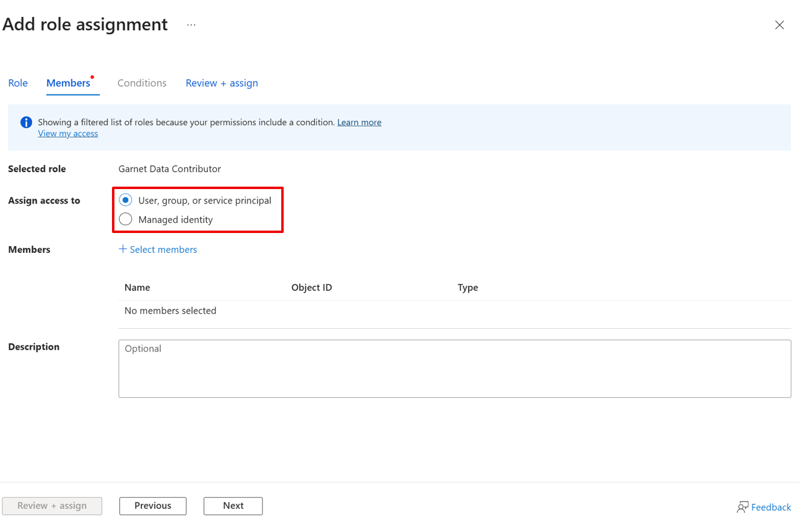
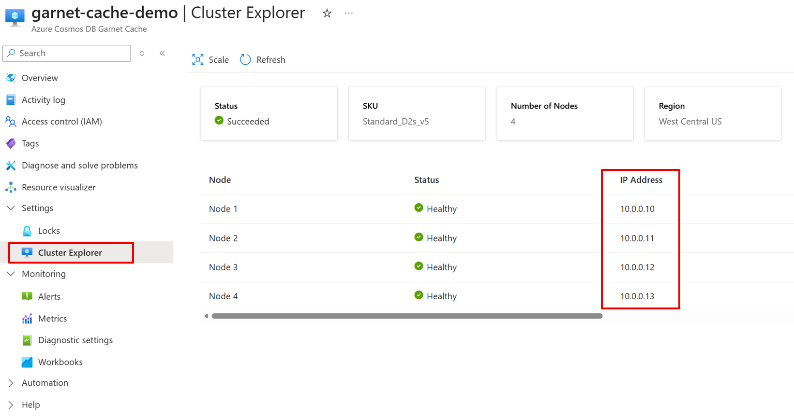

# Quick Start: Create Your First Azure Cosmos DB Garnet Cache

This guide will walk you through creating and connecting to your first Azure Cosmos DB Garnet Cache.

## Prerequisites

- An active Azure subscription
- Confirmed registration to the expanded Private Preview. If your subscription isn't already enrolled, [sign up](https://aka.ms/cosmos-db-garnet-preview).
- Access to the Azure portal and the [Azure CLI](https://learn.microsoft.com/en-us/cli/azure/install-azure-cli?view=azure-cli-latest)
- Required role assignment permissions. 
    - For successful provisioning, you must have **Microsoft.Authorization/roleAssignments/write** permissions at either the *Subscription* or *Resource Group* scope. Example built-in roles are [Owner](https://learn.microsoft.com/azure/role-based-access-control/built-in-roles/privileged#owner) and [User Access Administrator](https://learn.microsoft.com/azure/role-based-access-control/built-in-roles#user-access-administrator), or you can use a custom role with this permission.

## Step 1: Create an Azure Cosmos DB Garnet Cache

During provisioning, you must either create a new virtual network for your cache or use an existing one. All application access to the cache must be from within this virtual network.

1. Sign in to the [Azure portal](https://aka.ms/garnet-portal). The Azure Cosmos DB Garnet Cache is in an expanded Private Preview and you must access the Azure portal through this link to create caches.
2. Click **Create a resource** and search for **Azure Cosmos DB Garnet Cache**.
3. Select **Azure Cosmos DB Garnet Cache** and click **Create**.
4. Fill in the required information:
   - **Subscription**: Select your Azure subscription. This subscription must be enrolled in the expanded Private Preview. For access, [sign up here](https://aka.ms/cosmos-db-garnet-preview).
   - **Resource Group**: Create new or select existing.
   - **Region**: Select the region closest to your application. See the list of [supported regions](./cluster-configuration.md#regional-availability).
   - **Cluster Name**: Choose a unique name for your cache.
   - **Virtual Network**: Select *Create a new virtual network* then enter your network name, and optionally, customize the address space and subnet. If you're using an existing virtual network, ensure the proper [outbound network rules](./security.md#required-outbound-network-rules) are configured.
   - **Assign Roles**: Leave this option checked for successful provisioning. During provisioning, the *Network Contributor* role will be assigned to *Azure Cosmos DB* on both the virtual network and subnet. Ensure you have **Microsoft.Authorization/roleAssignments/write** permissions at either the *Subscription* or *Resource Group* scope for this operation to succeed.
   - **System Assigned Identity**: Optional. This will create a managed identity for the cache.
   - **Availability Zone**: Optional. Select to enable availability zones, meaning nodes will be distributed across zones. See [availability zone support](./resiliency.md#multi-availability-zone-deployment).
   - **Cluster Type**: Either Dev/Test or Production. This determines the SKUs that will be available and the performance characteristics to expect from your cache. See [cluster configuration](./cluster-configuration.md#cluster-types).
   - **SKU Size**: Once cluster type is selected, you can select your SKU. All nodes in the cluster will be provisioned on a Virtual Machine of this SKU. See [SKU details](./cluster-configuration.md#available-tiers).
   - **Shard Count**: The number of shards in your cluster, corresponding to the number of primary nodes. The memory footprint of your cache is determined by the total memory across all primary nodes. Learn when to [scale out vs. scale up](./cluster-configuration.md#choosing-your-scaling-strategy).
   - **Replication Factor**: Not currently configurable. The default replication factor is 2x meaning there are 2 nodes per shard, one primary and one replica.
   - **Total Node Count**: To modify, adjust the *Shard Count*. The total number of nodes in the cluster is calculated by *Shard Count x Replication Factor*.
5. Click **Review + Create** and then **Create**


## Step 2: Configure Data Access with RBAC

Azure Cosmos DB Garnet Cache uses Azure RBAC to grant access to supported Redis commands. Assigning Microsoft Entra ID RBAC roles is required to use data plane operations. No roles are assigned by default, including to the resource creator. There are several built-in roles, see [data plane built-in roles](./security.md#authentication-and-access-control) to choose the most appropriate role assignments for each user. Role assignments can take 5-10 minutes to become effective.

Roles can be assigned at various scopes, in both examples below we will assign the **Garnet Data Contributor** role at the Azure Cosmos DB Garnet Cache resource scope. To assign Azure roles, you must have **Microsoft.Authorization/roleAssignments/write permissions**, such as [Owner](https://learn.microsoft.com/azure/role-based-access-control/built-in-roles/privileged#owner) or [User Access Administrator](https://learn.microsoft.com/azure/role-based-access-control/built-in-roles#user-access-administrator).

### Set up in the Azure Portal
You can assign data access roles for the Azure Cosmos DB Garnet Cache clusters using the **Access control (IAM)** page.

1. Sign in to the [Azure portal](https://aka.ms/garnet-portal). The Azure Cosmos DB Garnet Cache is in an expanded Private Preview and you must access the Azure portal through this link to see your caches.
2. Navigate to the **Access control (IAM)** page of your Azure Cosmos DB Garnet Cache resource and select **Add > Add role assignment**.


3. In the **Add role assignment** page, enter **garnet** in the search box.
4. Select the role you would like to assign and then select **Next**. In this example, we’re adding the **Garnet Data Contributor** role. See details for all [built-in roles](./security.md#built-in-roles).


5. On the **Members** page, select **User, group or service principal** to assign the selected role to one or more Microsoft Entra users, groups or service principals (applications). Select **Managed identity** to assign the selected role to one or more managed identities.



6. Click **Select members** to search for users, groups, service principals, or managed identities for role assignment.
7. After adding all security principles, select **Review + assign**.


### Set up using the Azure CLI

You can assign data access roles for the Azure Cosmos DB Garnet Cache clusters using the Azure CLI. 

1. Sign in the the Azure CLI.

```bash
az login
```

2. Find your user Object ID.

```bash
# Get your own Object ID
az ad signed-in-user show --query id -o tsv

# Or get another user's Object ID
az ad user show --id "user@company.com" --query id -o tsv
```

2. Assign RBAC Roles. This example uses the **Garnet Data Contributor** role. See details for all [built-in roles](./security.md#built-in-roles).

```bash
# Set your parameters
userObjectId="your-object-id-from-step-1"
subscriptionId="your-subscription-id"
resourceGroup="your-garnet-cache-resource-group"
cacheName="your-garnet-cache-name"

# Assign Garnet Data Contributor to yourself
az role assignment create \
  --assignee $userObjectId \
  --role "Garnet Data Contributor" \
  --scope "/subscriptions/$subscriptionId/resourceGroups/$resourceGroup/providers/Microsoft.DocumentDB/garnetClusters/$cacheName"
```

## Step 3: Set Up Network Access

Azure Cosmos DB Garnet Cache does not provide public IP addresses or DNS and can't be accessed from the public internet. Cache nodes are provisioned on the virtual network provided during cluster creation. They are accessible via the internal IP addresses from the same virtual network. Your client machine must use the same network.

### Create a New Virtual Machine

You can create a new virtual machine in the same virtual network as your Azure Cosmos DB Garnet cache.
- [Create a Linux VM](https://learn.microsoft.com/azure/virtual-machines/linux/quick-create-portal?tabs=ubuntu)
- [Create a Windows VM](https://learn.microsoft.com/azure/virtual-machines/windows/quick-create-portal)

### Use Existing Infrastructure

You can use an existing VM or host machine in the same virtual network as your Azure Cosmos DB Garnet Cache. If your VM is in a different virtual network, [set up virtual network peering](https://learn.microsoft.com/azure/virtual-network/tutorial-connect-virtual-networks?tabs=portal). Ensure that the IP address spaces of the two virtual networks do not overlap. Once peering is established successfully, the client application in one virtual network can access the cache endpoints on the other network using their local IP addresses.

## Step 4: Connect and Test

Now you're ready to connect to your Azure Cosmos DB Garnet Cache!

1. Find your user Object ID. Save this for a future step.

```bash
# Get your own Object ID
az login
az ad signed-in-user show --query id -o tsv
```

2. Get an access token, and save this for a future step. Access tokens have an expiry window. Regenerate the token if it has expired. You can learn more about access tokens [here](https://docs.azure.cn/entra/identity-platform/access-tokens#token-lifetime).

```bash
az account get-access-token --scope https://cosmos.azure.com/.default --query accessToken -o tsv
```

3. Find the IP address of your cache nodes. Redis clients can connect to one of the node IP addresses and get the list of all replicas and ports automatically.
    1. Sign in to the [Azure portal](https://aka.ms/garnet-portal). The Azure Cosmos DB Garnet Cache is in an expanded Private Preview and you must access the Azure portal through this link to see your caches.
    2. Navigate to the **Settings > Cluster Explorer** page of your Azure Cosmos DB Garnet Cache resource.
    3. Find the IP addresses of all nodes in your cluster. Save them for a future step.

    

4. Connect using a Redis client. You can use any Redis client of your choice to connect to the cluster. Connecting with the [Redis CLI](https://redis.io/docs/latest/develop/tools/cli/) is optional, and it provides a quick way to test data access for your cache.
    1. [Install the Redis CLI](https://redis.io/docs/latest/develop/tools/cli/#install-redis-cli) on your machine. If you're using a Linux machine, run the following command.

    ```bash
    sudo apt-get install redis-tools
    ```

    2. Connect to your cluster using the Redis CLI.

    ```bash
    # Replace with your actual values
    export USER_OBJECT_ID="your-object-id-from-step-1"
    export ACCESS_TOKEN="your-access-token-from-step-2"
    export GARNET_HOST="10.0.0.5"  # Any IP from step 3
    export GARNET_PORT="6379"

    # Connect
    redis-cli -h $GARNET_HOST -p $GARNET_PORT --tls -c --user $USER_OBJECT_ID --pass $ACCESS_TOKEN
    ```

    3. Test basic operations using the Redis CLI. Once connected, try these commands. Explore the list of [supported commands](./api-compatibility.md).
    ```redis
    # Test connection
    PING

    # Set and get values
    SET mykey "Hello Garnet Cache!"
    GET mykey

    # Explore cluster topology
    CLUSTER NODES
    CLUSTER INFO

    # Test data types
    HSET user:1 name "John" age 30
    HGET user:1 name
    ```

## Learn More

- [Monitoring](./monitoring.md)
- [Security](./security.md)
- [Cluster Configuration](./cluster-configuration.md)
