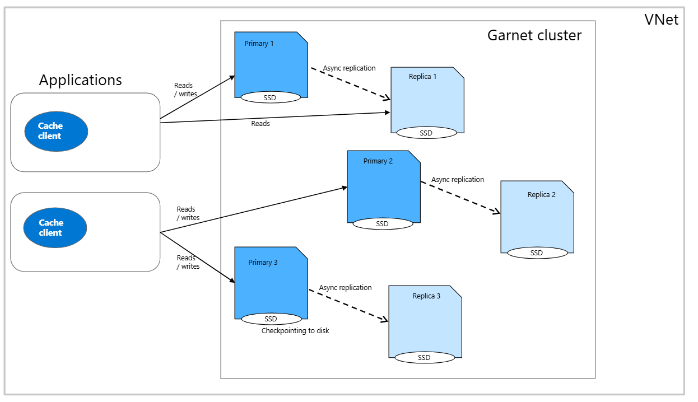

# Resiliency in Azure Cosmos DB Garnet Cache

Azure Cosmos DB Garnet Cache is designed for high availability and resilience, providing enterprise-grade uptime, data persistence, and automatic recovery capabilities. The service offers multiple layers of protection to ensure your cache remains available and your data is preserved even during infrastructure failures, maintenance events, or unexpected outages.

## Architecture Overview

Azure Cosmos DB Garnet Cache implements a distributed architecture with built-in redundancy and data persistence, deployed in a single Azure region.

- **Primary-Replica Architecture**: Each cache cluster consists of one or more shards with primary node and replica nodes
- **Asynchronous Replication**: Data is asynchronously replicated from primaries
- **AOF Persistence**: Append-Only File snapshots provide durable data storage to disk
- **Automatic Failover**: Fast failover for minimal service interruption
- **Automatic Recovery**: Failed nodes recover using AOF snapshots and replication

### Data Distribution and Sharding

Azure Cosmos DB Garnet Cache uses a consistent hashing approach to distribute data across the cluster for optimal availability and load distribution. The cluster's key space is divided into 16,384 hash slots, with each slot owned by a single primary node. Any given key maps to exactly one slot, ensuring predictable data placement and efficient retrieval.

When you have multiple shards in your cluster, hash slots are evenly distributed across all primary nodes. This distribution ensures that data and load are balanced across the cluster, preventing hotspots and maximizing resource utilization. Replica nodes serve read-only requests for the keys hashing to slots owned by their corresponding primary nodes, enabling read scaling while maintaining data consistency.

This sharding strategy provides several resiliency benefits: if a primary node fails, only the keys in its assigned slots are affected, while the rest of the cluster continues operating normally. Automatic slot reassignment ensures that when nodes become unavailable, their hash slots can be redistributed to healthy nodes, maintaining cluster availability even during node failures.

## High Availability

### Replication

Azure Cosmos DB Garnet Cache supports configurable replication factors to balance availability requirements with cost. You can configure replication during cluster provisioning and it can't be changed on existing clusters.

| Configuration | Replication Factor | Total Nodes Per Shard | Use Cases |
|---------------|--------------------|-----------------------|-----------|
| **No Replication** | 1x | 1, primary only | Development, testing, cost-optimized production |
| **High Availability** | 2x | 2, one replica per primary | Mission-critical applications |
| **Optimized Read Performance** | 3x-5x* | 3-5, two to four replicas per primary | Mission-critical applications requiring high read throughput |

*Reach out to [ManagedGarnet@service.microsoft.com](mailto:ManagedGarnet@service.microsoft.com) if you need a higher replication factor.

The replication process is as follows

1. **Write Operations**: All writes go to the primary node first
2. **Asynchronous Replication**: The write is acknowledged once written in the primary and is asynchronously replicated to all replicas in the shard
3. **Consistency**: Eventual consistency between replicas
4. **Read Distribution**: Read operations can be distributed across primary and replica nodes

### Automatic Failovers

A failover can be either planned, such as system updates or management operations, or it can be unplanned, such as hardware failure or unexpected outages. The Azure Cosmos DB Garnet Cache automatically handles failovers for you and will promote a replica to primary after detecting one of these events.

### Multi Availability Zone Deployment

Azure Cosmos DB Garnet Cache can be configured with availability zones during provisioning in [supported Azure regions](./cluster-configuration.md#regional-availability) where there is capacity for your chosen SKU. See the list of [Azure regions with availability zone support](https://learn.microsoft.com/azure/reliability/regions-list).

If enabled, nodes are automatically distributed across multiple availability zones within the region. Primary and replica nodes are not guaranteed to be in different availability zones. If a zone goes down and all replicas for a given shard are unhealthy, the hash slots assigned to it will automatically be reassigned to healthy shards.

## Data Persistence

Azure Cosmos DB Garnet Cache uses append only file (AOF) persistence to ensure data durability. Every write operation is appended to a persistent log file stored on an attached locally redundant [Premium Managed Disk](https://learn.microsoft.com/azure/virtual-machines/disks-types#premium-ssds). Checkpoints are stored every second. The disk size is automatically provisioned for each node based on 2x the total amount of memory for the SKU. See the [disks provisioned for each SKU](./cluster-configuration.md#available-tiers).

Data on nodes is restored from the latest data checkpoint upon restart, including from automatic failovers. It is possible to experience data loss after a failover for the portion of data that hasn't been replicated or wasn't included in the latest checkpoint.

## Learn More

- [Getting Started](./quickstart.md)
- [Cluster Configuration](./cluster-configuration.md)
- [Security](./security.md)
- [Monitoring](./monitoring.md)
