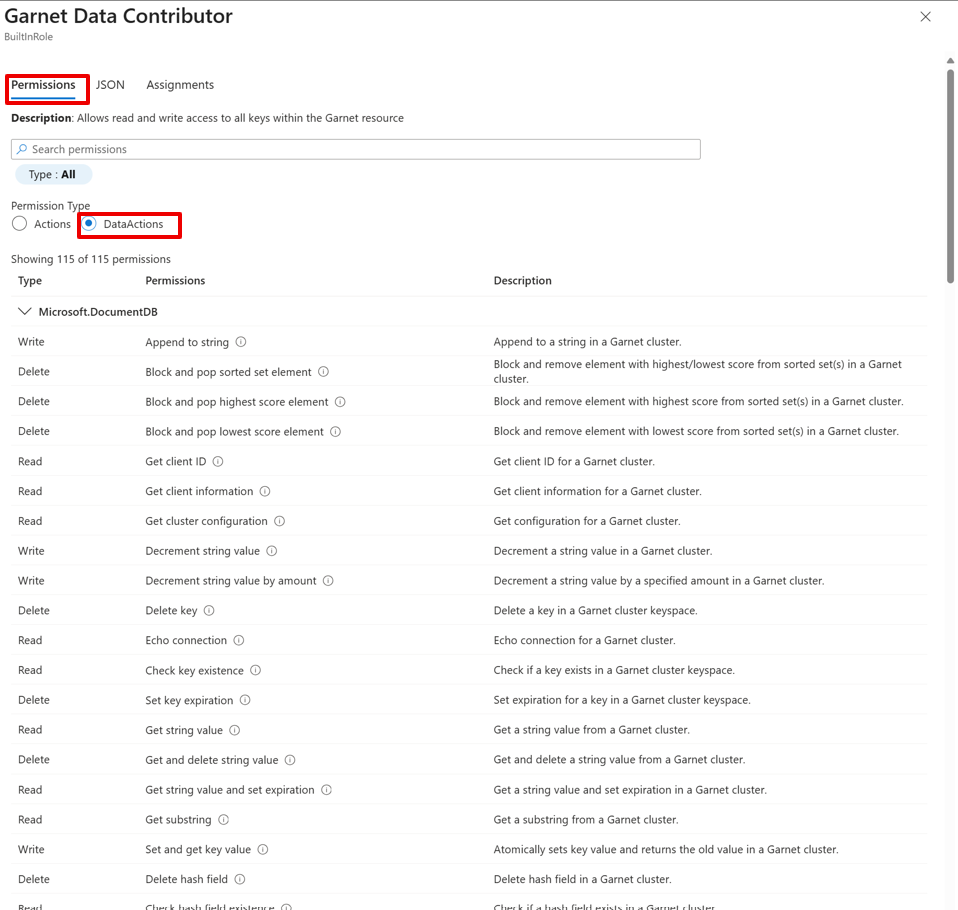

# Secure your Azure Cosmos DB Garnet Cache

Azure Cosmos DB Garnet Cache provides enterprise-grade security features to protect your data. This guide covers the security capabilities and best practices for securing your cache.

## Network Security

Azure Cosmos DB Garnet Cache does not provide public IP addresses or DNS, meaning it can't be accessed from the public internet. Cache nodes are provisioned on the virtual network provided during cluster creation. They are accessible via the internal IP addresses from the same VNet. 

There are the 2 options to connect to the cache:
1.	Deploy the clients connecting to the cache on the same virtual network with either the same subnet, or a different one. The Redis clients can use the internal IP address of the cache instances to connect. Learn how to [find your internal IP addresses](./quickstart.md#step-4-connect-and-test).
2.	If the client applications are deployed in a separate virtual network, then you can use [virtual network peering](https://learn.microsoft.com/azure/virtual-network/virtual-network-peering-overview) to connect the two. Follow the steps in this [tutorial](https://learn.microsoft.com/azure/virtual-network/tutorial-connect-virtual-networks?tabs=portal). Ensure that the IP address space of the two virtual networks does not overlap. Once peering is established successfully, the client application in one virtual network can access the cache endpoints on the other network using their local IP addresses.

### Required outbound network rules

If you use Azure Firewall to restrict outbound access from the existing subnet, we highly recommend that you use [virtual network service tags](https://learn.microsoft.com/azure/virtual-network/service-tags-overview). The tags in the following table are required to make the Azure Cosmos DB Garnet Cache function properly.

|Destination service tag |Protocol |Port |Use |
|------------------------|---------|-----|----|
|Storage                 |HTTPS    |443  |Required for secure communication between the nodes and Azure Storage for Control Plane communication and configuration. |
|AzureKeyVault           |HTTPS    |443  |Required for secure communication between the nodes and Azure Key Vault. Certificates and keys are used to secure communication inside the cache. |
|EventHub                |HTTPS    |443  |Required to forward logs to Azure. |
|AzureMonitor            |HTTPS    |443  |Required to forward metrics to Azure. |
|AzureActiveDirectory    |HTTPS    |443  |Required for Microsoft Entra authentication. |
|AzureResourceManager    |HTTPS    |443  |Required to gather information about and manage Garnet nodes (for example, reboot). |
|AzureFrontDoor.Firstparty |HTTPS  |443  |Required for logging operations. |
|GuestAndHybridManagement  |HTTPS  |443  |Required to gather information about and manage Garnet nodes (for example, reboot). |
|ApiManagement             |HTTPS  |443  |Required to gather information about and manage Garnet nodes (for example, reboot). |

In addition to the tags table, you need to add the following address prefixes because a service tag doesn't exist for the relevant service: 
- 104.40.0.0/13 
- 13.104.0.0/14 
- 40.64.0.0/10 

## Authentication and Access Control

Azure Cosmos DB Garnet Cache uses Azure RBAC to secure your data by granting permissions for supported Redis commands. Microsoft Entra ID RBAC roles define fine-grained permissions and are required to use data plane operations. No roles are assigned by default, including to the resource creator. You can assign roles to users, groups, service principals or managed identities for data access. Note that role assignments can take several minutes to propagate after being created or modified.

### Built-in Roles

There are several built-in roles to help you manage data access. Learn how to [assign roles](./quickstart.md#step-2-configure-data-access-with-rbac) using the Azure portal or Azure CLI.

| Role | Use Case | Access Level |
|------|----------|--------------|
| `Garnet Data Reader` | Read-only applications, monitoring | GET, EXISTS etc. |
| `Garnet Data Contributor` | Most applications | Read/write string, hash, set, sorted set |
| `Garnet Data Owner` | Admin access, full control | All operations including destructive ones |
| `Garnet Script Data Contributor` | Script execution and management | All scripting |
| `Garnet PubSub Data Reader` | Reading pub/sub messages | Read access to pub/sub channels |
| `Garnet PubSub Data Contributor` | All pub/sub messaging | Publish/subscribe operations |

To see detailed permissions associated with each role, navigate to the **Access control (IAM)** page of your Garnet Cache resource in the [Azure portal](https://aka.ms/garnet-portal). The Azure Cosmos DB Garnet Cache is in an expanded Private Preview and you must access the Azure portal through this link to manage your caches. The **Roles** tab has all available roles. Search for **garnet** and view the details for each role.

See a detailed list of allowed commands for each role under **Permissions > DataActions**.

## Data Encryption

Azure Cosmos DB Garnet Cache implements comprehensive data protection measures to ensure your data remains secure both at rest and in transit, giving you end-to-end encryption. TLS 1.2 or higher and node-to-node encryption are enforced.

## Learn More

- [Cluster Configuration](./cluster-configuration.md)
- [Resiliency](./resiliency.md)
- [Monitoring](./monitoring.md)
