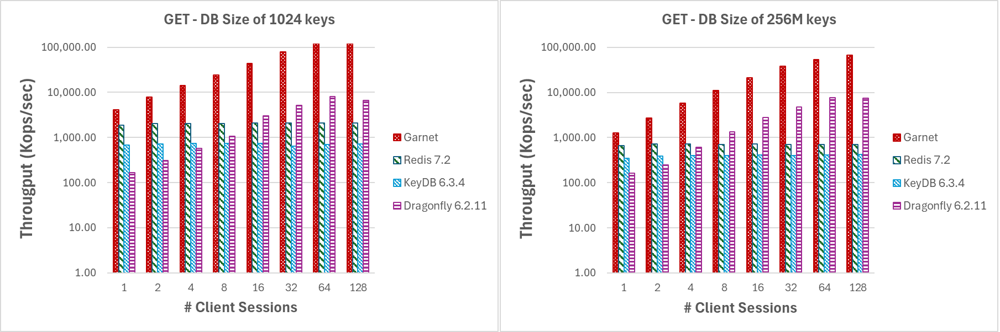
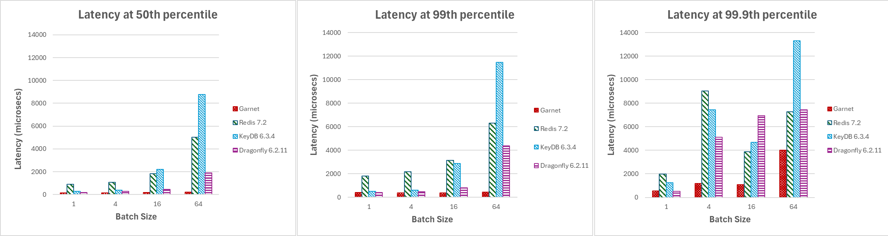
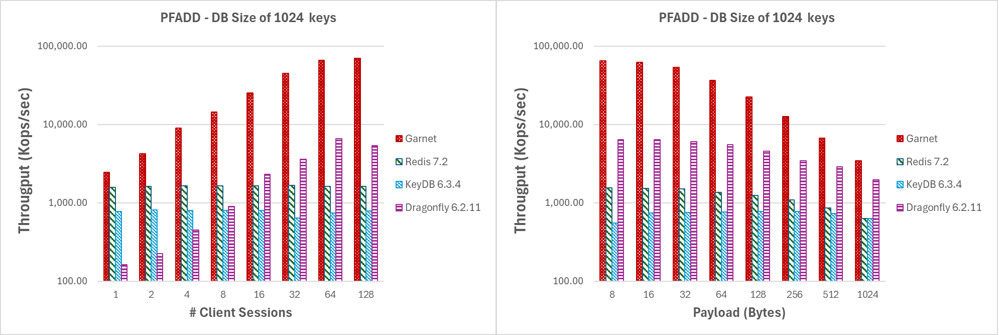
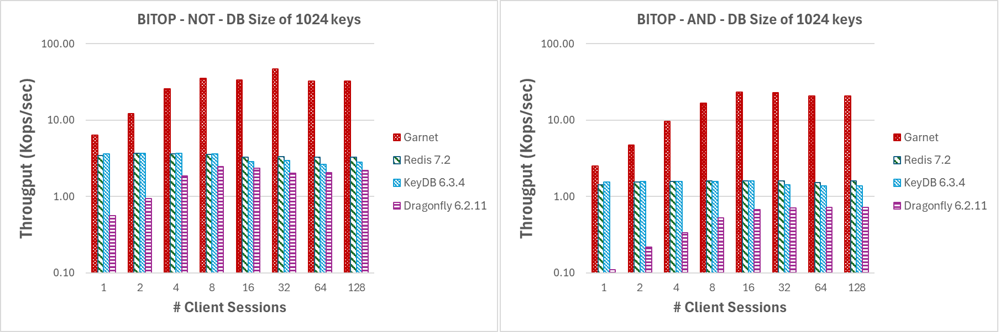
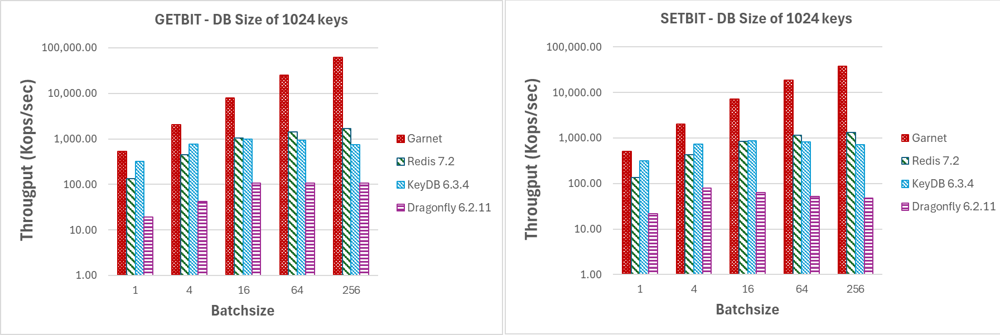

# Evaluating Garnet's Performance Benefits

We have tested Garnet thoroughly in a variety of deployment modes:

* Same local machine for client and server
* Two local machines - one client and one server
* Azure Windows VMs
* Azure Linux VMs

Below, we focus on a selected few key results.

## Setup

We provision two Azure Standard F72s v2 virtual machines (72 vcpus, 144 GiB memory each) running Linux (Ubuntu 20.04), with accelerated TCP enabled. 
The benefit of this SKU is that we are guaranteed not to be co-located with another VM, which will optimize the performance. 
One machine runs different cache-store servers, and the other is dedicated to issuing workloads. 
We use our benchmarking tool, called [Resp.benchmark](resp-bench), to generate all results. 
We compare Garnet to the latest open-source versions of Redis (v7.2), KeyDB (v6.3.4), and Dragonfly (v6.2.11) at the time of writing. 
We use a uniform random distribution of keys in these experiments (Garnet’s shared memory design benefits even more with skewed workloads).
All data fits in memory in these experiments. 
The baseline systems were tuned and optimized as much as possible based on available information.
Below, we summarize for each system the startup configuration used for our experiments.

<details>
    <summary>Garnet</summary>
    ```bash
          dotnet run -c Release --framework=net8.0 --project Garnet/main/GarnetServer -- \
                --bind $host \
                --port $port \
                --no-pubsub \
                --no-obj \
                --index 1g
    ```
</details>

<details>
    <summary>Redis 7.2</summary>
    ```bash
          ./redis-server \
                --bind $host \
                --port $port \
                --logfile "" \
                --save "" \
                --appendonly no \
                --protected-mode no \
                --io-threads 32
    ```
</details>

<details>
    <summary>KeyDB 6.3.4</summary>
    ```bash
          ./keydb-server \
                --bind $host \
                --port $port \
                --logfile "" \
                --protected-mode no \
                --save "" \
                --appendonly no \
                --server-threads 16 \
                --server-thread-affinity true
    ```
</details>

<details>
    <summary>Dragonfly 6.2.11</summary>
    ```bash
          ./dragonfly \
                  --alsologtostderr \
                  --bind $host \
                  --port $port \
                  --df_snapshot_format false \
                  --dbfilename "" \
                  --max_client_iobuf_len 10485760
    ```
</details>

## Basic Commands Performance

We measured throughput and latency for basic GET/SET operations by varying payload size, batch size, and number of client threads.
For our throughput experiments, we preload a small DB (1024 keys) and a large DB (256M keys) into Garnet before running the actual workload.
In contrast, our latency experiments were performed on an empty database and for a combined workload of GET/SET commands that operate on a small keyspace (1024 keys).

#### Throughput GET

For the experiment depicted in Figure 1., we used large batches of GET operations (4096 requests per batch) and small payloads (8-byte keys and values) to minimize network overhead.
As we increase the number of client sesssions, we observe that **Garnet** exhibits better scalability than Redis or KeyDB.
Dragonfly exhibits similar scaling characteristics though only up to 16 threads. Note also, that DragonFly is a pure in-memory system.
Overall, **Garnet**'s throughput relative to the other systems is consistently higher even when the database size (i.e., the number of distinct keys pre-loaded) is larger (at 256 million keys) than the size of the processor cache.

<details>
    <summary>Varying number of client sessions or batchsize (GET)</summary>
    ```bash 
        dotnet run -c Release --framework=net8.0 --project Garnet/benchmark/Resp.benchmark \
          --host $host \
          --port $port \
          --op GET \
          --keylength 8 \
          --valuelength $valuelength \
          --threads 1,2,4,8,16,32,64,128 \
          --batchsize $batchsize \
          --dbsize $dbsize
    ```
</details>

|  | 
|:--:| 
| Figure 1: Throughput (log-scale), varying number of client sessions, for a database size of (a) 1024 keys, and (b) 256 million keys |

Even for small batch sizes **Garnet** outperforms the competing systems by attaining a consistently a higher throughput, as indicated by Figure 2.
This happens irrespective of the actual database size.

|  | 
|:--:| 
| Figure 2: Throughput (log-scale), varying batch sizes, for a database size of (a) 1024 keys, and (b) 256 million keys |

#### Latency GET/SET

We next measure client-side latency for various systems, by issuing a mixture of 80% GET and 20% SET requests, and compare it against **Garnet**.
Since we care about latency, our DB size is kept small while we vary other parameters of the workload such as client threads, batch size, and payload size.

Figure 3, showcase that as increase the number of client sessions, Garnet's latency (measured in microseconds) and across various percentiles is consistently lower and more stable compared to other systems. Note this experiment does not utilize batching.

<details>
    <summary>Latency benchmark varying client sessions or batchsize (GET/SET)</summary>
    ```bash
        dotnet run -c Release --framework=net8.0 --project Garnet/benchmark/Resp.benchmark
          --host $host \
          --port $port \
          --batchsize 1 \
          --threads $threads \
          --client GarnetClientSession \
          --runtime 35 \
          --op-workload GET,SET \
          --op-percent 80,20 \
          --online \
          --valuelength $valuelength \
          --keylength $keylength \
          --dbsize 1024 \
          --itp $batchsize
    ```
</details>

|  | 
|:--:| 
| Figure 3: Latency, varying number of client sessions, at (a) median, (b) 99th percentile, and (c) 99.9th percentile |

Garnet’s latency is fine-tuned for adaptive client-side batching and efficiently handling multiple sessions querying the system.
For our next set of experiments, we increase the batch sizes from 1 to 64 and plot latency at different percentiles below with 128 active client connections.
As illustrated in Figure 4, **Garnet** maintains stability and achieves lower overall latency compared to other systems when the batch size is increased.

|  | 
|:--:| 
| Figure 4: Latency, varying batch sizes, at (a) median, (b) 99th percentile, and (c) 99.9th percentile |

## Complex Data Structures Performance

**Garnet** supports a vast number of different complex data structures such as Hyperloglog, Bitmap, Sorted Sets, Lists etc.
Below, we present performance metrics for a select few of them.

#### Hyperloglog

**Garnet** supports its own built-in Hyperloglog (HLL) data structure. 
This is implemented using C# and it supports operations such as update (PFADD), compute an estimate (PFCOUNT) and merge (PFMERGE) two or more distinct HLL structures.
HLL data structures are often optimized in terms of their memory footprint.
Our implementation is no different, utilizing a sparse representation when the number of nonzero counts is low and a dense representation beyond a given fixed threshold for which
the trade-off between memory savings and the additional work performed for decompression is no longer attractive.
Enabling efficient updates to the HyperLogLog (HLL) structure is essential for concurrent systems, such as Garnet.
For this reason, our experiments forcus specifically on the performance of PFADD and are deliberately designed to stress test our system for the following scenarios:

1. Large number of high contention updates (i.e. batchsize 4096, DB of 1024 keys) for increasing number of threads or increasing payload size
      After a few insertions, the constructed HyperLogLog (HLL) structures will transition to utilizing the dense representation.
2. Large number of low contention updates (i.e. batchsize 4096, DB of 256M keys) for increasing number of threads or increasing payload size
      This adjustment will increase the likelihood that the constructed HyperLogLog (HLL) structures utilize the sparse representation. 
      Consequently, our measurements will consider the added overhead of working with compressed data or incrementally allocating more space for non-zero values


In Figure 5, we present the results for first experimental scenario.
**Garnet** scales very well under high contention and consistently outperforms every other system in terms of raw throughput for increasing number of threads.
Similarly, for increasing payload size **Garnet** exhibits higher total throughput compared to other systems.
Across all tested systems, we noticed a noticeable decrease in throughput as the payload size increased. 
This behavior is anticipated due to the inherent TCP network bottleneck.

<details>
    <summary>Varying number of client sessions or payload size while operating on few keys</summary>
    ```bash
        dotnet run -c Release --framework=net8.0 --project Garnet/benchmark/Resp.benchmark \
          --host $host \
          --port $port \
          --op PFADD \
          --keylength 8 \
          --valuelength $valuelength \
          --threads 1,2,4,8,16,32,64,128 \
          --batchsize 4096 \
          --dbsize 1024 \
          --skipload
    ```
</details>

|  | 
|:--:| 
| Figure 5: Throughput (log-scale), for (a) increasing number of client sessions, and (b) increasing payload size, for a database size of 1024 keys. |


Figure 6 shows the results for the second experimental scenario as described above.
Even while operating on the HLL sparse representation, **Garnet** performs better that any other system and achieves consistently higher throughput while scaling very well for increasing numbers of client sessions.
Similarly, for increasing payload size, **Garnet** outperforms the competition by scoring overall higher throughput.
Notice in both cases the throughput is lower compared to the previous experiment due to the overhead of operating on compressed data.

<details>
    <summary>Varying number of client sessions or payload size while operating on many keys (PFADD)</summary>
    ```bash
        dotnet run -c Release --framework=net8.0 --project Garnet/benchmark/Resp.benchmark \
          --host $host \
          --port $port \
          --op PFADD \
          --keylength 8 \
          --valuelength $valuelength \
          --threads 1,2,4,8,16,32,64,128 \
          --batchsize 4096 \
          --dbsize 1048576 \
          --totalops 1048576 \
          --skipload
    ```
</details>

|  | 
|:--:| 
| Figure 6: Throughput (log-scale), for (a) increasing number of client sessions, and (b) increasing payload size, for a database size of 1M keys. |


In Figure 7, we perform the same type of experiment as previously stated fixing the number of client sessions to 64, and the payload to 128 bytes while increasing the batchsize.
Note that even for batch size of 4, **Garnet's** throughput gains are noticeably higher than any other system that we tested.
This demonstrates that even for small batch size we still outperform the competing systems.

|  | 
|:--:| 
| Figure 7: Throughput (log-scale), for increasing batchsize by 64 client sessions on a DB with (a) 1024 keys, (b) 1M keys. |

#### Bitmap

**Garnet** supports a set of bit-oriented operators on string data types.
These operators can be processed in constant time (i.e. GETBIT, SETBIT) or linear time (i.e. BITCOUNT, BITPOS, BITOP).
To speedup processing, for the linear time operators, we used hardware and SIMD instructions.
Below we present the benchmark results for a subset of these operators, covering both complexity categories.
Similarly to before we use a small DB size (1024 keys) to evaluate the performance of each system under high contention while avoiding
having all the data resident in CPU cache by increasing the paylaod size (1MB).

In Figure 8, we present the performance metrics for GETBIT and SETBIT commands.
In both cases,  **Garnet** consistently maintains higher throughput and better scalability as the number of client sessions increase.

<details>
    <summary>Varying number of client sessions (GETBIT/SETBIT/BITOP_NOT/BITOP_AND)</summary>
    ```bash
        dotnet run -c Release --framework=net8.0 --project Garnet/benchmark/Resp.benchmark \
          --host $host \
          --port $port \
          --op GETBIT \
          --keylength 8 \
          --valuelength 1048576 \
          --threads 1,2,4,8,16,32,64,128 \
          --batchsize 4096 \
          --dbsize 1024        
    ```
</details>

|  | 
|:--:| 
| Figure 8: Throughput (log-scale), varying number of client sessions, for a database size of 1024 keys and 1MB payload. |

In Figure 9, we evaluate the performance of BITOP NOT and BITOP AND (with two source keys) for increasing number of threads and a payload size of 1MB.
**Garnet** maintains overall higher throughput as the number of client session increases, compared to every other system we tested.
It also performs very well under high contention, given that our DB size is relatively small (i.e., only 1024 keys).


|  | 
|:--:| 
| Figure 9: Throughput (log-scale), varying number of client sessions, for a database size of 1024 keys and 1MB payload. |

As show in Figures 10 and 11, even for small batch sizes, **Garnet** attains a higher throughput that any other system we tested on the associated bitmap
operations.
In fact, we observe significantly higher throughput with **Garnet** even at a small batchsize of 4.

<details>
    <summary>Varying batch size (GETBIT/SETBIT/BITOP_NOT/BITOP_AND)</summary>
    ```bash
        dotnet run -c Release --framework=net8.0 --project Garnet/benchmark/Resp.benchmark \
          --host $host \
          --port $port \
          --op GETBIT \
          --keylength 8 \
          --valuelength 1048576 \
          --threads 64 \
          --batchsize $batchsize \
          --dbsize 1024        
    ```
</details>

|  | 
|:--:| 
| Figure 10: Throughput (log-scale), for increasing batchsize by 64 client sessions on a DB with 1024 keys and 1MB payload. |

|  | 
|:--:| 
| Figure 11: Throughput (log-scale), for increasing batchsize by 64 client sessions on a DB with 1024 keys and 1MB payload. |
