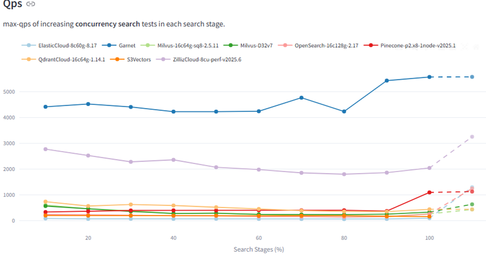
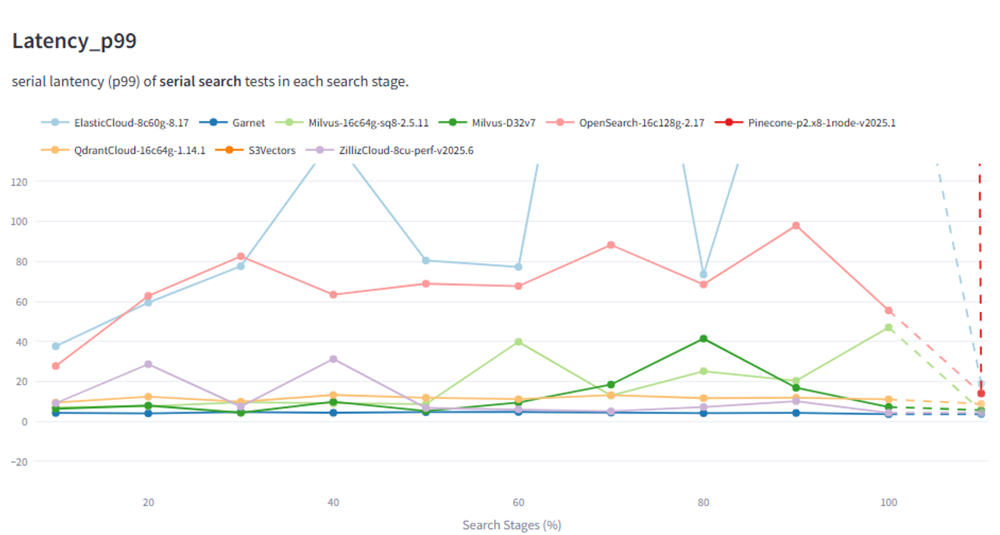
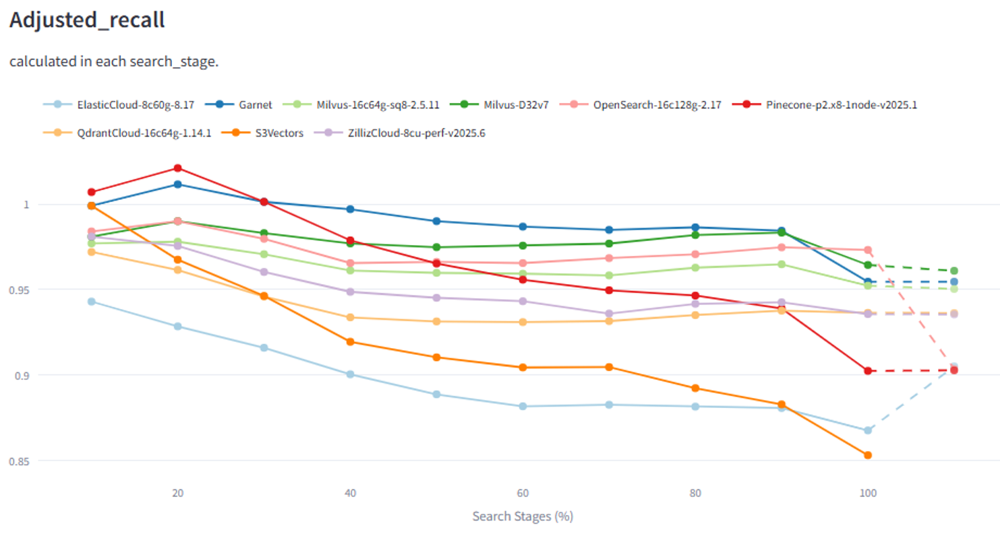
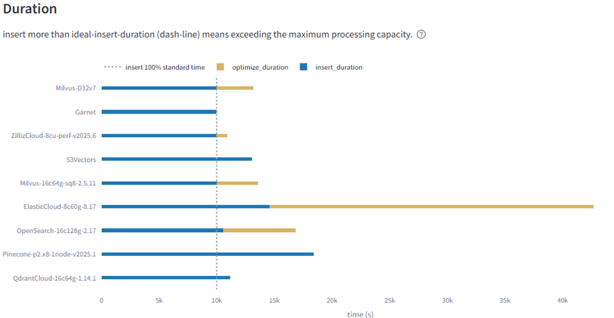

# Vector Sets (Preview)

Vector Sets are a Garnet data type backed by the [DiskANN](https://github.com/microsoft/DiskANN) algorithm — Microsoft's
graph-based approximate nearest-neighbor (ANN) index — coupled with the scalable storage performance of Tsavorite,
Garnet's storage engine for holding the state. They let you insert high-dimensional vector embeddings under a Garnet
key and perform fast similarity search over them, with optional JSON attributes for post-filtering.

The command surface is inspired by Redis' `V*` Vector Set commands but is implemented natively on top of Garnet's
storage stack and DiskANN. Some commands are Garnet-specific extensions (prefixed `X*`).

:::note
Vector Sets are a preview feature. Commands and on-disk layout are subject to change. Enable the feature with the
`--enable-vector-set-preview` server flag (see [Configuration](#configuration)). All `V*` commands return
`ERR Vector Set (preview) commands are not enabled` when the flag is off.
:::

## Performance

Garnet Vector Sets can deliver substantially higher throughput, lower tail latency, and higher
recall than many specialized vector databases, while keeping up with continuous ingestion.

The numbers below are based on our initial results on the Wikipedia-10M + Cohere Embeddings dataset
(768-dimensional FP32, ~10M vectors) run with [Zilliz's VectorDBBench](https://github.com/zilliztech/VectorDBBench)
 (streaming) on an Azure D32v6 VM. The workload inserts 1,000 vectors/second in the background while measuring foreground query
throughput, p99 latency, and recall. Numbers for other vector databases are taken from the public benchmark site.
More details are on the [DiskANN wiki](https://github.com/microsoft/DiskANN/wiki/Perf:-Garnet-Providers-vs-other-Vector-DBs-(Zilliz,-Pinecone,-etc.)).

Headline results:

- **~2× the QPS of Zilliz** (the next-best system) and **5–10× the QPS of every other vector DB** in the comparison.
- **p99 search latency stays under 5 ms** under sustained background ingestion — most other systems sit in the tens
  to hundreds of milliseconds and fluctuate heavily.
- **Highest recall** in the comparison across all search stages.
- **Fastest ingestion** — Garnet completes the load close to the ideal-insert duration. Several other
  systems cannot even keep up with the 1,000 vector/sec ingestion rate. Ingestion is even faster outside the
  benchmark harness.

The gap widens further at larger scale and higher embedding dimensions.

#### Queries per second (higher is better)



#### p99 search latency (lower is better, ms)



#### Adjusted recall (higher is better)



#### Ingestion duration (shorter is better, s)



For source and reproduction instructions, see the
[`vectorset`](https://github.com/microsoft/DiskANN/blob/main/vectorset/README.md) and
[`diskann-garnet`](https://github.com/microsoft/DiskANN/tree/main/diskann-garnet) crates in the DiskANN repository.

## Overview

Each Vector Set is identified by a Garnet key in the main store. Under the hood, the key holds a small index "stub"
that points at a DiskANN graph index. The vector algorithms themselves are stateless — they offload all of their state, both
the per-element vectors and the graph adjacency lists, into key-value pairs in Tsavorite (kept in dedicated internal
namespaces alongside per-element attributes). They reach that state through read/write/delete callbacks rather
than owning any in-process storage. From the user's point of view, the key behaves like a single Garnet object: it
can be inspected with `TYPE`, deleted with `DEL`/`UNLINK`, expired with `EXPIRE`/`PEXPIRE`, flushed with
`FLUSHDB`/`FLUSHALL`, and migrated across cluster nodes.

A typical workflow is:

1. **Insert vectors** with [`VADD`](#vadd), which implicitly creates the index on the first call.
2. **Search for nearest neighbors** with [`VSIM`](#vsim).
3. **Inspect** the index with [`VINFO`](#vinfo) / [`VDIM`](#vdim), read individual entries with [`VEMB`](#vemb) /
   [`VGETATTR`](#vgetattr).
4. **Remove** individual elements with [`VREM`](#vrem), or drop the whole index with `DEL`.

### Element IDs

Element IDs are byte strings up to 1024 bytes; they may be variable-length or fixed-length, including binary
content (e.g. a 4-byte big-endian counter). IDs are opaque to Garnet — they are stored verbatim and returned
verbatim in search results.

### Persistence and Replication

- **Checkpoint (BGSAVE)** — The index stub, per-element vectors and attributes, and the nearest neighbor graph
  adjacency lists all live in the Tsavorite store, so they are persisted as part of the standard Tsavorite
  checkpoint. On recovery, only the in-memory DiskANN handle needs to be rebuilt; it is **lazily** reconstituted
  over the persisted records the first time a Vector Set command touches the key, inside an exclusive lock so other
  readers wait.
- **AOF** — `VADD` and `VREM` are appended to the AOF as synthetic write entries. Replicas reapply them in parallel
  using a pool of worker tasks (configurable via `--vector-set-replay-task-count`); this is intentionally
  non-deterministic so the replica's graph topology may not bit-identically match the primary's, but the search
  semantics are preserved.
- **`FLUSHDB`/`FLUSHALL`** block all Vector Set writes for the duration of the flush so that the in-memory vector
  indices can be safely dropped.

### Cluster

Vector Sets participate in cluster sharding by their key. `MIGRATE` is supported and ships both the index stub and
all internal per-element data. The number of simultaneously open Vector Sets on a single instance is currently capped
(approximately 15) by an internal context metadata limit.

---

## Lifecycle Commands

### VADD

Insert a vector with the given element ID into a Vector Set, creating the index on the first call.

#### Syntax

```bash
VADD key [REDUCE dim] (FP32 vector | XB8 vector | VALUES n v1 ... vN) element
         [CAS] [NOQUANT | XPREQ8] [EF n] [SETATTR attr] [M n]
         [XDISTANCE_METRIC L2 | COSINE | IP | XCOSINE_NORMALIZED]
```

#### Vector Input Forms

| Form | Description |
|------|-------------|
| `FP32 <bytes>` | Raw little-endian `float32` blob. Length must be a multiple of 4. |
| `XB8 <bytes>` | Raw `uint8` byte blob. Each byte is one dimension. |
| `VALUES n v1 v2 ... vN` | `n` textual floats. |

#### Options

| Option | Default | Description |
|--------|---------|-------------|
| `REDUCE dim` | _disabled_ | Project the input vector down to `dim` dimensions. `dim` must be ≤ the input dimensions. Not allowed with `XPREQ8`. Only honored on the first `VADD` (when the index is created). |
| `CAS` | _off_ | Accepted for parser compatibility with Redis; currently a no-op. |
| `NOQUANT` \| `XPREQ8` | _required_ | Quantization (see [Quantization](#quantization)). `Q8` and `BIN` are parsed but rejected with `ERR Unsupported quantization type`. |
| `EF n` | `200` | Build-time exploration factor (DiskANN `R` candidate-list size). Must be in `[1, 1000000]`. |
| `SETATTR attr` | _none_ | Attach an arbitrary byte string to the element (typically a JSON object). Retrieve later with `VGETATTR` or via `WITHATTRIBS` on `VSIM`. |
| `M n` | `16` | DiskANN max out-degree per node. Must be in `[4, 4096]`. |
| `XDISTANCE_METRIC` | `L2` | Distance function (see [Distance Metrics](#distance-metrics)). |

Once the index is created, subsequent `VADD` calls must agree on `REDUCE`, quantization, `M`, and distance metric;
mismatches return errors like `ERR asked M value mismatch with existing vector set`.

#### Examples

```bash
# Create + insert with FP32 input, COSINE distance, M=32, EF=200 (default)
VADD movies FP32 <16-byte float blob> dune XDISTANCE_METRIC COSINE M 32

# Insert via VALUES (3 dimensions) with an attribute and explicit metric
VADD movies VALUES 3 0.12 0.34 0.56 inception \
     NOQUANT SETATTR "{\"year\":2010,\"rating\":4.2}" XDISTANCE_METRIC COSINE

# Insert a uint8 vector with the XPREQ8 pseudo-quantizer
VADD photos XB8 <128-byte blob> photo:42 XPREQ8
```

#### Resp Reply

- RESP2: integer `:1` if a new element was inserted, `:0` if the element was already present.
- RESP3: boolean `true` / `false`.
- Errors include `ERR Vector dimension mismatch`, `ERR REDUCE dimension must be <= vector dimensions`,
  `ERR M must be an integer between 4 and 4096`, `ERR EF must be an integer between 1 and 1000000`,
  `ERR vector exceeds maximum of 65536 dimensions`, `ERR Vector Set key cannot be empty`.

---

### VINFO

Return metadata about a Vector Set.

#### Syntax

```bash
VINFO key
```

#### Resp Reply

Array of 14 elements — 7 alternating field-name / value pairs:

| Field | Type | Description |
|-------|------|-------------|
| `quant-type` | simple string | One of `f32`, `bin`, `q8`, `xpreq8` |
| `distance-metric` | simple string | One of `l2`, `cosine`, `inner-product`, `cosine-normalized` |
| `input-vector-dimensions` | integer (bulk string) | Dimensions of the input vector |
| `reduced-dimensions` | integer (bulk string) | Dimensions stored in the index (after `REDUCE`); same as `input-vector-dimensions` if no projection |
| `build-exploration-factor` | integer (bulk string) | `EF` used at build time |
| `num-links` | integer (bulk string) | `M` (max out-degree) |
| `size` | integer (bulk string) | Number of elements currently in the index |

Returns a null array if the key does not exist; `WRONGTYPE` if the key holds a different data type.

```text
> VINFO movies
 1) "quant-type"
 2) "f32"
 3) "distance-metric"
 4) "cosine"
 5) "input-vector-dimensions"
 6) "768"
 7) "reduced-dimensions"
 8) "768"
 9) "build-exploration-factor"
10) "200"
11) "num-links"
12) "16"
13) "size"
14) "1024"
```

---

### VDIM

Return the input vector dimensions (i.e. the dimension before any `REDUCE`).

#### Syntax

```bash
VDIM key
```

#### Resp Reply

Integer reply. Returns `ERR Key not found` if the key does not exist; `WRONGTYPE` if the key holds a different
data type.

```text
> VDIM movies
(integer) 768
```

---

### DEL / UNLINK

Deleting a Vector Set uses the standard `DEL` or `UNLINK` commands. Garnet asynchronously drops the vector index
and releases all internal per-element storage.

```bash
DEL movies
UNLINK movies
```

If a delete is interrupted (for example, by a crash), the index key remains in a "partially deleted" state. Any
Vector Set command on that key returns:

```
ERR Vector Set is in a partially deleted state - re-execute DEL to complete deletion
```

Re-running `DEL key` (or letting expiration / `FLUSHDB` cover it) finishes the cleanup.

---

### TYPE / EXPIRE / PERSIST

Standard key-management commands work on Vector Set keys:

- `TYPE key` currently reports `string` for Vector Set keys (a dedicated reply name is not yet wired up).
- `EXPIRE` / `PEXPIRE` / `EXPIREAT` / `PERSIST` / `TTL` / `PTTL` set, query, and clear TTLs the same way as any
  other key. When a Vector Set key expires, the vector index is dropped in the background, matching the behavior
  of explicit `DEL`.

---

## Write Commands

### VREM

Remove an element from a Vector Set.

#### Syntax

```bash
VREM key element
```

#### Resp Reply

Integer reply: `:1` if the element was removed, `:0` if it was not present (or the key does not exist).

```bash
> VREM movies inception
(integer) 1
```

---

## Read Commands

### VEMB

Return the stored vector for an element as an array of textual floats.

#### Syntax

```bash
VEMB key element
```

#### Resp Reply

Array of bulk strings, one per dimension. Returns an empty array if the element is not present in the index.

```text
> VEMB movies dune
1) "0.12"
2) "0.34"
3) "0.56"
...
```

:::note
The `RAW` form (`VEMB key element RAW`) is parsed but not yet implemented — invoking it currently throws.
:::

---

### VGETATTR

Return the attribute that was attached to an element via `VADD ... SETATTR`.

#### Syntax

```bash
VGETATTR key element
```

#### Resp Reply

Bulk string reply with the raw attribute bytes, or nil if the element exists but has no attribute / does not exist.

```bash
> VGETATTR movies inception
"{\"year\":2010,\"rating\":4.2}"
```

---

## Search Commands

### VSIM

Find the nearest neighbors of a query vector or an existing element.

#### Syntax

```bash
VSIM key (ELE element | FP32 vector | XB8 vector | VALUES n v1 ... vN)
         [WITHSCORES] [WITHATTRIBS]
         [COUNT n] [EPSILON delta] [EF n]
         [FILTER expr] [FILTER-EF n]
         [TRUTH] [NOTHREAD]
```

#### Query Input Forms

| Form | Description |
|------|-------------|
| `ELE element` | Use the vector already stored under `element` as the query. |
| `FP32 <bytes>` | Raw little-endian `float32` query blob. |
| `XB8 <bytes>` | Raw `uint8` query blob. |
| `VALUES n v1 ... vN` | `n` textual floats. |

The query's effective dimension must match the index's `input-vector-dimensions`.

#### Options

| Option | Default | Description |
|--------|---------|-------------|
| `WITHSCORES` | _off_ | Also return the distance/similarity score for each result. |
| `WITHATTRIBS` | _off_ | Also return the attribute (set with `VADD ... SETATTR`) for each result. |
| `COUNT n` | `10` | Maximum number of results to return. Must be in `[0, 100000000]`. |
| `EPSILON delta` | `2.0` | DiskANN `L_search` epsilon — controls how aggressively the graph is explored beyond the current best. |
| `EF n` | `100` | Search-time exploration factor (`L_search` candidate-list size). Must be in `[1, 1000000]`. |
| `FILTER expr` | _none_ | Post-filter results by an attribute expression (see [Filter Expressions](#filter-expressions)). |
| `FILTER-EF n` | `16` | Scale factor for adaptive inline filter search. Must be in `[4, 256]`. This controls how high the EF will scale based on selectivity. |
| `TRUTH` | _off_ | Accepted for compatibility; exact / brute-force search is not yet wired up. |
| `NOTHREAD` | _off_ | Accepted for compatibility; currently ignored (search always runs on the calling thread). |

#### Resp Reply

A flat RESP array. The number of elements per result depends on which `WITH*` flags are set:

| Flags | Items per result | Order |
|-------|------------------|-------|
| _(none)_ | 1 | `id` |
| `WITHSCORES` | 2 | `id`, `score` |
| `WITHATTRIBS` | 2 | `id`, `attr` |
| `WITHATTRIBS WITHSCORES` | 3 | `id`, `score`, `attr` |

Scores are returned as bulk strings (decimal text). When `WITHATTRIBS` is set and an element has no attribute, the
slot is an empty bulk string. The result is in similarity order (closest first). Results may be fewer than `COUNT`
if the candidate set is smaller.

:::note
`VSIM` currently only supports RESP2. Calling it in a RESP3 session is not yet implemented.
:::

#### Examples

```bash
# Top-5 nearest to an existing element, with scores
VSIM movies ELE dune COUNT 5 WITHSCORES

# Top-10 nearest to a VALUES query, with attributes, default COUNT
VSIM movies VALUES 3 0.10 0.20 0.30 WITHATTRIBS

# Filtered search: only movies from after 1950, with both scores and attributes
VSIM movies VALUES 3 0.0 0.0 0.0 \
     FILTER ".year > 1950" COUNT 5 WITHSCORES WITHATTRIBS
```

---

### Filter Expressions

`VSIM ... FILTER <expr>` post-filters candidates by their JSON attribute. The expression is compiled once and
evaluated against each candidate's attribute.

#### Syntax

- **Field access:** dot notation — `.year`, `.rating`, `.tags`
- **Arithmetic:** `+`, `-`, `*`, `/`, `%`, `**`
- **Comparison:** `==`, `!=`, `>`, `<`, `>=`, `<=`
- **Logical:** `and`, `or`, `not` (also `&&`, `||`, `!`) — case-sensitive lowercase
- **Containment:** `in`
  - Tuple membership: `.director in ["Spielberg", "Nolan"]`
  - JSON array membership: `"classic" in .tags` (when `.tags` is a JSON array)
  - Substring: `"act" in .genre` (when `.genre` is a string)
- **Grouping:** parentheses `()`
- **Values:** integers, floats, single/double-quoted strings (with `\"` escapes), `true`/`false`, `null`

#### Operator Precedence (low → high)

| Precedence | Operators |
|-----------|-----------|
| 0 | `or`, `\|\|` |
| 1 | `and`, `&&` |
| 2 | `>`, `>=`, `<`, `<=`, `==`, `!=`, `in` |
| 3 | `+`, `-` |
| 4 | `*`, `/`, `%` |
| 5 | `**` (right-associative) |
| 6 | `not`, `!` |

#### Limits

Filters are compiled and evaluated with zero heap allocation on the hot path, so they have fixed upper bounds:

| Limit | Value | What it bounds |
|-------|-------|----------------|
| Max tokens | 128 | Total operators + operands in the expression (~18 AND/OR clauses) |
| Max tuple elements | 64 | Total elements across all `[...]` literals |
| Max runtime array elements | 64 | Per candidate; total elements pulled from JSON array fields |
| Max unique selectors | 32 | Distinct `.field` references in one expression |
| Max eval stack depth | 16 | Postfix evaluation depth |
| Max parenthesis nesting | 128 | Bounded by the token buffer |

Missing attributes cause the filter to evaluate to false for that candidate. Compile errors yield an empty result
set rather than a server-side error.

#### Examples

```bash
VSIM movies ELE dune FILTER ".year >= 1980 and .rating > 7"
VSIM movies ELE dune FILTER ".genre == \"action\" && .rating > 8.0"
VSIM movies ELE dune FILTER "\"classic\" in .tags"
VSIM movies ELE dune FILTER ".director in [\"Spielberg\", \"Nolan\"]"
VSIM movies VALUES 3 0.12 0.34 0.56 FILTER ".year != null and .rating >= 4.0"
```

---

## Quantization

The active quantizer determines how vectors are stored internally and which input forms are valid.

| Token | Status | Notes |
|-------|--------|-------|
| `NOQUANT` | ✅ Supported | Store input as `float32`. Works with `FP32`, `XB8`, and `VALUES` inputs (uint8 bytes are widened to floats). |
| `XPREQ8` | ✅ Supported | Garnet extension: stores the input `uint8` bytes verbatim with no further quantization. Requires `XB8` input and is incompatible with `REDUCE`. |
| `Q8` | ❌ Rejected | Parsed for compatibility; returns `ERR Unsupported quantization type`. |
| `BIN` | ❌ Rejected | Parsed for compatibility; returns `ERR Unsupported quantization type`. |

If no quantizer is specified on the first `VADD`, the default is `Q8`, which currently fails — supply `NOQUANT` (or
`XPREQ8` for uint8 data) explicitly.

## Distance Metrics

| Token | Description |
|-------|-------------|
| `L2` (default) | Squared Euclidean distance. |
| `COSINE` | Cosine distance. Vectors are normalized internally. |
| `IP` | Inner product (larger is closer). |
| `XCOSINE_NORMALIZED` | Garnet extension: cosine distance with **no** internal normalization — caller guarantees inputs are already unit-length. |

`XDISTANCE_METRIC` is honored only on the first `VADD` that creates the index. Subsequent `VADD`s must agree, or
they return `ERR Distance metric mismatch`.

---

## Type Safety

Vector Set keys are type-safe:

- `GET` / `SET` / `INCR` / etc. on a Vector Set key return `WRONGTYPE`.
- `V*` commands on a non-Vector-Set key return `WRONGTYPE`.
- Element data is stored in private internal namespaces — issuing `GET` / `SET` / `DEL` on an element ID does
  **not** see or disturb the vector. You can freely use the same byte string as both a Garnet string key and a
  Vector Set element ID without collision.
- `DEL` / `UNLINK` / `TYPE` / `EXPIRE` / `TTL` / `RENAME` / `RENAMENX` / `DEBUG` work on any key type, including
  Vector Sets.

---

## Not Yet Implemented

These commands are reachable through the parser but currently return `+OK` regardless of arguments. They are
reserved for future implementation:

| Command | Intended behavior |
|---------|--------------------|
| `VCARD key` | Cardinality (number of elements). Use `VINFO key` and read the `size` field instead. |
| `VISMEMBER key element` | Test membership. |
| `VLINKS key element [WITHSCORES]` | Return the neighbours of `element` in the DiskANN graph. |
| `VRANDMEMBER key [count]` | Return random element IDs. |
| `VSETATTR key element attr` | Update an element's attribute in place. Today the only way to set/replace an attribute is to re-run `VADD ... SETATTR`. |

Treat these as no-ops in preview builds — do not rely on their return value.

---

## Example Session

```bash
> VADD movies VALUES 3 1.0 2.0 3.0 dune NOQUANT SETATTR "{\"year\":1984,\"rating\":4.3}" XDISTANCE_METRIC COSINE
(integer) 1

> VADD movies VALUES 3 2.0 3.0 4.0 inception NOQUANT SETATTR "{\"year\":2010,\"rating\":4.2}"
(integer) 1

> VADD movies VALUES 3 1.5 2.5 3.5 matrix NOQUANT SETATTR "{\"year\":1999,\"rating\":4.7}"
(integer) 1

> VINFO movies
 1) "quant-type"
 2) "f32"
 3) "distance-metric"
 4) "cosine"
 5) "input-vector-dimensions"
 6) "3"
 7) "reduced-dimensions"
 8) "3"
 9) "build-exploration-factor"
10) "200"
11) "num-links"
12) "16"
13) "size"
14) "3"

> VDIM movies
(integer) 3

> VEMB movies dune
1) "1"
2) "2"
3) "3"

> VGETATTR movies inception
"{\"year\":2010,\"rating\":4.2}"

> VSIM movies VALUES 3 1.4 2.4 3.4 COUNT 3 WITHSCORES WITHATTRIBS
1) "matrix"
2) "0.000113"
3) "{\"year\":1999,\"rating\":4.7}"
4) "dune"
5) "0.001052"
6) "{\"year\":1984,\"rating\":4.3}"
7) "inception"
8) "0.001241"
9) "{\"year\":2010,\"rating\":4.2}"

> VSIM movies VALUES 3 1.4 2.4 3.4 FILTER ".year > 1990" COUNT 3 WITHATTRIBS
1) "matrix"
2) "{\"year\":1999,\"rating\":4.7}"
3) "inception"
4) "{\"year\":2010,\"rating\":4.2}"

> VREM movies dune
(integer) 1

> VSIM movies ELE inception COUNT 3
1) "inception"
2) "matrix"

> DEL movies
(integer) 1
```

---

## Configuration

Enable Vector Sets with the server flag:

```bash
garnet-server --enable-vector-set-preview
```

Or in `garnet.conf`:

```
"EnableVectorSetPreview": true
```

| Option | Default | Description |
|--------|---------|-------------|
| `--enable-vector-set-preview` / `EnableVectorSetPreview` | `false` | Master switch for all `V*` commands. When off, every Vector Set command returns `ERR Vector Set (preview) commands are not enabled`. |
| `--vector-set-replay-task-count` / `VectorSetReplayTaskCount` | `0` (= CPU count) | Number of worker tasks used by replicas to replay `VADD`/`VREM` from the AOF in parallel. |

---

## Limits

| Limit | Value | Source |
|-------|-------|--------|
| Maximum vector dimensions | 65,536 | `VectorManager.MaxVectorDimensions` |
| Maximum build / search EF | 1,000,000 | `VectorManager.MaxExplorationFactor` |
| Maximum `COUNT` | 100,000,000 | `VectorManager.MaxRetrieveCount` |
| Maximum `FILTER-EF` | 256 | `VectorManager.MaxFilteringScaleFactor` |
| Maximum elements per Vector Set | 2³² − 1 | DiskANN limit |
| Concurrent Vector Sets per instance | ~15 | Internal context metadata limit |
| Empty Vector Set keys | not allowed | Returns `ERR Vector Set key cannot be empty` (preview restriction) |

---

## Supported ACL Category

All `V*` commands belong to the `@vector` ACL category in addition to the per-command categories. You can grant or
revoke access in bulk via standard `ACL SETUSER` syntax, for example:

```bash
ACL SETUSER alice on >secret ~vec:* +@vector
```
