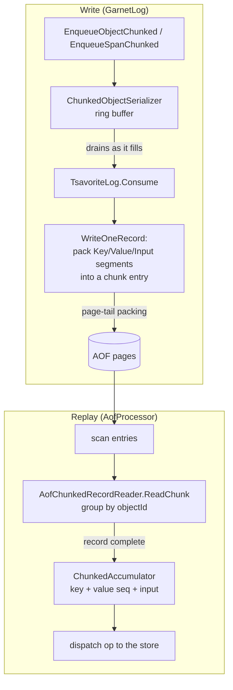
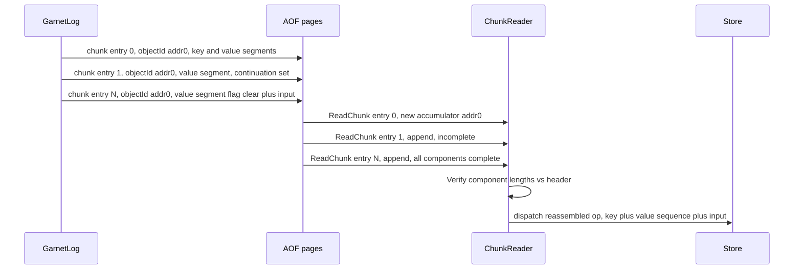

# AOF / TsavoriteLog record layout

This document describes the on-log byte layout of **non-chunked** and **chunked** AOF records, and how a large
key/value/object is split across multiple AOF entries and reassembled on replay.

> **Keep this document in sync with the code.** If any of the following change, update the layouts and diagrams below:
> - `libs/server/AOF/AofHeader.cs` — the AOF header hierarchy and the `flags` bitfield.
> - `libs/server/AOF/AofChunkHeader.cs` — the per-chunk framing header.
> - `libs/server/AOF/GarnetLog.cs` — `Enqueue` / `EnqueueSpanChunked` / `EnqueueObjectChunked` / `IsChunkable`.
> - `libs/storage/Tsavorite/cs/src/core/TsavoriteLog/TsavoriteLog.Chunked.cs` — the chunk writer (`WriteOneRecord`).
> - `libs/server/AOF/AofChunkedRecordReader.cs` / `AofProcessor.ChunkReplay.cs` — the reader / replay side.
> - `libs/storage/Tsavorite/cs/src/core/Allocator/ObjectSerialization/ChunkedRecordConstants.cs` — the continuation flag.

---

## 1. Overview

Garnet's AOF is a [`TsavoriteLog`](./tsavorite/intro.md). Each mutating operation (SET, HSET, an object upsert, an RMW,
DELETE, a transaction marker, …) is appended as one or more **AOF entries**.

- A small operation is written as a **single, non-chunked entry** ([§3](#3-non-chunked-aof-headers)–[§4](#4-non-chunked-entry-body)).
- An operation whose **key + value + input** together exceed `TsavoriteLog.MinPartialAllocSize` is written as a
  **chunked record**: a run of AOF entries that the reader reassembles (`GarnetLog.IsChunkable`) ([§5](#5-chunked-aof-records)).

Chunking lets a value that is larger than an AOF page — even larger than 2 GB — be written and replayed without ever
materializing the whole serialized value contiguously.

> The AOF stores an **operation image** (`opType` + key + value/input), which is *not* the same as the serialized
> `DiskLogRecord` image shipped by cluster migration / replication. For that format see the companion doc,
> [Migration / Replication record layout](./migration-replication-record-layout.md).

---

## 2. TsavoriteLog entry framing

Every AOF entry — chunked or not — is a single `TsavoriteLog` entry:

```
+------------------------------+------------------------+-----------------------------+
| entry-length prefix          |  AOF header (variant)  |  body                       |
| (TsavoriteLog headerSize)    |  §3 / §5               |  §4 / §5                    |
+------------------------------+------------------------+-----------------------------+
```

- The **entry-length prefix** is written by `TsavoriteLog` (`SetHeader`); it frames the entry on the page and is not
  part of the AOF header.
- The **AOF header variant** is selected by the log topology (single vs. sharded, per-key vs. coordinated).

---

## 3. Non-chunked AOF headers

The header hierarchy is defined in `AofHeader.cs`. All offsets/sizes are in bytes.

### `AofHeader` — 16 B (base, single-log per-key entries)

```
off  0        1        2        3          4                         12          16
     +--------+--------+--------+----------+-------------------------+-----------+
     |version | flags  | opType | proc/db  | storeVersion            | sessionID |
     | u8     | u8     | u8     | id  u8   | i64                     | i32       |
     +--------+--------+--------+----------+-------------------------+-----------+
```

`flags` is a bitfield:

```
bit    7   6   5   4   3   2   1   0
       .   .   .   .   |   +---+---+---  AofHeaderTypeMask (0b0111)
       \___________/   |   |   \_______  base type (bits 0-1): Basic=0, Sharded=1,
        unused         |   |                                    SingleLogTxn=2, ShardedLogTxn=3
                       |   +-----------  ChunkedRecordFlag (0b0100): set on chunk entries (bit 2)
                       +---------------  UnsafeTruncateLogFlag (0b1000): FLUSH (bit 3)
```

A chunked header type is simply its non-chunked counterpart with **bit 2 set**: `BasicChunkHeader = 4`,
`ShardedChunkHeader = 5`.

### Other non-chunked headers

| Header | Size | = base + extra | Used for |
|---|---|---|---|
| `AofHeader` | 16 B | — | Single physical log, per-key entries |
| `AofShardedHeader` | 24 B | `AofHeader` + `sequenceNumber` (i64) | Multi-physical-log (sharded) per-key entries |
| `AofSingleLogTransactionHeader` | 50 B | `AofHeader` + `participantCount` (i16) + `replayTaskAccessVector` (32 B) | Coordinated ops (txn/checkpoint/flush), single physical log + multi-replay |
| `AofShardedLogTransactionHeader` | 58 B | `AofShardedHeader` + `participantCount` (i16) + `replayTaskAccessVector` (32 B) | Coordinated ops, sharded |

Selection logic (`GarnetLog.Enqueue`):

| Topology | Per-key entry | Coordinated / broadcast entry |
|---|---|---|
| Single log (1 physical, 1 replay task) | `AofHeader` | `AofHeader` |
| Single physical log, multi-replay | `AofHeader` | `AofSingleLogTransactionHeader` |
| Multi physical log, multi-replay | `AofShardedHeader` | `AofShardedLogTransactionHeader` |

---

## 4. Non-chunked entry body

For a per-key operation, the body that follows the header is the operation's key, then (as required by `opType`) the
value and/or the serialized input, laid out by `TsavoriteLog.Enqueue(header, key, value, ref input, …)`:

```
+----------------------+--------------------------+--------------------------+---------------------+
|  AOF header (§3)      |  key                     |  value (Upsert shapes)   |  input (RMW /       |
|                       |  [i32 len][key bytes]    |  [i32 len][value bytes]  |  Upsert-with-input) |
|                       |  (SpanByte framing)      |  (SpanByte framing)      |  [raw serialized]   |
+----------------------+--------------------------+--------------------------+---------------------+
```

- **key** and **value** use SpanByte framing: a 4-byte little-endian length prefix followed by the bytes
  (`ReadOnlySpan<byte>.SerializeTo`, `TotalSize = 4 + Length`).
- **input** is the raw serialized input (`IStoreInput.CopyTo`, `SerializedLength` bytes; no separate length prefix).
- Which components are present depends on the op shape: e.g. DELETE is key-only (the value slot is unused on replay);
  a plain upsert is key + value; an RMW / upsert-with-input carries the input.

---

## 5. Chunked AOF records

When `GarnetLog.IsChunkable(key, value, input)` is true (`key.TotalSize + value.TotalSize + inputSerializedLength >
TsavoriteLog.MinPartialAllocSize`), the operation is written as a **run of chunk entries** by `EnqueueSpanChunked`
(span key/value) or `EnqueueObjectChunked` (streamed object value).

### 5.1 Chunk headers

Each chunk entry uses a chunked header: a normal header immediately followed by an `AofChunkHeader`.

`AofChunkHeader` — 28 B (`AofChunkHeader.cs`):

```
off  0            4            8            12                   20                   28
     +------------+------------+------------+--------------------+--------------------+
     | overflow   | overflow   | input      | objectId           | keyHash            |
     | KeyLength  | ValueLength| Length     | (u64)              | (i64)              |
     | u32        | u32        | u32        |                    |                    |
     +------------+------------+------------+--------------------+--------------------+
```

- `overflowKeyLength` / `overflowValueLength` / `inputLength` — the **full** length of each component, known up front, so
  the reader pre-allocates one buffer per component. `overflowValueLength` is left **0** for a streamed object value
  (its length is not known up front; the reader accumulates it as a chunk list instead).
- `objectId` — the identifier that groups a record's chunks: the **logicalAddress of the record's first chunk**, written
  identically on every chunk. It is the only field patched per-chunk at write time.
- `keyHash` — `GarnetLog.HASH(key)`, identical on every chunk; used to route all of a record's chunks to the same replay
  task during parallel/sharded replay (the chunks cannot expose the key directly — it is itself split across chunk data).

Chunked header variants:

| Header | Size | = |
|---|---|---|
| `AofBasicChunkHeader` | 44 B | `AofHeader` (16) + `AofChunkHeader` (28) |
| `AofShardedChunkHeader` | 52 B | `AofShardedHeader` (24) + `AofChunkHeader` (28) |

### 5.2 Chunk entry body: packed component segments

The components are written in the fixed order **Key → Value → Input**, **packed**: a single chunk entry holds one
`[i32 prefix][data]` **segment** per component that (partly) fits, in order — so key + value + input can share an entry.
A component too large to fit is **split**: its last segment in an entry sets the high bit of the prefix (the continuation
flag), and it resumes in the next entry.

```
chunk entry body = [ prefix | seg-data ] [ prefix | seg-data ] ... (bounded by the entry length)

prefix (i32):
   bit 31        = ChunkedRecordConstants.ContinuationFlag  (1 = more of this component follows)
   bits 30..0    = this segment's data length
```

- The reader (`AofChunkedRecordReader.ReadChunk`) reads every segment in an entry, and advances Key → Value → Input each
  time it sees a prefix whose continuation flag is **clear** (the current component is complete).
- A length prefix is written **whole or not at all**: if fewer than `sizeof(int)` bytes remain in the entry, the prefix
  is deferred to the start of the next chunk entry — a prefix is **never split** across an entry boundary, on both the
  write (`WriteOneRecord`) and read side.
- A span (overflow) value is copied into its pre-sized buffer; a streamed **object** value is accumulated as a list of
  buffers and exposed as a `ReadOnlySequence<byte>` (`ChunkedAccumulator.GetValueSequence`) for streaming deserialize
  with no giant contiguous copy — this is what lets an object value exceed 2 GB.

### 5.3 A large object across chunk entries

```
 logical record (opType = ObjectStoreUpsert, key K, object value V, |V| >> page)

 entry 0                    entry 1                    ...        entry N
 +---------------------+    +---------------------+               +---------------------+
 | AofBasicChunkHeader |    | AofBasicChunkHeader |               | AofBasicChunkHeader |
 |  objectId = addr0   |    |  objectId = addr0   |               |  objectId = addr0   |
 +---------------------+    +---------------------+               +---------------------+
 | [len|+] key seg     |    | [len|+] value seg   |               | [len ] value seg    |  <- last: flag clear
 | [len|+] value seg   |    | [len|+] value seg   |               | [len ] input seg    |  <- (if any)
 +---------------------+    +---------------------+               +---------------------+
        page tail  ---------------> next page (page-tail packing via AllocateBlockPartial)

 every entry carries objectId = addr0 (the first chunk's logicalAddress) so the reader groups them;
 the value's continuation flag stays set until the object serializer's final (isComplete) drain.
```

### 5.4 Write and replay flow




