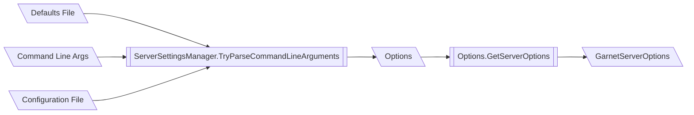
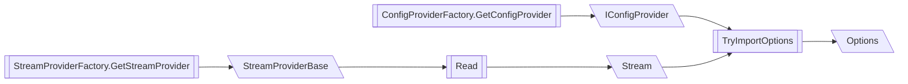

## Code Overview

Every configurable Garnet setting has a matching property defined in the **Options** class (`GarnetServer\Configuration\Options.cs`). \
When GarnetServer.exe initializes, it creates a new Options object using the command line variables, the defaults file and a configuration file, if supplied, by calling **ServerSettingsManager.TryParseCommandLineArguments()**.\
It then calls the instance method **GetServerOptions()** which returns an instance of **GarnetServerOptions**, that can be then used to create a new instance of **GarnetServer**.

## Options Parsing

The **Options** object is initialized by calling **ServerSettingsManager.TryParseCommandLineArguments()** with the set of inputted command line arguments.\
The initialization of the object consists of:
1) Parsing the **defaults configuration file** into the Options object (defaults to `defaults.conf`, unless otherwise specified by the command line arguments) 
2) Parsing the **configuration file** (if specified by the command line arguments) and populating the initialized object, overriding default settings. 
3) Parsing the **command line variables** and populating the object again, overriding and default settings or settings provided by the configuration file. 

### Configuration File Parsing

Parsing of the configuration files is done by calling **ServerSettingsManager.TryImportServerOptions()**. This method supports reading files from multiple sources (curretly supported: **local files** & remote files on **Azure Storage**), as well as reading multiple file formats (specified by the **ConfigFileType** enum).
This is done by calling the following factory methods: 
1) **StreamProviderFactory.GetStreamProvider()** - returns a **StreamProviderBase** for reading from the appropriate file source
2) **ConfigProviderFactory.GetConfigProvider()** - returns an **IConfigProvider** for reading the appropriate file format

**Note:** When specifying an configuration export file path in the command line provider, the **ServerSettingsManager.TryExportServerOptions()** will similarly use **StreamProviderFactory** and **ConfigProviderFactory** to write the configuration file in the specified format to the specified file source.

### Supported File Formats
Currently we support 2 different configuration file formats (all supported file formats are described by the **ConfigFileType** enum):

#### GarnetConf
The **GarnetConf** configuration file format is the default format for Garnet configuration files.\
This format consists of a **JSON-serialized** Options object.\
The **GarnetConfigProvider** is the implementation of **IConfigProvider** which allows to serialize and deserialize options from or into an Options object (into or from an instance of **StreamProviderBase** respectively), using the **Newtonsoft.Json** serializer for JSON deserialization and the **System.Text** serializer for JSON serialization.

#### RedisConf
The **RedisConf** configuration file format is the file format used to configure a Redis server (read more [here](https://redis.io/docs/management/config/)).\
Each Garnet-supported setting in this format has a matching property in the **RedisOptions** class (`GarnetServer\Configuration\RedisOptions.cs`).\
Each property is decorated with the **RedisOptionAttribute**, which is used to specify the key (the Redis keyword), the Garnet property name that matches this property, and optionally - the type of trasformer to use when transforming the Redis property to the Garnet property.

The **RedisConfigProvider** is the implementation of **IConfigProvider** which allows to deserialize options into an Options object (from an instance of **StreamProviderBase**).It uses a custom serializer, **RedisConfigSerializer** (`GarnetServer\Configuration\RedisConfigSerializer.cs`) to deserialize and populate the Options object.
Deserialization may use a custom converter to convert the string value to a Redis type (all Redis types and custom converters can be found in `GarnetServer\Configuration\RedisTypes.cs` and `GarnetServer\Configuration\TypeConverters.cs`).\
Populating the Options object is done by the matching Options property from the **RedisOptionAttribute**, then either transforming the **RedisOptions** property to the destination Options property (if a custom transformer is specified in the attribute) or converting the property using a TypeConverter, if such exists. If neither a transformer nor a type converter exists, a simple cast is attempted. If all fails, the serialization will fail.

### Command Line Argument Parsing

Parsing of the command line arguments is done by a 3rd party library named [CommandLineParser](https://github.com/commandlineparser/commandline). Each Options property is decorated by the **OptionAttribute**, which specifies its long name and / or short name (e.g. "memory" / "m" respectively) as well as its help text to be displayed when running `GarnetServer.exe -h` or `GarnetServer.exe --help`.\
The OptionsAttribute also supports specifying a default value, which is **not used** as to not create confusion with the default values specified in the defaults configuration file.

Command line arguments parsing is effectively done twice, we first parse the command line arguments in order to retrieve the defaults configuration file and the configuration file, if specified. We then hand the command line arguments parser an initialization function that populates an Options object as described in the [Configuration File Parsing](#configuration-file-parsing) section. The parser then proceeds to populate the initialized object with settings specified in the command line.

### Options Validation

Once Options parsing is done, the **ServerSettingsManager.TryParseCommandLineArguments()** then calls the instance method **Options.IsValid()** to validate the final Options object.\
Each Options property may be decorated with a ValidationAttribute (all custom Garnet validation attributes can be found in `GarnetServer\Configuration\OptionsValidators.cs`), which can then be used to check each property value validity.\ 
If any invalid property values are found, the method will return a null options object, as well as a list of the invalid property names.\
All errors returned by the validators will be written to the console.

## How to Add a New Setting

In order to add a new setting to Garnet, follow these steps:
1) Add a new property to the Options class (`GarnetServer\Configuration\Options.cs`)
2) Decorate your property with the **OptionAttribute**, and assign it with a long name, short name or both. Also add the appropriate help text to describe the property
3) If your property requires validation, decorate it with a custom **ValidationAttribute** from `GarnetServer\Configuration\OptionsValidators.cs` (add a new one if needed)
4) Add your property's default value in `defaults.conf`
5) If the new setting is required in the core Garnet code - add a matching property to the **GarnetServerOptions** class, and add the property setting when constructing the **GarnetServerOptions** object in **Options.GetServerOptions()**
6) If the setting has a matching setting in Redis and you would like to support it in a Redis-formatted configuration file:
    1) Add the matching property to the **RedisOptions** class (`GarnetServer\Configuration\RedisOptions.cs`)
    2) Decorate your property with the **RedisOptionAttribute**. Specify in the attribute constuctor the key (the Redis keyword), the Garnet property name that matches this property, and optionally - the type of trasformer to use when transforming the Redis property to the Garnet property. Read more about how to properly convert your property in the [RedisConf](#redisconf) section.
7) Test your code by adding the new setting to a configuration file and make sure that it's being parsed correctly. Alternatively, you can add a check for your setting in **GarnetServerConfigTests** (`Garnet.test\GarnetServerConfigTests.cs`). 

## How to Add a New Configuration File Format

In order to add a new configuration file formet to Garnet, follow these steps:
1) Add a new value to the **ConfigFileType** enum that matches the new file type
2) Implement a new instance of **IConfigProvider** for importing / exporting options from or to the new file format
3) Add a new case to the **ConfigProviderFactory.GetConfigProvider()** switch clause, and return a new instance of your **IConfigProvider** implementation
4) If needed, add a custom serializer to serialize or deserialize the new file format
5) Add a new test case to **GarnetServerConfigTests** (`Garnet.test\GarnetServerConfigTests.cs`) to check that your code imports / exports options correctly 