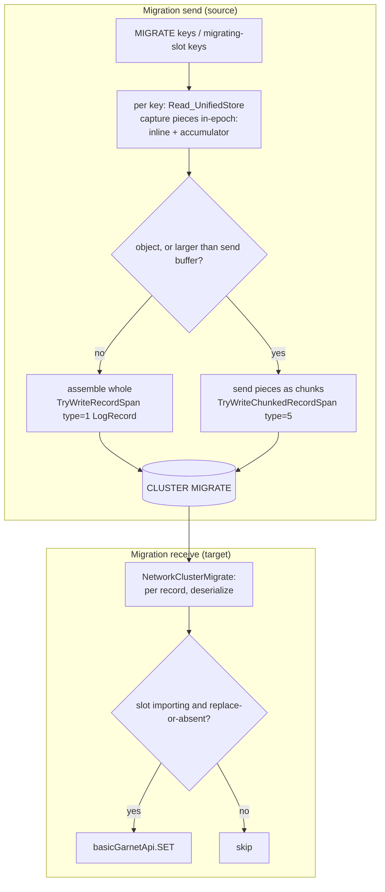
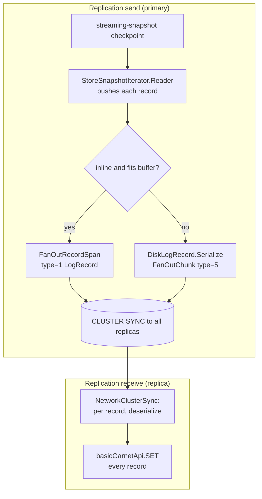
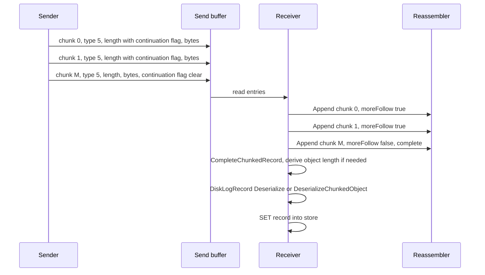

# Migration / Replication record layout

This document describes the on-the-wire byte layout of the records that cluster **key migration** and **replication**
ship in the send buffer, in both the **non-chunked** (whole record in one buffer) and **chunked** (record too large for
one buffer) forms.

> **Keep this document in sync with the code.** If any of the following change, update the layouts and diagrams below:
> - `libs/storage/Tsavorite/cs/src/core/Allocator/DiskLogRecord.cs` — `Serialize` / `Deserialize`, the chunked helpers
>   (`GetChunkedObjectValueStart`, `DeserializeChunkedObject`), and `SerializeInlinePortionForMigration`.
> - `libs/storage/Tsavorite/cs/src/core/Allocator/RecordDataHeader.cs` — the record data header (indicator word).
> - `libs/client/ClientSession/GarnetClientSessionIncremental.cs` — `MigrationRecordSpanType`, `TryWriteRecordSpan`,
>   `TryWriteChunkedRecordSpan`, and the send-buffer framing.
> - `libs/cluster/Session/ChunkedRecordReassembler.cs` — the receive-side reassembler.
> - `libs/cluster/Session/RespClusterMigrateCommands.cs` / `RespClusterReplicationCommands.cs` — the receive paths
>   (`NetworkClusterMigrate` / `NetworkClusterSync`, `CompleteChunkedRecord`).
> - `libs/server/MigrationChunkAccumulator.cs` / `libs/server/Storage/Functions/UnifiedStore/ReadMethods.cs` — migration's
>   in-epoch capture (`HandleMigrate` fills the accumulator + inline portion).
> - `libs/cluster/Server/Migration/MigrateSessionCommonUtils.cs` — migration send (per-key `Read_UnifiedStore`, assemble the
>   captured pieces, `WriteOrSend*RecordAsync`).
> - `libs/cluster/Server/Replication/PrimaryOps/DisklessReplication/ReplicationSnapshotIterator.cs` — replication send (`StoreSnapshotIterator.Reader` / `WriteRecord` / fan-out).
> - `libs/storage/Tsavorite/cs/src/core/Allocator/ObjectSerialization/ChunkedRecordConstants.cs` — the continuation flag.

---

## 1. Overview

Both migration and replication ship store records over the network as serialized `DiskLogRecord` images in a **send
buffer** that is flushed to the target, which deserializes each record back into the store. The two mechanisms differ in
how records are produced and applied (see [§5](#5-send-and-receive-flows)): **migration** retrieves the specific keys
being moved (a read per key) and the target applies them conditionally as commands; **replication** streams the whole
store through a snapshot iterator and the replica inserts every record.

- A record whose serialized size fits within `NetworkBufferSettings.maxSendBufferContentSize` is written whole, as a
  single **non-chunked** `LogRecord` entry ([§3](#3-non-chunked-record-logrecord-tag-1)).
- A larger record is split into a sequence of **chunk** entries (`ChunkedLogRecord`) that the receiver reassembles
  before deserializing ([§4](#4-chunked-record-chunkedlogrecord-tag-5)). Because the chunks are reassembled as a `ReadOnlySequence<byte>` (not one contiguous
  array), an object value may exceed 2 GB.

> This is a serialized `DiskLogRecord` **record image**, distinct from the AOF's operation image. For the AOF format
> see the companion doc, [AOF / TsavoriteLog record layout](./aof-record-layout.md). The two paths share only the chunk
> **continuation flag** (`ChunkedRecordConstants.ContinuationFlag`).

---

## 2. Send-buffer framing

The migrate/replica iteration buffer is a single RESP bulk string whose payload is a count-prefixed run of entries
(`GarnetClientSession.SendAndResetIterationBuffer`):

```
+------------------+----------------------+-----------------------------+------+
| $<len>\r\n       | recordCount (i32)    | entry, entry, entry, ...    | \r\n |
+------------------+----------------------+-----------------------------+------+
```

Each **entry** begins with a one-byte `MigrationRecordSpanType` tag:

| Tag | Value | Payload |
|---|---|---|
| `Invalid` | 0 | — |
| `LogRecord` | 1 | A whole serialized `DiskLogRecord` ([§3](#3-non-chunked-record-logrecord-tag-1)) |
| `VectorSetElement` | 2 | Bespoke vector-set element encoding (out of scope here) |
| `VectorSetIndex` | 3 | Bespoke vector-set index encoding (out of scope here) |
| `SerializedRangeIndexStream` | 4 | Chunked RangeIndex stream (out of scope here) |
| `ChunkedLogRecord` | 5 | One chunk of a serialized `DiskLogRecord` too large for one buffer ([§4](#4-chunked-record-chunkedlogrecord-tag-5)) |

This doc covers `LogRecord` (1) and `ChunkedLogRecord` (5). Vector-set and RangeIndex encodings are handled separately.

---

## 3. Non-chunked record: `LogRecord` (tag 1)

`GarnetClientSession.TryWriteRecordSpan` writes the whole record:

```
+--------+---------------------------------------------+
| type=1 |  serialized DiskLogRecord (§3.1)            |
+--------+---------------------------------------------+
```

### 3.1 Serialized `DiskLogRecord` layout

The record is one contiguous image: an **inline portion** followed by any **overflow key**, then any **overflow value**
or **object value** (`DiskLogRecord.Serialize` / `Deserialize`).

```
+=====================================================================+
| INLINE PORTION                                                      |
+----------------+----------------+----------------+------------------+
| RecordInfo     | RecordDataHdr  | ExtendedNamesp.| inline Key       |
| (8 B)          | (8 B, §3.2)    | (0..N B)       | (0..N B)*        |
+----------------+----------------+----------------+------------------+
| inline Value   | optionals: ETag (8 B if present), Expiration       |
| (0..N B)*      | (8 B if present), ObjectLogPosition, ...           |
+----------------+----------------------------------------------------+
| OVERFLOW KEY data   (present only if the key is Overflow)           |
+---------------------------------------------------------------------+
| OVERFLOW VALUE data (if the value is Overflow)                      |
|   -- or -- streamed OBJECT VALUE serialization (if ValueIsObject)   |
+=====================================================================+

* For an overflow/object key or value, the inline slot holds a 4-byte objectId placeholder
  (restored on read); the actual bytes live in the overflow-key / overflow-value / object tail.
```

`FixedHeaderSize = RecordInfo.Size (8) + RecordDataHeader.Size (8) = 16`. The inline size is
`FixedHeaderSize + ExtendedNamespaceLength + KeyLength + ValueLength + OptionalSize`, rounded up to
`kRecordAlignment`.

### 3.2 `RecordDataHeader` (indicator word) — 8 B

A single 8-byte word (atomically published) that fully defines the record's layout (`RecordDataHeader.cs`):

```
bit(s)   field
 0       KeyIsInline
 1       ValueIsInline
 2       ValueIsObject
 3       HasExpiration
 4       HasETag
 5       (reserved)
 6..13   FillerWords          (count of 8-byte filler words after alignment padding)
 14..23  KeyLength            (raw inline key length; = objectId size for an overflow key)
 24..47  ValueLength          (raw inline value length; = objectId size for overflow/object)
 48..55  RecordType           (byte, caller-interpreted)
 56..63  Namespace            (byte; encodes whether extra namespace bytes precede the key data)
```

The receiver reads these bits to know whether the key/value are inline, overflow, or (for the value) an object, and
therefore how to interpret the tail.

---

## 4. Chunked record: `ChunkedLogRecord` (tag 5)

When the serialized record does not fit the send buffer, `DiskLogRecord.Serialize` streams it through a reused
network-mode `ChunkedObjectSerializer`, whose consumer frames each drained span with
`GarnetClientSession.TryWriteChunkedRecordSpan`:

```
each chunk entry:
+--------+------------------------------+---------------------+
| type=5 | i32 chunkLength | cont-flag  |  chunk bytes        |
+--------+------------------------------+---------------------+
          bit 31 = ChunkedRecordConstants.ContinuationFlag
                   (1 = more chunks of this record follow; clear on the last chunk)
          bits 30..0 = this chunk's data length
```

The **concatenation of all chunk bytes** of a record equals exactly the [§3.1](#31-serialized-disklogrecord-layout) serialized `DiskLogRecord` image — the
chunk boundaries are arbitrary send-buffer cut points, not record-structure boundaries. The chunks of one record may
span multiple send buffers / commands.

### 4.1 Object value length (the one asymmetry)

When the value is a streamed object, its length is **not known** when the inline portion is emitted, so the RDH
`ValueLength` for the object is left **0** on the wire. The receiver derives it from the reassembled size:

- `GetChunkedObjectValueStart(headerPrefix, out isObjectRecord)` returns the offset where the object value begins
  (`RoundUp(ActualSize) + overflowKeyLength`).
- The object value length is `reassembledLength - objectValueStart`, passed to `Deserialize` as the value-length
  override.

### 4.2 Reassembly and &gt;2 GB support

`ChunkedRecordReassembler` appends each chunk's payload into a **list of buffers** (`List<byte[]>`) and exposes them as a
`ReadOnlySequence<byte>` (mirroring the AOF reader's streamed-object approach). This avoids a single &gt;2 GB contiguous
reassembly buffer, so an object value larger than 2 GB (the max length of one `byte[]`) can be received and deserialized
as a stream:

- **Object-value record:** keep the small inline header + overflow key contiguous, stream the object value from
  `sequence.Slice(objectValueStart)`, deserialize it, then build the record with `DiskLogRecord.DeserializeChunkedObject`.
- **Fully-inline / overflow record:** the reassembled size is ≤ 2 GB (overflow key/value are `byte[]`-bounded on the
  source), so the receiver materializes the sequence contiguously and calls `DiskLogRecord.Deserialize`.

## 5. Send and receive flows

Both mechanisms use the record layout above (a whole `LogRecord`, or a stream of `ChunkedLogRecord` chunks), but they
**produce** and **apply** records differently: **migration** retrieves the individual keys being moved and applies them
conditionally as commands; **replication** streams the whole store through a snapshot iterator and inserts every record.

### 5.1 Migration

The source retrieves each key being migrated and captures its pieces **in-epoch** (`HandleMigrate` → a
`MigrationChunkAccumulator`): the inline portion is copied and RDH-encoded into `output.SpanByteAndMemory`, while the
overflow key (a **shallow reference** — store keys are immutable), the overflow value (a **deep copy** — the store value
may be mutated once the epoch is released), or an object value (serialized into a **chunk list**, so it may exceed 2 GB)
go into the accumulator. Out of epoch the caller assembles `[inline][overflow key][overflow value | object chunks]` and
sends it under a `CLUSTER MIGRATE` command — whole (`LogRecord`) if the record fits a send buffer, else as
`ChunkedLogRecord` chunks. An **object value always chunks** (even when small): its RDH length is left zero and the
receiver derives it, so it cannot be sent as a whole `LogRecord`. This in-epoch capture / out-of-epoch send is required
because migration sends **asynchronously** and the store epoch must never be held across an `await` (unlike replication,
which sends synchronously via `BlockingWait` and can stream a record to the network in-epoch). The target applies each
record only if its slot is importing and the key may be written (`replace` set, or the key is absent).



Migration also carries `VectorSetElement` / `VectorSetIndex` / `SerializedRangeIndexStream` record kinds (out of scope
here); this doc covers only the `LogRecord` / `ChunkedLogRecord` kinds.

### 5.2 Replication

Diskless replica sync takes a streaming-snapshot checkpoint whose `StoreSnapshotIterator.Reader` pushes every store
record to `WriteRecord`, which fans each record out to all attached replica sessions in lockstep under `CLUSTER SYNC`.
The replica inserts every record unconditionally.



### 5.3 Chunked transfer over the wire (shared)

The chunk framing and reassembly are identical for both mechanisms (only the final apply differs — conditional SET for
migration, unconditional SET for replication). A record too large for one send buffer is streamed as `ChunkedLogRecord`
chunks and reassembled by `ChunkedRecordReassembler` before deserialize:


