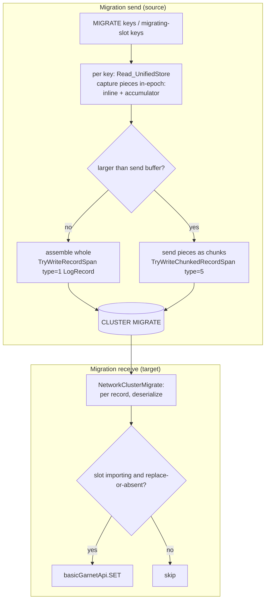
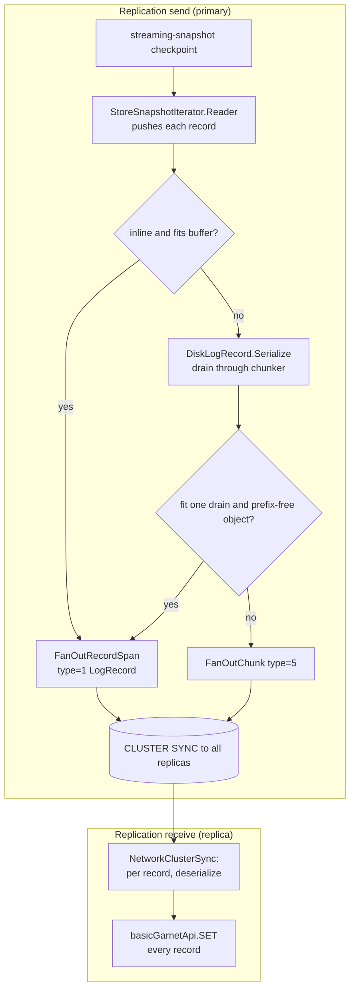
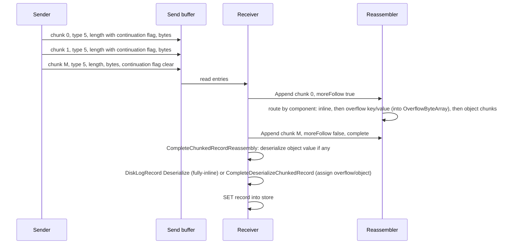

# Migration / Replication record layout

This document describes the on-the-wire byte layout of the records that cluster **key migration** and **replication**
ship in the send buffer, in both the **non-chunked** (whole record in one buffer) and **chunked** (record too large for
one buffer) forms.

> **Keep this document in sync with the code.** If any of the following change, update the layouts and diagrams below:
> - `libs/storage/Tsavorite/cs/src/core/Allocator/DiskLogRecord.cs` — `Serialize` / `Deserialize`, the chunked helpers
>   (`GetChunkedRecordInlineSize`, `CompleteDeserializeChunkedRecord`), and `SerializeInlinePortionForMigration`.
> - `libs/storage/Tsavorite/cs/src/core/Allocator/RecordDataHeader.cs` — the record data header (indicator word).
> - `libs/client/ClientSession/GarnetClientSessionIncremental.cs` — `MigrationRecordSpanType`, `TryWriteRecordSpan`,
>   `TryWriteChunkedRecordSpan`, and the send-buffer framing.
> - `libs/cluster/Session/ChunkedRecordReassembler.cs` — the receive-side reassembler.
> - `libs/cluster/Session/RespClusterMigrateCommands.cs` / `RespClusterReplicationCommands.cs` — the receive paths
>   (`NetworkClusterMigrate` / `NetworkClusterSync`, `CompleteChunkedRecordReassembly`).
> - `libs/server/MigrationChunkWriterAccumulator.cs` / `libs/server/Storage/Functions/UnifiedStore/ReadMethods.cs` — migration's
>   in-epoch capture (`HandleMigrate` fills the accumulator + inline portion).
> - `libs/cluster/Server/Migration/MigrateSessionCommonUtils.cs` — migration send (per-key `Read_UnifiedStore`, assemble the
>   captured pieces, `WriteOrSend*RecordAsync`).
> - `libs/cluster/Server/Replication/PrimaryOps/DisklessReplication/ReplicationSnapshotIterator.cs` — replication send (`StoreSnapshotIterator.Reader` / `WriteRecord` / fan-out).
> - `libs/storage/Tsavorite/cs/src/core/Allocator/ObjectSerialization/ChunkedRecordConstants.cs` — the continuation flag.

---

## 1. Overview

Both migration and replication ship store records over the network as serialized `DiskLogRecord` images in a **send
buffer** that is flushed to the target, which deserializes each record back into the store. The two mechanisms differ in
how records are produced and applied (see [§5](#5-send-and-receive-flows)): **migration** retrieves the specific keys
being moved (a read per key) and the target applies them conditionally as commands; **replication** streams the whole
store through a snapshot iterator and the replica inserts every record.

- A record whose serialized size fits within `NetworkBufferSettings.maxSendBufferContentSize` is written whole, as a
  single **non-chunked** `LogRecord` entry ([§3](#3-non-chunked-record-logrecord-tag-1)).
- A larger record is split into a sequence of **chunk** entries (`ChunkedLogRecord`) that the receiver reassembles
  before deserializing ([§4](#4-chunked-record-chunkedlogrecord-tag-5)). Because the chunks are reassembled as a `ReadOnlySequence<byte>` (not one contiguous
  array), an object value may exceed 2 GB.

> This is a serialized `DiskLogRecord` **record image**, distinct from the AOF's operation image. For the AOF format
> see the companion doc, [AOF / TsavoriteLog record layout](./aof-record-layout.md). The two paths share only the chunk
> **continuation flag** (`ChunkedRecordConstants.ContinuationFlag`).

---

## 2. Send-buffer framing

The migrate/replica iteration buffer is a single RESP bulk string whose payload is a count-prefixed run of entries
(`GarnetClientSession.SendAndResetIterationBuffer`):

```
+------------------+----------------------+-----------------------------+------+
| $<len>\r\n       | recordCount (i32)    | entry, entry, entry, ...    | \r\n |
+------------------+----------------------+-----------------------------+------+
```

Each **entry** begins with a one-byte `MigrationRecordSpanType` tag:

| Tag | Value | Payload |
|---|---|---|
| `Invalid` | 0 | — |
| `LogRecord` | 1 | A whole serialized `DiskLogRecord` ([§3](#3-non-chunked-record-logrecord-tag-1)) |
| `VectorSetElement` | 2 | Bespoke vector-set element encoding (out of scope here) |
| `VectorSetIndex` | 3 | Bespoke vector-set index encoding (out of scope here) |
| `SerializedRangeIndexStream` | 4 | Chunked RangeIndex stream (out of scope here) |
| `ChunkedLogRecord` | 5 | One chunk of a serialized `DiskLogRecord` too large for one buffer ([§4](#4-chunked-record-chunkedlogrecord-tag-5)) |

This doc covers `LogRecord` (1) and `ChunkedLogRecord` (5). Vector-set and RangeIndex encodings are handled separately.

---

## 3. Non-chunked record: `LogRecord` (tag 1)

`GarnetClientSession.TryWriteRecordSpan` writes the whole record:

```
+--------+---------------------------------------------+
| type=1 |  serialized DiskLogRecord (§3.1)            |
+--------+---------------------------------------------+
```

### 3.1 Serialized `DiskLogRecord` layout

The whole record is one contiguous image: an **inline portion** followed by any **overflow key**, then any **overflow
value** or **object value** (`DiskLogRecord.Serialize` / `Deserialize`). Each overflow key/value is preceded by its full
length as a **4-byte little-endian prefix** so `Deserialize` can locate it (the same contiguous layout the chunked form
uses). An **object value** is the tail of the image (**no length prefix**) and its length is derived on read as
`recordSpan.Length - objectValueStart`, so a small object deserializes directly from the buffer. The inline portion's RDH
`KeyLength`/`ValueLength` raw fields are left exactly as the source record had them and are never rewritten on the wire. A record is sent whole only when it fits one send buffer; a larger record (including a large object) takes the
chunked path ([§4](#4-chunked-record-chunkedlogrecord-tag-5)).

```
+=====================================================================+
| INLINE PORTION                                                      |
+----------------+----------------+----------------+------------------+
| RecordInfo     | RecordDataHdr  | ExtendedNamesp.| inline Key       |
| (8 B)          | (8 B, §3.2)    | (0..N B)       | (0..N B)*        |
+----------------+----------------+----------------+------------------+
| inline Value   | optionals: ETag (8 B if present), Expiration       |
| (0..N B)*      | (8 B if present), ObjectLogPosition, ...           |
+----------------+----------------------------------------------------+
| int keyLen (4 B) + OVERFLOW KEY data    (only if the key is Overflow)|
+---------------------------------------------------------------------+
| int valueLen (4 B) + OVERFLOW VALUE data (only if value is Overflow) |
|   -- or -- OBJECT VALUE bytes (no length prefix, only if Object)     |
+=====================================================================+

* For an overflow key/value or object value, the inline slot holds a 4-byte objectId placeholder
  (restored on read); the actual bytes live in the overflow-key / overflow-value / object tail. An
  overflow key/value is preceded by its 4-byte little-endian length; an object value has no prefix.
```

`FixedHeaderSize = RecordInfo.Size (8) + RecordDataHeader.Size (8) = 16`. The inline size is
`FixedHeaderSize + ExtendedNamespaceLength + KeyLength + ValueLength + OptionalSize`, rounded up to
`kRecordAlignment`.

### 3.2 `RecordDataHeader` (indicator word) — 8 B

A single 8-byte word (atomically published) that fully defines the record's layout (`RecordDataHeader.cs`):

```
bit(s)   field
 0       KeyIsInline
 1       ValueIsInline
 2       ValueIsObject
 3       HasExpiration
 4       HasETag
 5       (reserved)
 6..13   FillerWords          (count of 8-byte filler words after alignment padding)
 14..23  KeyLength            (raw inline key length; = objectId size for an overflow key; never rewritten on the wire)
 24..47  ValueLength          (raw inline value length; = objectId size for overflow/object; never rewritten on the wire)
 48..55  RecordType           (byte, caller-interpreted)
 56..63  Namespace            (byte; encodes whether extra namespace bytes precede the key data)
```

The receiver reads these bits to know whether the key/value are inline, overflow, or (for the value) an object, and
therefore how to interpret the tail.

---

## 4. Chunked record: `ChunkedLogRecord` (tag 5)

A record too large for one send buffer — a large inline record, an overflow key/value, or a large object value — is streamed
as a sequence of chunk entries. Replication drives this through `DiskLogRecord.Serialize` (a reused network-mode
`ChunkedObjectSerializer`); migration assembles the captured pieces and sends them via
`MigrateSession.WriteOrSendAccumulatedRecordAsync`. Either way each chunk is framed by
`GarnetClientSession.TryWriteChunkedRecordSpan`:

```
each chunk entry:
+--------+------------------------------+---------------------+
| type=5 | i32 chunkLength | cont-flag  |  chunk bytes        |
+--------+------------------------------+---------------------+
          bit 31 = ChunkedRecordConstants.ContinuationFlag
                   (1 = more chunks of this record follow; clear on the last chunk)
          bits 30..0 = this chunk's data length
```

The chunk boundaries are arbitrary send-buffer cut points (not record-structure boundaries), and the chunks of one
record may span multiple send buffers / commands. The **concatenation of all chunk bytes** of a record is the serialized
stream:

```
+=====================+===========+==============+=============+================+==================================+
| INLINE PORTION      | int keyLen| overflow key | int valueLen| overflow value | -- or -- object value (streamed) |
| (RDH, §3.2)         | (4 B)     | (keyLen B)   | (4 B)       | (valueLen B)   |    (no length prefix)            |
+=====================+===========+==============+=============+================+==================================+
   always present        only if key is Overflow      only if value is Overflow    only if value is Object
```

- The inline portion is the same [§3.1](#31-serialized-disklogrecord-layout) inline bytes (RDH indicator bits tell the
  receiver which out-of-line components follow).
- Each overflow key/value is preceded by its **full length as a 4-byte little-endian prefix**, so the receiver can
  allocate the overflow buffer up front and populate it directly. Overflow key/value are `byte[]`-bounded (≤ 512 MB), so
  an `int` prefix suffices.
- An **object value** has **no length prefix** — it is streamed and its length is derived on receive (it may exceed
  2 GB, the max length of one `byte[]`).

### 4.1 Object value length

An object value's serialized length is not known when the inline portion is emitted, so no length is written for it (on
the wire or in the RDH). The receiver derives it as the **sum of the accumulated object-value chunk lengths**
(`ChunkedRecordReassembler.objectValueLength`) and streams those chunks to the object deserializer; no length is written
back into the record's RDH.

### 4.2 Reassembly and &gt;2 GB support

`ChunkedRecordReassembler` routes the incoming chunk bytes by component using a small state machine. The inline size comes
from `DiskLogRecord.GetChunkedRecordInlineSize`; the component kinds are read on demand from the record's data header (the
`RecordDataHeader` at the start of the accumulated inline buffer):

- **Inline portion:** accumulated contiguously into `ChunkedRecordReassembler.inlineBuffer`; once the fixed header
  (`FixedHeaderSize` = 16 B) is present, the layout gives the inline size and which components follow.
- **Overflow key / value:** the 4-byte length prefix is read, a single `OverflowByteArray` is allocated up front, and
  each incoming chunk is copied **straight into it** (no intermediate list) — populating
  `ChunkedRecordReassembler.keyOverflow` / `valueOverflow`.
- **Object value:** accumulated as a chunk list (`ChunkedRecordReassembler.objectValueChunks`, `List<byte[]>`) and
  exposed as a `ReadOnlySequence<byte>` for streaming deserialize — so it may exceed 2 GB.
- **Fully-inline record:** the whole record is the contiguous inline buffer.

On completion:

- **Fully-inline record** → `DiskLogRecord.Deserialize(inlineBuffer)`.
- **Any out-of-line component** → deserialize the object value (if any) from its sequence, then
  `DiskLogRecord.CompleteDeserializeChunkedRecord(header, keyOverflow, valueOverflow, valueObject)`,
  which **assigns** the pre-populated overflow key/value directly (no re-allocation or copy). The RDH length fields are
  left untouched (the out-of-line lengths rode in the 4-byte wire prefixes, which the receiver already consumed).

## 5. Send and receive flows

Both mechanisms use the record layout above (a whole `LogRecord`, or a stream of `ChunkedLogRecord` chunks), but they
**produce** and **apply** records differently: **migration** retrieves the individual keys being moved and applies them
conditionally as commands; **replication** streams the whole store through a snapshot iterator and inserts every record.

### 5.1 Migration

The source retrieves each key being migrated and captures its pieces **in-epoch** (`HandleMigrate` → a
`MigrationChunkWriterAccumulator`): the inline portion is copied into `output.SpanByteAndMemory`, while the
overflow key (a **shallow reference** — store keys are immutable), the overflow value (a **deep copy** — the store value
may be mutated once the epoch is released), or an object value (serialized into a **chunk list**, so it may exceed 2 GB)
go into the accumulator. Out of epoch the caller assembles `[inline][int keyLen][overflow key][int valueLen][overflow value | object chunks]`
(each overflow key/value preceded by its 4-byte length) and
sends it under a `CLUSTER MIGRATE` command — whole (`LogRecord`) if the record fits a send buffer, else as
`ChunkedLogRecord` chunks. An object value carries no length prefix; the receiver derives it from the record span (whole
records) or the accumulated chunks (chunked), so a small object is sent whole and deserialized directly from the buffer,
while a large object chunks. This in-epoch capture / out-of-epoch send is required
because migration sends **asynchronously** and the store epoch must never be held across an `await` (unlike replication,
which sends synchronously via `BlockingWait` and can stream a record to the network in-epoch). The target applies each
record only if its slot is importing and the key may be written (`replace` set, or the key is absent).



Migration also carries `VectorSetElement` / `VectorSetIndex` / `SerializedRangeIndexStream` record kinds (out of scope
here); this doc covers only the `LogRecord` / `ChunkedLogRecord` kinds.

### 5.2 Replication

Diskless replica sync takes a streaming-snapshot checkpoint whose `StoreSnapshotIterator.Reader` pushes every store
record to `WriteRecord`, which fans each record out to all attached replica sessions in lockstep under `CLUSTER SYNC`.
The replica inserts every record unconditionally. A record that fits one send buffer is sent whole (`LogRecord`): a
fully-inline record directly, and a **prefix-free object record** (inline key + object value) via the chunker's `Consume`
when it drains in one piece (the chunker's ring buffers up to one send buffer, so an object that completes in the first
drain fit) — so small objects deserialize directly on the replica. Anything larger streams as `ChunkedLogRecord` chunks.



### 5.3 Chunked transfer over the wire (shared)

The chunk framing and reassembly are identical for both mechanisms (only the final apply differs — conditional SET for
migration, unconditional SET for replication). A record too large for one send buffer is streamed as `ChunkedLogRecord`
chunks and routed by component in `ChunkedRecordReassembler` before deserialize:



### 5.4 Allocation and copy accounting (reviewer reference)

This subsection enumerates every buffer allocation and byte copy on the record paths and justifies each, for a
review focused on minimizing allocations and copies. Three constraints drive the accounting:

1. **Migration serializes in-epoch but sends out of epoch** (it sends asynchronously, and the store epoch must never be
   held across an `await`). Bytes that must outlive the epoch are copied into detached memory before the send; a
   migrating key is not locked, so its value may change concurrently.
2. **Replication sends synchronously in-epoch** (it flushes via `BlockingWait` and never awaits), so it can stream a
   record straight from the record's native log memory into the send buffer, with no per-record heap copy.
3. **An overflow key/value has a known length** and lands in a single owned buffer, while **an object value has an
   unknown, possibly larger-than-2 GB length** and is held as a list of chunks (`List<byte[]>`), never one array.

**Inline portion - when it is copied.** The inline portion (RecordInfo + RDH + inline key/value + optionals, padded to
`RoundUp(ActualSize)`) is copied only under these conditions:

- **Migration, always** (`DirectCopyInlinePortionOfRecord` into `output.SpanByteAndMemory`, in-epoch). Required because
  the record's native log memory is only valid in-epoch and the send happens after the epoch is released. The copy also
  resets the filler length so the receiver can locate the overflow components at `RoundUp(ActualSize)`. The output buffer
  is reused across keys (heap-backed through `MemoryPool` only when it must outlive the network buffer, e.g. an object
  value).
- **Replication whole-inline fast path** (`DirectCopyInlinePortionOfRecord` into the reused `serializationOutput`).
  Copied once, then fanned to each replica's send buffer. Required to reset the filler and to stage one stable image that
  is copied to all N replica buffers without re-reading the (possibly-evicted) record per replica.
- **Replication chunked path - not separately copied.** `SerializeChunked` emits the inline portion directly from the
  record's native memory (`chunker.WriteBytes` over `physicalAddress`); the only staging is the chunker ring, allocated
  once and reused across all records. A stale filler is harmless because the receiver locates the overflow at
  `RoundUp(ActualSize)`, which is filler-independent. **This is the per-record scratch copy the current design removes** -
  the record was previously copied into a rented `ArrayPool` buffer solely to reset the filler.

In short, the inline portion is copied once when the bytes must outlive the producing epoch (migration) or be fanned
identically to multiple replicas (replication fast path); it is streamed with no extra allocation when a single
synchronous consumer drains it in-epoch (replication chunked path, through the reused ring).

**Chunk accumulation - where and why.** Chunks are accumulated as a `List<byte[]>` in exactly two places, both only for
an **object value**:

- **Migration send** (`MigrationChunkWriterAccumulator.objectValueChunks`). The object is serialized in-epoch through a
  reused 4 MB ring; each drain is copied into an owned chunk. Required because (a) the live object may change once the
  epoch is released, so it must be snapshotted in-epoch, and (b) a serialized object may exceed 2 GB, which a single
  `byte[]` cannot hold. The ring is allocated once per migration (reused across keys); only the per-object chunk arrays
  are per-record. An **overflow value** on this path is instead a single deep-copy array (`SetValueOverflowDeepCopy`),
  and an **overflow key** is a shallow reference to the store's immutable array (no copy).
- **Receive** (`ChunkedRecordReassembler.objectValueChunks`). Each arriving object chunk is copied once from the
  transient network buffer into an owned array, because the object length is not known up front (no single array can be
  pre-sized) and may exceed 2 GB. The chunks are wrapped as a `ReadOnlySequence<byte>` (no further copy) and streamed to
  the object deserializer.

Everything else avoids accumulation. On **receive**, an overflow key/value is a single up-front `OverflowByteArray`
(sized from its 4-byte length prefix) that chunk bytes are copied **directly** into (`FillOverflow`), never staged in an
intermediate buffer; `CompleteDeserializeChunkedRecord` then assigns it to the record with no re-copy. **Replication send
never accumulates** - it streams synchronously in-epoch through the shared reused ring, so an object value is never
materialized whole on the sender.

**Copies at a glance.**

| Path | Component | Per-record allocation | Copies of the bytes | Why not direct |
|------|-----------|-----------------------|---------------------|----------------|
| Migration send | inline portion | reused output buffer | 1 to detach (+1 more if assembled whole, below) | native memory invalid after epoch release |
| Migration send | overflow key | none | 0 (shallow ref) | store keys are immutable and stable across epoch release |
| Migration send | overflow value | 1 (`ToArray`) | 1 to detach | store value may be mutated after epoch release |
| Migration send | object value | per-object chunks (ring reused per migration) | 1 per drain to detach | must snapshot in-epoch; may exceed 2 GB |
| Migration send | whole-record assembly | reused assemble buffer (grows to high-water) | 1 (pieces into one span) | `TryWriteRecordSpan` needs one contiguous entry |
| Migration send | backpressure retry only | 1 (`span.ToArray`) | 1 | the reused span may not survive the flush `await` |
| Replication send | inline record | reused `serializationOutput` | 1, then 1 per replica | reset filler; fan one stable image to N replicas |
| Replication send | chunked (inline/overflow/object) | none (ring reused) | 1 into ring, then 1 per replica | streaming send; no whole-record materialization |
| Receive | inline portion | reused `inlineBuffer` (grows to high-water) | 1 (chunks into one span) | header/inline may split across chunks; must be contiguous to read the layout |
| Receive | overflow key/value | 1 `OverflowByteArray` each | 1 (chunk into final buffer) | store-owned; the network receive buffer is transient/reused |
| Receive | object value | per-object chunks | 1 per chunk | length unknown up front; may exceed 2 GB; then wrapped as `ReadOnlySequence` (no copy) |

Every copy that remains after the table above is the unavoidable transfer into or out of the transient network
send/receive buffer.

**One extra copy, called out.** On the migration path only, a **non-inline record that fits one send buffer** is
assembled into one contiguous `LogRecord` entry, so its already-detached pieces (inline portion, overflow value or object
chunks) are copied once more into `sendAssembleBuffer` before the send. This is the price of emitting a single type-1
entry from non-contiguous captured pieces; the alternative (chunking a buffer-sized record) would trade this copy for a
multi-chunk reassembly on the receiver. The extra copy is bounded by the send-buffer size and does not apply to a
fully-inline record (sent straight from `output.SpanByteAndMemory`) or to the replication paths.

---

## 6. Call sequence (code paths)

Indentation = call depth; a multi-step flow may sit on one line (`a → b → c`), and *italic* sub-items are terse notes.
Migration and replication differ on write; they share the receive path. The record's components — **inline portion**,
**overflow key**, **overflow value**, **object value** — are called out throughout.

**Migration write** — retrieve each key from the store and send it (in-epoch capture → out-of-epoch send):

- `MigrateSession.TransmitKeysAsync()`
  - *`MigrateOperation.cs`; iterate the keys being migrated*
  - `WriteOrSendRecordAsync(key)`
    - *`MigrateSessionCommonUtils.cs`*
    - `BasicGarnetApi.Read_UnifiedStore(key)` → `HandleMigrate(srcLogRecord)`
      - *`UnifiedStore/ReadMethods.cs`; capture the record's pieces in-epoch (a migrating key is not locked, so its value may change concurrently)*
      - `DiskLogRecord.SerializeInlinePortionForMigration()`
        - *inline portion → `output.SpanByteAndMemory`; copy only; overflow key/value lengths are added as 4-byte prefixes by the sender out of epoch*
      - `acc.SetKeyOverflow(KeyOverflow)`
        - *overflow key → shallow ref (store keys are immutable); populates `MigrationChunkWriterAccumulator.keyOverflow`*
      - `acc.SetValueOverflowDeepCopy(ValueOverflow)`
        - *overflow value → deep copy (the value may change once the epoch is released); populates `MigrationChunkWriterAccumulator.valueOverflow`*
      - `acc.SerializeObjectValue(ValueObject)` → `ChunkedObjectSerializer` → `acc.Consume(first, second)`
        - *object value → serialized chunks; populates `MigrationChunkWriterAccumulator.objectValueChunks` (`List<byte[]>`, supports values over 2 GB). The serializer is reused across records, so its ring is allocated once per migration, not per object*
    - `WriteOrSendAccumulatedRecordAsync(inline, acc)`
      - *out of epoch: assemble the captured pieces and send*
      - `gcs.TryWriteRecordSpan(record, LogRecord)`
        - *fits one buffer → whole record (type 1); assemble `[inline][int keyLen][overflow key][int valueLen][overflow value | object bytes]` contiguously (each overflow key/value preceded by its 4-byte length; an object value is the tail, length derived on read from the record span)*
      - `gcs.TryWriteChunkedRecordSpan(chunk, moreFollow)`
        - *too large for one buffer → chunks (type 5): stream `[inline][int keyLen][overflow key][int valueLen][overflow value | object chunks]`, continuation until the last byte → **send buffer** → `CLUSTER MIGRATE`*

**Replication write** — stream a store snapshot to the replica(s) (in-epoch, synchronous send):

- `ReplicationSyncManager` → `StoreSnapshotIterator.Reader(srcLogRecord)` → `SnapshotIteratorManager.WriteRecord(srcLogRecord)`
  - *`ReplicationSnapshotIterator.cs`; a streaming-snapshot checkpoint pushes each record*
  - `DiskLogRecord.DirectCopyInlinePortionOfRecord()` → `FanOutRecordSpan(LogRecord)`
    - *inline record → whole (type 1), fanned to all replicas in lockstep*
  - `DiskLogRecord.Serialize(srcLogRecord, serializer, chunker)` → `SnapshotIteratorManager.Consume(...)`
    - *`DiskLogRecord.cs`; non-inline → stream through the chunker (epoch held; replication flushes synchronously via `BlockingWait`, so it may stream in-epoch)*
    - *writes the inline portion, then (each preceded by its 4-byte length) the **overflow key** and **overflow value** — or streams the **object value** (no prefix) — into the chunk stream; the carrier is the streamed netbuffer chunk (no accumulator)*
    - `Consume`: `first` drain is `isComplete` and prefix-free object → `FanOutRecordSpan(LogRecord)`
      - *small object (inline key + object value) that fit one drain → whole record (type 1), deserialized directly on the replica*
    - `Consume`: otherwise → `FanOutChunk(chunk, moreFollow)`
      - *too large for one buffer → chunks (type 5), continuation until the last byte → **send buffer** → `CLUSTER SYNC`*

**Receive** (migration + replication) — read records from the buffer and write them to the store:

- `NetworkClusterMigrate()` / `NetworkClusterSync()`
  - *`RespClusterMigrateCommands.cs` / `RespClusterReplicationCommands.cs`; per record in the payload*
  - `type == LogRecord` → `DiskLogRecord.Deserialize(recordSpan)`
    - *whole record: inline + any overflow key/value (each preceded by its 4-byte length) or a small object value (length derived from the record span), restored/deserialized directly from the contiguous span*
  - `type == ChunkedLogRecord` → `ChunkedRecordReassembler.Append(chunk, moreFollow)`
    - *route bytes by component (may span commands): inline → `inlineBuffer`; overflow key/value → a single `OverflowByteArray` (`keyOverflow`/`valueOverflow`) populated directly from the chunks; object value → `objectValueChunks` (`List<byte[]>`)*
    - `CompleteChunkedRecordReassembly(headerPtr)`
      - *component kinds read from the record header in `inlineBuffer`; a fully-inline record → `DiskLogRecord.Deserialize(inlineBuffer)`*
      - `GarnetObjectSerializer.Deserialize(ObjectValueSequence())` → `DiskLogRecord.CompleteDeserializeChunkedRecord(header, keyOverflow, valueOverflow, valueObject)`
        - *assign the pre-populated overflow key/value directly + the deserialized (over-2 GB-capable) object value; the RDH lengths are left untouched (the 4-byte wire prefixes were already consumed)*
  - `basicGarnetApi.SET(diskLogRecord)`
    - *→ **store** (migrate: only if the slot is importing and `replace`-or-absent; replication: unconditional)*
