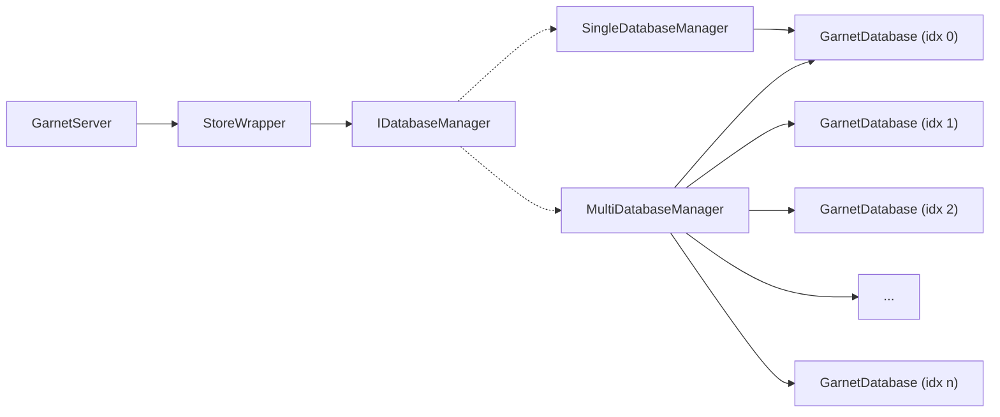

## Overview

Garnet supports multiple logical databases in a single server instance. This feature is made available *only when cluster mode is turned off* (by default cluster mode is turned off).\
The number of allowed logical databases in a server instance can be altered by changing the `MaxDatabases` configuration option (either in your `garnet.conf` file, or via the command line with `--max-databases`). By default, `MaxDatabases` is set to **16**.

New clients will always connect to the default database (of index **0**). To switch database context, you can use the [SELECT](../commands/generic-commands.md#select) command.

## Design

Each logical database in Garnet is represented by a `GarnetDatabase` instance. Each such instance holds a reference to the database stores, AOF device as well as other database-specific data.\
When the Garnet server instance is created, `StoreWrapper` instantiates a server-wide `IDatabaseManager`, which by default is a `SingleDatabaseManager` that that holds the default database.\
The `IDatabaseManager` can be later upgraded to a `MultipleDatabaseManager`, if a non-zero database index is selected.\
`StoreWrapper` in turn calls the `IDatabaseManager` to perform actions as checkpointing, AOF commits etc., which at each different implementation of `IDatabaseManager` will handle those in either a single-database or multiple-database context.

Each `RespServerSession` manages a map of `GarnetDatabaseSession` instances, which represent per-database session data. Each `GarnetDatabaseSession` holds an instance of `StorageSession` as well as `GarnetApi` instances and a `TransactionManager` instance.\
Whenever a client chooses to interact with a database it hasn't interacted with before (using `SELECT`, for instance), a new `GarnetDatabaseSession` will be created.\
Each time the client calls `SELECT`, the `RespServerSession` would switch its context based on the appropriate `GarnetDatabaseSession` instance.

## Checkpointing, AOF & Recovery

Each database's store data will be separately stored on its own directory. Checkpoints are stored in `CheckpointDir` defined in the confguration (and if not specified defaults to `LogDir`). Each store checkpoint data will then be stored in `Store/checkpoints` and `ObjectStore/checkpoints` respectively for the default database or in `Store/checkpoints_i` and `ObjectStore/checkpoints_i` for database of index `i`.\
Similarly, AOF data will be stored in the same  `CheckpointDir` (and if not specified defaults to `LogDir`). Each database AOF data will be stored in `AOF` for the default database or in `AOF_i` for database of index `i`.

Upon recovery, Garnet will extract the indexes of the saved databases from the aforementioned directory name pattern and recover any saved data matching the database index.