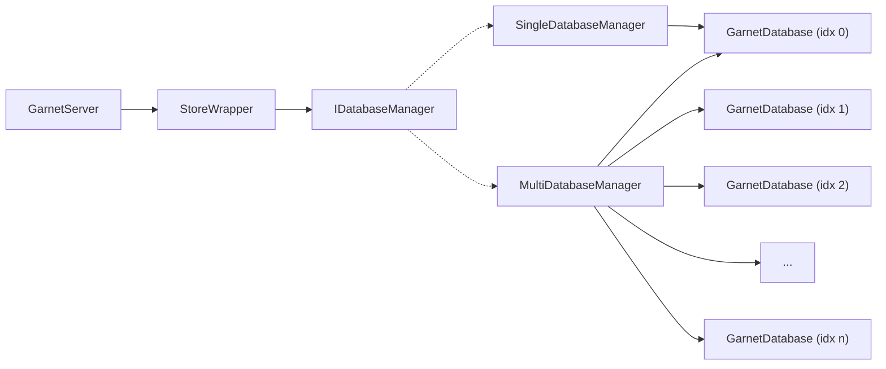

## Overview

Garnet supports multiple logical databases in a single server instance. This feature is made available *only when cluster mode is turned off* (by default cluster mode is turned off).\
The number of allowed logical databases in a server instance can be altered by changing the `MaxDatabases` configuration option (either in your `garnet.conf` file, or via the command line with `--max-databases`). By default, `MaxDatabases` is set to **16**.

New clients will always connect to the default database (of index **0**). To switch database context, you can use the [SELECT](../commands/generic-commands.md#select) command.

## Design

Each logical database in Garnet is represented by a `GarnetDatabase` instance. Each such instance holds a reference to the database stores, AOF device as well as other database-specific data.\
When the Garnet server instance is created, `StoreWrapper` instantiates a server-wide `IDatabaseManager`, which by default is a `SingleDatabaseManager` that that holds the default database.\
The `IDatabaseManager` can be later upgraded to a `MultiDatabaseManager`, if a non-zero database index is selected.\
`StoreWrapper` in turn calls the `IDatabaseManager` to perform actions as checkpointing, AOF commits etc., which at each different implementation of `IDatabaseManager` will handle those in either a single-database or multiple-database context.

Each `RespServerSession` manages a map of `GarnetDatabaseSession` instances, which represent per-database session data. Each `GarnetDatabaseSession` holds an instance of `StorageSession` as well as `GarnetApi` instances and a `TransactionManager` instance.\
Whenever a client chooses to interact with a database it hasn't interacted with before (using `SELECT`, for instance), a new `GarnetDatabaseSession` will be created.\
Each time the client calls `SELECT`, the `RespServerSession` would switch its context based on the appropriate `GarnetDatabaseSession` instance.


```mermaid
flowchart LR
    accTitle: Multi Database Design
    accDescr: Garnet's multi database design
    srv[GarnetServer]
    sw[StoreWrapper]
    idbm[IDatabaseManager]
    sdbm[SingleDatabaseManager]
    mdbm[MultiDatabaseManager]
    db0["GarnetDatabase (idx 0)"]
    db1["GarnetDatabase (idx 1)"]
    db2["GarnetDatabase (idx 2)"]
    db3["..."]
    dbn["GarnetDatabase (idx n)"]
    srv --> sw
    sw --> idbm
    idbm -.-> sdbm
    idbm -.-> mdbm
    sdbm --> db0
    mdbm --> db0
    mdbm --> db1
    mdbm --> db2
    mdbm --> db3
    mdbm --> dbn
```

## Storage Layout

A server instance keeps three kinds of on-disk state, each rooted at a different configured directory:

| State | Root option | Root when unspecified |
| --- | --- | --- |
| Hybrid log — tiered records, written only when `EnableStorageTier` (`--storage-tier`) is on | `LogDir` (`-l`, `--logdir`) | current directory |
| Checkpoints | `CheckpointDir` (`-c`, `--checkpointdir`) | `LogDir` |
| AOF | `CheckpointDir` (`-c`, `--checkpointdir`) | current directory |

Checkpoint, AOF and hybrid log paths are all per-database: the default database (index `0`) uses the unsuffixed name, and the database of index `i` uses the same name with an `_i` suffix.

The tree below is the layout for a server started with `--storage-tier --logdir <LogDir> --checkpointdir <CheckpointDir> --aof`, with databases `0` and `2` in use:

```text
<LogDir>/
└── Store/
    ├── hlog.0, hlog.1, ...                 database 0 main-log segments
    ├── hlog_objs.0, hlog_objs.1, ...       database 0 object-log segments
    ├── hlog_2.0, hlog_2.1, ...             database 2 main-log segments
    ├── hlog_objs_2.0, hlog_objs_2.1, ...   database 2 object-log segments
    ├── rangeindex/                         database 0 RangeIndex files (preview)
    └── rangeindex_2/                       database 2 RangeIndex files (preview)

<CheckpointDir>/
├── Store/
│   ├── checkpoints/                    database 0
│   │   ├── index-checkpoints/<token>/  info.dat, ht.dat
│   │   └── cpr-checkpoints/<token>/    info.dat, snapshot.dat, snapshot.obj.dat
│   │                                   (and rangeindex/ when the preview is enabled)
│   └── checkpoints_2/                  database 2, same structure
├── AOF/                                database 0
│   ├── aof.log.0, aof.log.1, ...
│   └── log-commits/commit.<n>.0
└── AOF_2/                              database 2, same structure
```

When `CheckpointDir` is not specified it defaults to `LogDir`, so a single `Store/` directory holds both the hybrid log segments and the `checkpoints[_i]/` directories.

Every name above is a logical device name; the device layer appends a segment index, so `hlog` is stored as `hlog.0`, `hlog.1`, … and `info.dat` as `info.dat.0`.

All of a database's file names are fixed when its store is created. [SWAPDB](../commands/server.md#swapdb) exchanges the logical index of two databases but does not move their files, so it is not durable: recovery reconstructs each database's index from the directory names and undoes the swap.

:::caution
Databases did not always have their own log devices. A store checkpointed by an earlier release wrote every database into one shared `Store/hlog` and `Store/hlog_objs` pair, whose contents cannot be attributed to a single database (see [issue #2152](https://github.com/microsoft/garnet/issues/2152)). Recovering such a store reports the condition for each database other than the default, and any records those databases had tiered to storage are lost. The default database is unaffected — it keeps the unsuffixed file names and recovers unchanged.
:::

## Checkpointing, AOF & Recovery

Upon recovery, Garnet will extract the indexes of the saved databases from the aforementioned directory name pattern and recover any saved data matching the database index.