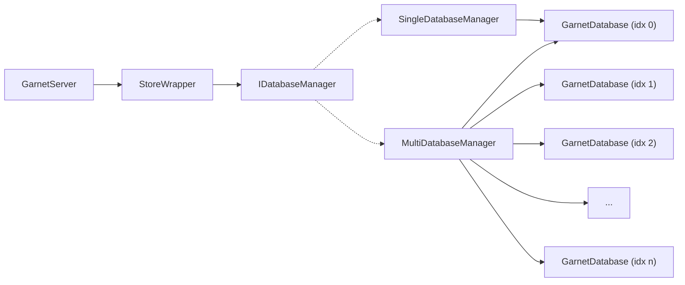

## Overview

Garnet supports multiple logical databases in a single server instance. This feature is made available *only when cluster mode is turned off* (by default cluster mode is turned off).\
The number of allowed logical databases in a server instance can be altered by changing the `MaxDatabases` configuration option (either in your `garnet.conf` file, or via the command line with `--max-databases`). By default, `MaxDatabases` is set to **16**.

New clients will always connect to the **default database**, the database whose ID is **0**. To switch database context, you can use the [SELECT](../commands/generic-commands.md#select) command. The default database is defined by that ID rather than by a particular store — [SWAPDB](../commands/server.md#swapdb) can put a different store at ID 0, and new clients then connect to that one; see [Database IDs and storage slots](#database-ids-and-storage-slots).

## Design

Each logical database in Garnet is represented by a `GarnetDatabase` instance. Each such instance holds a reference to the database stores, AOF device as well as other database-specific data.\
When the Garnet server instance is created, `StoreWrapper` instantiates a server-wide `IDatabaseManager`, which by default is a `SingleDatabaseManager` that that holds the default database.\
The `IDatabaseManager` can be later upgraded to a `MultiDatabaseManager`, if a non-zero database ID is selected.\
`StoreWrapper` in turn calls the `IDatabaseManager` to perform actions as checkpointing, AOF commits etc., which at each different implementation of `IDatabaseManager` will handle those in either a single-database or multiple-database context.

Each `RespServerSession` manages a map of `GarnetDatabaseSession` instances, which represent per-database session data. Each `GarnetDatabaseSession` holds an instance of `StorageSession` as well as `GarnetApi` instances and a `TransactionManager` instance.\
Whenever a client chooses to interact with a database it hasn't interacted with before (using `SELECT`, for instance), a new `GarnetDatabaseSession` will be created.\
Each time the client calls `SELECT`, the `RespServerSession` would switch its context based on the appropriate `GarnetDatabaseSession` instance.


```mermaid
flowchart LR
    accTitle: Multi Database Design
    accDescr: Garnet's multi database design
    srv[GarnetServer]
    sw[StoreWrapper]
    idbm[IDatabaseManager]
    sdbm[SingleDatabaseManager]
    mdbm[MultiDatabaseManager]
    db0["GarnetDatabase (idx 0)"]
    db1["GarnetDatabase (idx 1)"]
    db2["GarnetDatabase (idx 2)"]
    db3["..."]
    dbn["GarnetDatabase (idx n)"]
    srv --> sw
    sw --> idbm
    idbm -.-> sdbm
    idbm -.-> mdbm
    sdbm --> db0
    mdbm --> db0
    mdbm --> db1
    mdbm --> db2
    mdbm --> db3
    mdbm --> dbn
```

## Storage Layout

A server instance keeps three kinds of on-disk state, each rooted at a different configured directory:

| State | Root option | Root when unspecified |
| --- | --- | --- |
| Hybrid log — tiered records, written only when `EnableStorageTier` (`--storage-tier`) is on | `LogDir` (`-l`, `--logdir`) | current directory |
| Checkpoints | `CheckpointDir` (`-c`, `--checkpointdir`) | `LogDir`, or the current directory if that is also unspecified |
| AOF | `CheckpointDir` (`-c`, `--checkpointdir`) | `LogDir`, or the current directory if that is also unspecified |

Checkpoint, AOF and hybrid log paths are all per-database: the database occupying storage slot `0` uses the unsuffixed name, and the database in slot `i` uses the same name with an `_i` suffix. Slot and database ID are the same number until `SWAPDB` separates them — see [Database IDs and storage slots](#database-ids-and-storage-slots). The default database normally occupies slot `0`, so the unsuffixed names are normally its own.

The tree below is the layout for a server started with `--storage-tier --logdir <LogDir> --checkpointdir <CheckpointDir> --aof`, with databases `0` and `2` in use:

```text
<LogDir>/
└── Store/
    ├── hlog.0, hlog.1, ...                 database 0 main-log segments
    ├── hlog_objs.0, hlog_objs.1, ...       database 0 object-log segments
    ├── hlog_2.0, hlog_2.1, ...             database 2 main-log segments
    ├── hlog_objs_2.0, hlog_objs_2.1, ...   database 2 object-log segments
    ├── rangeindex/                         database 0 RangeIndex files (preview)
    └── rangeindex_2/                       database 2 RangeIndex files (preview)

<CheckpointDir>/
├── Store/
│   ├── checkpoints/                    database 0
│   │   ├── index-checkpoints/<token>/  info.dat, ht.dat
│   │   └── cpr-checkpoints/<token>/    info.dat, snapshot.dat, snapshot.obj.dat
│   │                                   (and rangeindex/ when the preview is enabled)
│   └── checkpoints_2/                  database 2, same structure
├── AOF/                                database 0
│   ├── aof.log.0, aof.log.1, ...
│   └── log-commits/commit.<n>.0
└── AOF_2/                              database 2, same structure
```

When `CheckpointDir` is not specified it defaults to `LogDir`, so a single `Store/` directory holds both the hybrid log segments and the `checkpoints[_i]/` directories.

Every name above is a logical device name; the device layer appends a segment index, so `hlog` is stored as `hlog.0`, `hlog.1`, … and `info.dat` as `info.dat.0`.

All of a database's file names are fixed when its store is created, so a file name records a **storage slot**, not a database ID. The two are equal until [SWAPDB](../commands/server.md#swapdb) exchanges the IDs of two databases, which relabels them without moving any files. The next section describes how the two are kept in step.

:::warning[Previous database versions did not have their own log devices.]
A store checkpointed by an earlier Garnet release wrote every database into one shared `Store/hlog` and `Store/hlog_objs` pair, whose contents cannot be attributed to a single database (see [issue #2152](https://github.com/microsoft/garnet/issues/2152)). Recovering such a store reports the condition and cannot recover any records that databases other than the default had tiered to storage.

The default database is not exempt. It keeps the unsuffixed file names, so recovery finds a log — but in a multi-database store that log is the shared one, and the records in it may have been written by, or overwritten by, another database. Only a store that held a single database is unaffected.
:::

## Database IDs and storage slots

A database has two identities, and `SWAPDB` is what separates them:

| | Database ID | Storage slot |
| --- | --- | --- |
| What it is | The ID a client selects with `SELECT` | The on-disk identity of one store |
| In memory | `GarnetDatabase.Id` | `GarnetDatabase.StorageSlot` |
| Lifetime | Changes on every `SWAPDB` | Fixed when the store is created |
| Determines | The key into the database manager's map | `hlog_i`, `checkpoints_i`, `AOF_i` |

The **default database** is the database whose ID is `0` — the one a new client is connected to before it issues `SELECT`, and the one a single-database server runs with. It is defined by the ID, so it names whichever store currently answers to `0`: after `SWAPDB 0 1` the default database is the store whose files are named for slot `1`, and the store that was the default now answers to ID `1`. In code it is `IDatabaseManager.DefaultDatabase`, which `MultiDatabaseManager` resolves as `databases.Map[0]` on each access rather than caching, for exactly that reason.

`SWAPDB` cannot move files. A store's hybrid log, checkpoint directory and AOF directory are all bound to open devices when the store is created, so renaming them would mean closing and reopening every device and rewriting the checkpoint metadata that names them, on a live server. A swap therefore exchanges only the IDs: `MultiDatabaseManager.TrySwapDatabases` builds a new `GarnetDatabase` around each existing store with the other's `Id`, carrying `StorageSlot` across unchanged. After `SWAPDB 0 1`, the store whose files are named for slot `0` answers to ID `1`.

That divergence has to survive a restart, or recovery would silently hand each client's data to the wrong ID.

### Where each piece lives

| Piece | Where | Notes |
| --- | --- | --- |
| Storage slot | **Not stored as a value** — it *is* the file name | Recovered by scanning `checkpoints_*` directory names (`TryGetSavedDatabaseIds`) |
| Slot → ID mapping | Checkpoint metadata, `cpr-checkpoints/<token>/info.dat` | `HybridLogRecoveryInfo.databaseMapping`, where `databaseMapping[slot] = logicalDatabaseId` |
| Swap epoch | Same metadata record | `HybridLogRecoveryInfo.swapEpoch` |
| A single database's ID | That database's own AOF | `SwapDb` record: epoch plus the one ID, not the whole mapping |
| Current epoch at run time | `MultiDatabaseManager.swapEpoch` | Incremented per swap; on recovery, resumed from the highest value read back |

The slot is never written as a field anywhere. It is recoverable purely because it names the files, which is also why it cannot change: a stored value could be rewritten, a directory full of open device handles cannot.

Both metadata fields are part of checkpoint format **version 8**. A version 7 checkpoint has neither, and reads back as "identity mapping, epoch 0" — which is exactly how a store that never swapped behaves.

### Writing the mapping

The mapping is not pushed into Tsavorite on each swap. Instead `MultiDatabaseManager` registers a callback once per store, via `ICheckpointManager.SetDatabaseMappingProvider`, and Tsavorite *queries* it while a checkpoint runs (`Checkpoint.WriteHybridLogMetaInfo`, alongside the existing cookie hook). A checkpoint therefore always records the mapping in force at the moment it ran, with no window in which the two disagree.

Two consequences:

- **Every database's checkpoint carries the whole mapping**, so the most recent checkpoint describes the entire permutation on its own. This matters because databases are checkpointed individually: after a swap followed by a partial checkpoint, two databases would otherwise both claim the same ID.
- **A server that never swaps records nothing.** The provider returns `null` while the mapping is still the identity, so its checkpoints stay byte-identical to those a build without this feature would write.

The epoch is what makes "most recent" well defined. Because checkpoints are per database, timestamps and file order cannot be trusted to rank them; the monotonic epoch can.

## Checkpointing, AOF & Recovery

Upon recovery, Garnet extracts the storage slots of the saved databases from the aforementioned directory name pattern, and recovers the data saved under each slot. Each database then has to be given back the ID it carried, which is the only thing a swap changed. That ID is recorded in two places — the checkpoints and the AOFs — so recovery relabels in two passes.

Steps 3 to 5 below run only when AOF is enabled. Without `--aof`, a swap performed after the last checkpoint is not recorded anywhere, and those databases recover under the IDs they had when the checkpoint was taken. With `--aof` that gap is closed, which matters because a server may checkpoint rarely or never, so "after the last checkpoint" is the common case rather than an edge.

### Recovery sequence

Driven by `StoreWrapper.RecoverAsync`:

| # | Step | Where |
| --- | --- | --- |
| 1 | Discover the storage slots on disk and recover each store under its own slot, collecting the `(mapping, swapEpoch)` each checkpoint carried. The highest epoch wins. | `MultiDatabaseManager.RecoverCheckpointAsync` |
| 2 | **Relabel, pass 1.** Apply that mapping, so every database carries the ID it had when the winning checkpoint ran. `swapEpoch` is advanced to the epoch just applied. | `ResolveLogicalDatabaseIds` → `ApplyDatabaseMapping` |
| 3 | Load each database's AOF from disk. | `RecoverAOFAsync` |
| 4 | Replay the AOFs, one database at a time. Before each log, the processor binds itself to that log's database, recording both its database ID (`activeDbId`) and its storage slot (`activeStorageSlot`). | `ReplayAOF` → `ReplayDatabaseAOF` → `AofProcessor.SwitchActiveDatabaseContext` |
| 5 | **Relabel, pass 2.** Overlay the IDs the logs carried onto the result of pass 1, and relabel once. | `ApplyReplayedDatabaseLabels` |

Step 4 is where the two database-scoped record types are handled, and they are handled differently:

| Record | Written when | During replay (step 4) |
| --- | --- | --- |
| `FlushDb` | `FLUSHDB`, and once per database for `FLUSHALL` | **Applied immediately**, to the bound database |
| `SwapDb` | `SWAPDB`, into every active database's AOF | **Collected, never applied**, into `AofProcessor.ReplayedDatabaseLabels` |

A flush changes a database's *contents*, so its position among the surrounding key records is significant — records written after it must survive it — and it has to be applied in stream order. A swap changes only a database's *ID*. Applying one mid-stream would move the store out from under the replay context currently walking that log, and it would buy nothing: the remaining records in the log belong to the store, not to the ID, so they replay identically either way.

`ReplayedDatabaseLabels` is therefore a pure accumulator, keyed by storage slot and keeping the highest epoch seen for each. It is read once, in step 5, after every log has been replayed.

### Scoping to the log

Both record types are scoped to the log they are written into rather than naming a database ID. An ID recorded *inside* a record names whichever database answers to it at recovery time, which after a swap is a different store; the log that *contains* the record always belongs to the same store.

`FLUSHALL` therefore writes one `FlushDb` record into each database's own log instead of a single flush-all record. Replaying one database's log can then never flush another, including one whose log has already been replayed.

`SwapDb` records carry the ID its own database took, rather than the whole mapping. Every active database is written on every swap, so a log truncated by an intervening flush regains its ID at the next one.

### Combining the two passes

Pass 2 overlays per storage slot rather than wholesale. A slot whose log carried no `SwapDb` record — because it was truncated by a flush, or never written — keeps the ID pass 1 gave it, instead of falling back to the ID matching its slot. Only slots whose logged epoch beats the epoch already applied in pass 1 contribute, so an AOF that is older than the checkpoint cannot undo it. If no log carries a newer epoch, pass 2 does nothing.

Both passes apply a mapping whole or not at all, through the same permutation check. If a mapping is not a valid permutation of the configured ID range — for example because `MaxDatabases` was lowered since it was written — it is rejected, the condition is logged, and the databases keep the IDs they already had: the ID matching their storage slot in pass 1, or the checkpoint's IDs in pass 2. That discards a swap, but never loses data or attributes a store to the wrong ID. A mapping naming a slot whose directory no longer exists is not an error: that ID simply goes unused, and is logged.