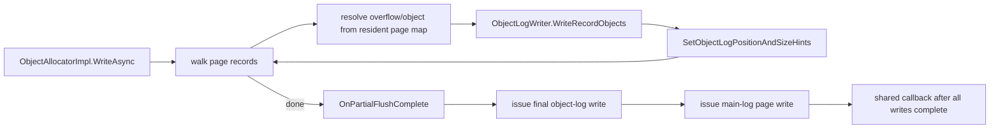

# Object-log serialization

This document describes the current file format and code paths used by Tsavorite's `ObjectAllocator` to persist and
reload a record's out-of-line pieces:

- an overflow key;
- an overflow value; or
- a serialized object value.

The hybrid log stores the record header, inline fields, objectId slots, optionals, and the object-log position. The
object log stores the bytes referenced by those slots. The two logs are written and read together, but their metadata
has deliberately separate responsibilities:

- The effective `RecordDataHeader.KeyLength` and `RecordDataHeader.ValueLength` properties describe physical fields in
  the hybrid-log record. They always return an exact inline length or the 4-byte objectId-slot size.
- For an overflow key, the raw 10-bit RDH KeyLength field is free because `KeyIsInline` is false. A flushed record uses
  it for the high bits of the key's page-count read extent without changing the effective property or record layout.
- The high 9 bits of each out-of-line field's objectId slot contain an initial object-log read hint.
- `KeyIsExactSize` / `ValueIsExactSize` bits in the object-log position word select whether that 9-bit value is an
  exact byte length or a page-count hint.
- `ChunkHeader` framing carries authoritative lengths for every non-exact overflow component and framed object chunk.

Inline values never enter the object log. Migration and replication use an independent network record format; see
[Migration / Replication record layout](../migration-replication-record-layout.md).

> **Keep this document in sync with the code.** The primary implementation files are:
>
> - `libs/storage/Tsavorite/cs/src/core/Allocator/RecordDataHeader.cs` - hybrid-log field kinds and physical field lengths.
> - `libs/storage/Tsavorite/cs/src/core/Allocator/ObjectIdMap.cs` - objectId index/hint bit allocation.
> - `libs/storage/Tsavorite/cs/src/core/Allocator/LogRecord.cs` / `LogRecord_v21.cs` - metadata stamping/decoding,
>   objectId-map assignment, and legacy decoding.
> - `libs/storage/Tsavorite/cs/src/core/Allocator/ObjectAllocatorImpl.cs` - page flush, disk read, scan, and recovery orchestration.
> - `libs/storage/Tsavorite/cs/src/core/Allocator/ObjectSerialization/ObjectLogWriter.cs` - overflow/object serialization.
> - `libs/storage/Tsavorite/cs/src/core/Allocator/ObjectSerialization/ObjectLogReader.cs` - overflow/object framing and deserialization.
> - `libs/storage/Tsavorite/cs/src/core/Allocator/ObjectSerialization/CircularDiskWriteBuffer.cs` / `DiskWriteBuffer.cs` -
>   buffered object-log writes.
> - `libs/storage/Tsavorite/cs/src/core/Allocator/ObjectSerialization/CircularDiskReadBuffer.cs` / `DiskReadBuffer.cs` -
>   read-ahead and direct reads.
> - `libs/storage/Tsavorite/cs/src/core/Allocator/ObjectSerialization/ObjectLogDmaAlignment.cs` - direct-IO alignment.
> - `libs/storage/Tsavorite/cs/src/core/Allocator/ObjectSerialization/ObjectLogFilePositionInfo.cs` - position arithmetic
>   and format flags.
> - `libs/storage/Tsavorite/cs/src/core/Allocator/ObjectSerialization/ChunkHeader.cs` /
>   `ChunkedRecordConstants.cs` - authoritative framing.
> - `libs/storage/Tsavorite/cs/src/core/Allocator/OverflowByteArray.cs` - owned overflow storage and direct-IO slack.
> - `libs/storage/Tsavorite/cs/src/core/Index/CheckpointManagement/RecoveryInfo.cs` - checkpoint format versions.

---

## 1. Record and object-log mental model

A fully inline record is self-contained:

```text
+=======================================================================+
| RecordInfo | RecordDataHeader | namespace | inline key | inline value |
|            |                  |           |            | optionals    |
+=======================================================================+
```

A record with any out-of-line component replaces that component's inline bytes with a 4-byte objectId slot and adds
an 8-byte object-log position to its optional area:

```text
HYBRID LOG RECORD
+================================================================================+
| RecordInfo | RDH | namespace | key field | value field | ETag/expiry | obj-pos |
+================================================================================+
                               |             |
                  inline bytes or i32        +-- inline bytes or i32 objectId
                  objectId

OBJECT LOG, starting at obj-pos
+=========================+==============================+
| overflow key, if any    | overflow value or object,   |
|                         | if any                       |
+=========================+==============================+
```

The key bytes come first. The value bytes start immediately after the key's complete object-log extent, including any
key header and alignment padding. Components within a record are densely packed and have no record-level length prefix.
A record start is not necessarily the previous record's exact end: each partial flush is sector-padded, and recovery
relocation may insert up to 7 bytes to preserve the source record's modulo-8 alignment. A reader obtains each record
start from that record's object-log position word rather than deriving it from the preceding record.

The objectId has two roles at different times:

1. In memory, its low bits index the page's `ObjectIdMap`, which owns the `OverflowByteArray` or `IHeapObject`.
2. In a flushed record image, its high bits also carry an initial object-log read hint. The low index bits remain
   intact, so a live-page flush can stamp a hint without changing which object the slot resolves to.

Every in-memory lookup uses `ObjectIdMap.GetIndex()` and therefore masks away the hint bits.

---

## 2. Effective RDH lengths and raw overflow-key metadata

`RecordDataHeader` (RDH) is one atomically published 8-byte word. Its relevant fields are:

```text
bit(s)   field
 0       KeyIsInline
 1       ValueIsInline
 2       ValueIsObject
 6..13   FillerWords
14..23   KeyLength       (10 bits)
24..47   ValueLength     (24 bits)
```

### 2.1 Exact meaning of `KeyLength` and `ValueLength`

The effective length properties always describe the physical key/value fields in the hybrid-log record:

| Field kind | Physical field contents | RDH length |
|---|---|---|
| Inline key | key bytes | exact key byte length |
| Overflow key | one 4-byte objectId | `ObjectIdMap.ObjectIdSize` (4) |
| Inline value | value bytes | exact value byte length |
| Overflow value | one 4-byte objectId | `ObjectIdMap.ObjectIdSize` (4) |
| Object value | one 4-byte objectId | `ObjectIdMap.ObjectIdSize` (4) |

The `KeyLength` and `ValueLength` property getters enforce this interpretation:

- for an inline field, return the raw RDH field;
- for an out-of-line field, return `ObjectIdMap.ObjectIdSize`.

Consequently, `GetKeyFieldInfo`, `GetValueFieldInfo`, `ActualSize`, `AllocatedSize`, optional-field placement,
`ObjectLogPosition` placement, record scans, and filler calculations never depend on the serialized object-log size.
Changing an overflow payload from 1 KB to 500 MB does not change the hybrid-log record's physical field size.

For an inline key, raw RDH KeyLength and effective `KeyLength` are the same exact byte count. For an overflow key,
effective `KeyLength` remains 4, but the raw field has no physical-layout consumer. The flushed record therefore uses
those 10 raw bits as the high portion of the key's 4 KB page count. Assigning the recovered key to an `ObjectIdMap`
restores the raw field to 4; the effective property remains 4 before and after restoration.

### 2.2 What object-log code must never do

Current-format object-log flush and read paths do not:

- put an overflow/object byte length into a raw RDH length field;
- use raw RDH ValueLength as object-log metadata;
- use raw RDH KeyLength for an overflow key except as the high page-count bits;
- derive authoritative object-log framing from either RDH field; or
- rewrite RDH lengths after deserializing an object, except to restore/assert the physical 4-byte objectId slot.

This also keeps the file-IO format independent of the migration/replication format. Network serialization may add
component length prefixes outside the inline record image, but it leaves RDH lengths unchanged.

### 2.3 Legacy exception

Checkpoint v2.1 used an older split length encoding: the RDH raw field held the low length bits and the objectId slot
held the next 32 bits. `ReuseObjectIdForSize` (object-log position bit 63) selects that decoder in
`LogRecord_v21.cs`.

The legacy decoder interprets both raw fields according to that older layout. Current-format code uses
`GetKeyLengthRaw()` only for the overflow-key page-count high bits and does not use `GetValueLengthRaw()` as an
object-log hint.

---

## 3. ObjectId size hints and position flags

### 3.1 ObjectId slot layout

Each objectId slot is one 32-bit integer:

```text
31                       23 22                              0
+--------------------------+--------------------------------+
| initial-read hint (9 b)  | ObjectIdMap index (23 b)       |
+--------------------------+--------------------------------+
```

| Bits | Name | Meaning |
|---|---|---|
| 0..22 | index | Index into the record page's `ObjectIdMap` |
| 23..31 | size hint | Exact byte length, value page count/sentinel, or low 9 bits of the key page count |

The 23-bit index is larger than the maximum index needed by a 128 MB page at the minimum record size. The high 9 bits
are therefore available for the disk-read hint without reducing the supported page population.

`ObjectIdMap.StampSizeHint(slot, hint)` preserves the low index. `ObjectIdMap.GetIndex(slot)` masks the hint before
an in-memory lookup, and `ObjectIdMap.GetSizeHint(slot)` extracts the high 9 bits for disk IO.

### 3.2 Object-log position word

The optional 8-byte object-log position combines an address and format flags:

```text
63             62                        61                 60                 59..0
+--------------+-------------------------+------------------+------------------+------------------+
| v2.1 reuse   | KeyHasExtendedSizeHint  | KeyIsExactSize   | ValueIsExactSize | segment + offset |
+--------------+-------------------------+------------------+------------------+------------------+
```

| Bit | Meaning |
|---|---|
| 0..59 | Object-log segment and offset (about 1 EB address range) |
| 60 | `ValueIsExactSize` |
| 61 | `KeyIsExactSize` |
| 62 | `KeyHasExtendedSizeHint`: a headered key's page count spans raw RDH KeyLength and the objectId hint |
| 63 | Legacy v2.1 `ReuseObjectIdForSize` discriminator |

The key and value flags are independent because one record can have, for example, a 100-byte headerless overflow key
and a 5 MB framed object value.

After an object value is deserialized during recovery, this optional word is temporarily repurposed in memory to hold
the object's serialized on-disk extent, preserving bit 63 for a v2.1 source. A later recovery-state flush consumes that
extent when converting a supported v2.1 record. It is no longer an object-log position while in this transient state.

### 3.3 Exact versus page-count interpretation

For an exact/headerless key or value:

| Exact-size flag | objectId hint | Stream layout | Initial read |
|---|---|---|---|
| Set | 0..511 | Headerless | Exactly `hint` bytes |

For a non-exact/headered overflow key with `KeyHasExtendedSizeHint` set:

```text
pageCount = (rawRdhKeyLength << 9) | objectIdHint
initialReadExtent = pageCount * 4 KB
```

The 19-bit page count is exact: it is `ceil((ChunkHeader + alignment padding + payload) / 4 KB)`. It covers the
configured 512 MB maximum key size with framing and alignment overhead. The reader can allocate/read the complete key
without a sentinel-driven extension path; `ChunkHeader` still supplies the exact logical payload length.

When `KeyHasExtendedSizeHint` is clear, a checkpoint from the preceding chunk-framing format uses the value-style
objectId-only page-count/sentinel interpretation. The checkpoint version was advanced when the extended encoding was
introduced so a binary that does not recognize bit 62 rejects the checkpoint rather than under-reading a large key.

For a non-exact overflow or object value:

| 9-bit objectId hint | Stream layout | Initial read |
|---|---|---|
| 1..510 | Overflow: leading header; object: 511-byte prefix, padding, then headers | `hint * 4 KB` bytes |
| 511 | Same framing | One 4 MB discovery window |

For values only, 511 is the sentinel meaning "issue a 4 MB discovery read and follow framing." It is not
`511 * 4 KB`.

### 3.4 Computing and stamping a hint

`LogRecord.SetObjectLogPositionAndSizeHints()` handles keys and values separately:

1. If the serialized data length is at most 511:
   - stamp the exact byte length;
   - set the component's exact-size flag;
   - write no `ChunkHeader`.
2. For a larger overflow key:
   - compute `ceil(totalOnDiskExtent / 4 KB)`;
   - stamp its low 9 bits into the objectId and its high 10 bits into raw RDH KeyLength;
   - set `KeyHasExtendedSizeHint`;
   - leave `KeyIsExactSize` clear; and
   - obtain the exact logical length from the leading `ChunkHeader`.
3. For a larger overflow/object value:
   - compute `ceil(initialOnDiskExtent / 4 KB)`;
   - clamp it to 511;
   - leave `ValueIsExactSize` clear;
   - obtain authoritative lengths from `ChunkHeader`.

For overflow, `initialOnDiskExtent` is the complete component:

```text
ChunkHeader + alignment padding + payload
```

For an object, it covers only:

```text
511-byte prefix + 8-align padding + first ChunkHeader + first framed chunk
```

Later object chunks are discovered from continuation headers. The key page count is an exact rounded read extent, not
an exact logical byte length. Value hints are initial IO requirements and may not cover the total value.

### 3.5 Decoding a hint

`LogRecord.GetObjectLogRecordStartPositionAndLengths()`:

1. checks `ReuseObjectIdForSize`; if set, dispatches to the v2.1 exact-length decoder;
2. reads the key/value objectId high bits and, for a non-exact key, raw RDH KeyLength;
3. reads `KeyIsExactSize` / `ValueIsExactSize`;
4. converts the key metadata to exact bytes or its full 19-bit page extent, and value metadata to exact bytes,
   page-count bytes, or a 4 MB discovery window; and
5. masks the high flag bits from the returned object-log address.

The method's output lengths are initial read extents for current-format records, not necessarily component lengths.

---

## 4. Object-log byte layouts

### 4.1 `ChunkHeader`

`ChunkHeader` is 8 bytes:

| Field | Overflow | Object chunk |
|---|---|---|
| `currentLength` | complete payload length | this chunk's data length; high bit is `ContinuationFlag` |
| second word | alignment padding before payload | reserved |

There is no forward `nextLength`. Every header describes the bytes immediately following it, and continuation is
self-terminating.

### 4.2 Overflow key or value

At most 511 bytes:

```text
+-------------------+
| payload           |
| exact bytes       |
+-------------------+
```

More than 511 bytes:

```text
+-------------------+-------------------+---------------------------+
| ChunkHeader       | alignment padding | payload                   |
| full payload len  | 0..sector-1 bytes | currentLength bytes       |
+-------------------+-------------------+---------------------------+
```

The padding aligns the large direct-IO portion. It is part of the component's on-disk extent but not part of the
`OverflowByteArray`'s logical payload.

### 4.3 Object value

At most 511 serialized bytes:

```text
+-------------------+
| serialized data   |
+-------------------+
```

More than 511 serialized bytes:

```text
+----------------------+--------------+---------------+-------------+-----+
| first 511 data bytes | 8-align pad  | ChunkHeader 1 | chunk 1     | ... |
+----------------------+--------------+---------------+-------------+-----+
                                                       |
                                      currentLength + continuation
```

The first 511 data bytes remain headerless. The absolute object-log position is then padded to an 8-byte boundary.
Every remaining data chunk has its own header. A header may describe a zero-length continuing chunk when the header
itself exactly fills the remaining write-buffer space.

The object serializer/deserializer sees one dense logical byte stream. `ObjectLogWriter` inserts framing, and
`ObjectLogReader` removes it.

---

## 5. Flush and write flow

### 5.1 Page-level ordering

For a page containing objects, `ObjectAllocatorImpl.WriteAsync()` preserves this issue and completion protocol:

1. determine the record range and whether the live page or a private aligned copy is the main-log write source;
2. walk records in address order;
3. serialize/copy every record's object-log components;
4. stamp that record's object-log position and objectId hints;
5. issue the sector-padded final object-log write;
6. submit the main-log page write containing those references; and
7. invoke the external flush callback only after every object-log and main-log write completes.

The main-log write is issued after all object-log writes have been issued, but the devices may complete independently.
The shared completion countdown prevents `FlushedUntilAddress` from advancing until both the main-log page and all
referenced object-log bytes are durable.



### 5.2 Per-record serialization

`ObjectAllocatorImpl.WriteAsync()` resolves objectId slots to local `OverflowByteArray` / `IHeapObject` references.
ReadOnly enters from an epoch callback and suspends that hold while serializing; Snapshot enters without epoch
protection. Snapshot/ReadOnly ordering prevents `FlushedUntilAddress`, and therefore `HeadAddress`, from reaching the
active Snapshot page on a real main-log device. For `NullDevice`, the same watermark directly caps `HeadAddress`.
Thus the page and its `ObjectIdMap` remain resident without a Snapshot epoch pulse:

- overflow key -> `ObjectLogWriter.WriteOverflowComponent()`;
- overflow value -> `ObjectLogWriter.WriteOverflowComponent()`;
- object value -> `ObjectLogWriter.DoSerialize()`; and
- all records -> `CircularDiskWriteBuffer.OnRecordComplete()`.

After serialization, `SetObjectLogPositionAndSizeHints()` writes:

- the record's starting object-log segment/offset;
- the key objectId hint, raw RDH page-count high bits, `KeyHasExtendedSizeHint`, and `KeyIsExactSize`, if the key is overflow; and
- the value hint and `ValueIsExactSize`, if the value is overflow/object.

The method does not change either effective RDH length. Stamping raw RDH KeyLength for an overflow key is
layout-neutral because `KeyLength` returns `ObjectIdSize` whenever `KeyIsInline` is false.

### 5.3 Buffered overflow write

For payloads at most `MaxCopySpanLen` (128 KB), or whenever direct IO is not selected:

1. write a `ChunkHeader` when the payload is greater than 511;
2. write the payload through `CircularDiskWriteBuffer`;
3. copy bytes into the current pooled sector-aligned buffer;
4. flush a full buffer asynchronously and continue in the next buffer; and
5. split naturally at object-log segment boundaries.

Small exact payloads write only their bytes. Framed payloads on this path normally have zero alignment padding.

### 5.4 Direct overflow write

For an overflow payload larger than 128 KB, `WriteOverflowDma()` avoids copying the aligned interior through the
4 MB ring:

1. pin the `OverflowByteArray`;
2. compute the source pointer residue and object-log sector residue;
3. write the header, alignment padding, and any leading source fragment through the ring;
4. flush the current ring buffer before issuing overlapping direct IO;
5. write the sector-aligned interior directly from the pinned array;
6. split direct writes at object-log segment boundaries;
7. write any trailing fragment through the ring; and
8. release the pin only after every asynchronous direct write callback completes.

`RefCountedPinnedGCHandle` shares pin ownership across split direct writes. No callback can observe a movable source.

### 5.5 Object serialization and header backfill

`DoSerialize()` lazily creates and reuses a `PinnedMemoryStream<ObjectLogWriter<...>>` and the store's object
serializer. Serializer writes call `ObjectLogWriter.Write()`, which routes object bytes to `WriteObjectData()`:

1. copy the first 511 bytes without a header;
2. align the first header to an absolute 8-byte boundary;
3. reserve a placeholder `ChunkHeader`;
4. fill the remainder of the current write buffer with object data;
5. when the buffer fills, backfill the header with the chunk length and `ContinuationFlag`;
6. flush the buffer and reserve the next header; and
7. when serialization ends, backfill the final header without continuation.

Headers are backfilled only while their containing buffer is still mutable. An 8-byte-aligned header cannot straddle
the 4 MB buffer or segment boundary because both are multiples of 8.

### 5.6 Buffer and callback lifetime

`CircularDiskWriteBuffer` owns pooled `DiskWriteBuffer` instances. It tracks each buffer's completion plus a global
in-flight count. `OnSplitPartialFlushComplete()` sector-pads and flushes the last object-log buffer, then schedules the
direct and optional trailing main-log spans in the same completion batch. Disposal returns buffers only after their
writes complete. `PageAsyncFlushResult.RecordError()` retains the first error even when split writes complete out of
order.

The main-log write always uses the allocator's live page; objectId hint stamping is index-preserving, but metadata
non-destructiveness alone is not sufficient. Recovery has exclusive access. Snapshot/ReadOnly coordination keeps the
page resident and prevents those modes from stamping the same page concurrently.

A front-partial ReadOnly flush starts after a prefix already written by the same monotonic flush sequence. The physical
write rounds down to the sector boundary and rewrites that prefix from the live page; those records already carry
main-object-log positions, so no leading-sector read or page image is needed. Complete sectors are written directly.
If the logical endpoint is inside a sector, one pooled sector buffer copies live bytes through that endpoint and zeros
the remainder. The zero suffix prevents metadata above the main-log durable boundary from looking valid if recovery
boundaries ever become inconsistent; a later ReadOnly flush overwrites it.

### 5.7 Snapshot and ReadOnly page ordering

At `PREPARE`, `fuzzyRegionStartAddress` captures the exact tail that starts the fuzzy region and Snapshot publishes
permissive coordination. ReadOnly work during PREPARE/IN_PROGRESS is tracked but not blocked. PREPARE's epoch barrier
captures the endpoint of any ReadOnly worker that started before coordination publication. At `WAIT_FLUSH`,
`recoveredTailAddress` captures TailAddress; Snapshot arms the conservative page gate, drains tracked and
pre-coordination ReadOnly flushes through address publication, then captures `snapshotFileLogicalStartAddress` from
the stable `FlushedUntilAddress`. Snapshot does not advance `ReadOnlyAddress`.

`HybridLogCheckpointInfo.LastCompletedSnapshotPage` is a runtime-only contiguous completion watermark. Snapshot issues one
page write at a time. During `WAIT_FLUSH`, ReadOnly may serialize page `P` only while
`P < LastCompletedSnapshotPage`. The value is the exclusive page after the most recently completed Snapshot page, so
ReadOnly waits only when Snapshot is still writing that same page; once Snapshot completes it, ReadOnly proceeds and
retains eviction priority. After the final page containing captured TailAddress completes, Snapshot publishes the
exclusive end page so ReadOnly may process the final page. One active-ReadOnly-write
counter closes the state-transition race: a claim remains active through `LastFlushedUntilAddress` and
`FlushedUntilAddress` publication, installation waits for all prior claims to drain, and new ReadOnly work claims its
page before either issuing IO or taking a no-IO address-advancement path. ReadOnly suspends epoch protection while
waiting on Snapshot progress, then resumes only to preserve the epoch callback's entry/exit contract.

Outside a Snapshot checkpoint, ReadOnly samples coordination once per contiguous flush range and performs no lock,
counter update, or epoch suspend. With no ReadOnly waiters, each Snapshot page completion advances the watermark with a
monotonic CAS and does not acquire the progress monitor.

For `NullDevice`, Head may advance behind completed Snapshot pages even though no main-log bytes are durable.
`mainLogRecoveryEndAddress` therefore remains the captured Snapshot start rather than the later HeadAddress; recovery reads
that evicted prefix from the snapshot file.

Snapshot serializes stable records into the snapshot object log and stamps their snapshot positions directly on the live
page. ReadOnly does not consume `ObjectLogPosition`; after Snapshot completes the page, ReadOnly resolves each object through
`ObjectIdMap`, serializes it to the main object log, and replaces the Snapshot position. No page-image copy or metadata
journal is required.

Snapshot leaves fuzzy v+1 records unchanged. Recovery uses the exact persisted `fuzzyRegionStartAddress` as the fuzzy lower
boundary and invalidates such records before hashing overflow keys or reading payloads. RDH must still describe the record's
stable allocation so recovery can advance to the next record.

---

## 6. Read flow

### 6.1 Initial read range

The caller obtains the record's start position and initial key/value extents from
`GetObjectLogRecordStartPositionAndLengths()`.

- A record with an overflow key begins with only that key's exact-byte or 4 KB-page discovery extent.
- After a framed key reveals its exact endpoint, the value demand is rebased there and uses its own exact-byte or initial
  4 KB-page extent.
- A record without an overflow key begins directly with the value's extent.
- Page load/recovery scans object-bearing records in one object-log address space. Each later record position safely
  bounds the preceding record; the final scanned record contributes only its first-component hint.
- The scan stops as soon as the initial range reaches one complete circular-ring capacity
  (`bufferSize * numberOfBuffers`, 16 MB with defaults). Framing and later record hints extend demand while consumed.
- Recovery splits the page containing the exact Snapshot/main boundary into separate main- and snapshot-device ranges.
  A main-log record is therefore never used as a Snapshot record's successor. Iterators use the same scan entirely in
  main-object-log space.

For Snapshot recovery, `mainLogRecoveryEndAddress` is the exact overlay boundary. Main-log recovery supplies the page
prefix below `mainLogRecoveryEndAddress`. Snapshot recovery then reads only the suffix at/above that address from the
snapshot file; if it is not sector-aligned, recovery saves and restores the main bytes below it in the first shared
sector. The snapshot file's
`snapshotFileLogicalStartAddress` remains the page-offset mapping for locating that suffix, but it is not the
main/snapshot object-device split. If the main boundary page is not resident (for example, because an index checkpoint
made replay unnecessary), recovery first reloads its durable main prefix.

Main object-log reads use `objectLogTail` as a hard logical end once that tail is set. During early recovery an unset
main tail disables this bound. Snapshot recovery carries the persisted `snapshotEndObjectLogTail` as a separate,
same-space hard end through Pass 1 overflow-key hashing, snapshot-to-main verbatim copying, and Pass 2 deserialization.
Framing may tighten or extend speculative read-ahead within that boundary, but an authoritative endpoint beyond it is
reported as truncation or corruption.

### 6.2 Absolute endpoint accounting

`CircularDiskReadBuffer` tracks:

| State | Meaning |
|---|---|
| `baseRequiredEndAddress` | fixed endpoint of the caller's bounded same-space scan range |
| `dynamicRequiredEndAddress` | replaceable current framing demand; grows for continuation/discovery and shrinks when a header reveals an earlier exact end |
| `RequiredEndAddress` | maximum of the fixed base demand and replaceable framing demand |
| `nextFileReadPosition` | sector-aligned start of the next sequential device request, and therefore the exclusive high-water submitted since ring initialization or the last direct-read reset |
| `hardReadEndAddress` | known and initialized main object-log durable tail, or `ulong.MaxValue` while that tail is unset or no same-address-space tail was supplied |
| `deferredBufferStartPosition` | payload-end offset within a sector, retained when a direct read resets the ring but no following ring read is yet required |

All endpoints are absolute object-log addresses. "Submitted" means `IDevice.ReadAsync` has been called; the request may
still be in flight and its bytes have not necessarily been consumed. Device requests are sector-rounded, so
`nextFileReadPosition` may pass `RequiredEndAddress`. It advances monotonically within a ring-read epoch;
`RepositionAfterDirectRead()` drains pending requests and begins a new epoch at the payload-end sector.

`SetDynamicReadThrough()` replaces rather than adds to dynamic demand, so parsing the same header twice cannot
double-extend a read. `RequiredEndAddress` remains the maximum of that dynamic demand and the bounded initial range.
A discovery endpoint may clamp to the hard tail. An authoritative endpoint parsed from a header may not cross it;
crossing is treated as truncated/corrupt framing. Already-submitted sector-rounded IO cannot be cancelled and is
reused by later components and same-space records or drained at disposal.

Large overflow reads bypass the ring for the aligned payload interior. `RepositionAfterDirectRead()` drains and resets
the ring at the logical payload end. If no later bytes are required yet, it saves that endpoint's in-sector offset in
`deferredBufferStartPosition`; when framing later grows demand, the first refill starts at the preceding sector
boundary but exposes bytes only from the saved logical offset.

### 6.3 Overflow read

`ObjectLogReader.ReadOverflow()` has three paths:

**Exact/headerless (0..511 bytes)**

1. allocate one exact `OverflowByteArray`;
2. copy exactly the objectId-hint byte count from the ring; and
3. fail if the ring cannot supply the complete length.

**Framed, small enough for buffered copy**

1. read `ChunkHeader`;
2. set the authoritative absolute payload endpoint;
3. skip recorded alignment padding;
4. allocate one exact `OverflowByteArray`; and
5. copy the payload from the ring.

**Framed, large direct read**

1. parse the header and padding through the ring;
2. allocate `payload length + 3 * sectorSize` bytes;
3. pin the array;
4. choose `StartOffset`/`EndOffset` so the logical payload pointer has the same sector residue as its file position;
5. copy payload bytes already available in the current ring buffer;
6. direct-read the remaining aligned range into the same final array;
7. split reads at object-log segment boundaries;
8. wait for every direct read;
9. reposition the ring at the logical payload end; and
10. release the pin in `finally`.

There is no intermediate payload-sized buffer and no second copy into the final `OverflowByteArray`.

If an overflow key precedes an out-of-line value, the key header may reveal that the key is larger than its initial
hint. After reading the key, `ReadRecordObjects()` rebases the value's initial requirement at the actual key end before
reading the value.

### 6.4 Object read

For an exact/headerless object, the object deserializer reads the dense stream directly from the ring.

For a framed object, `ReadObjectData()`:

1. supplies the first 511 data bytes;
2. consumes the absolute 8-byte-alignment padding;
3. reads a `ChunkHeader`;
4. sets the exact endpoint for that chunk;
5. supplies only `currentLength` data bytes to the deserializer;
6. if continuation is set, requests the next 4 MB discovery window;
7. skips zero-length continuing chunks; and
8. stops interpreting framing when continuation clears.

The object deserializer self-terminates according to the object format. It never sees object-log padding or
`ChunkHeader` bytes.

### 6.5 Assignment to the objectId map

After object deserialization, `LogRecord.SetDeserializedValueObject()`:

1. allocates a slot in the selected `ObjectIdMap`;
2. stores the `IHeapObject`;
3. writes the new low-bit objectId index into the value field;
4. replaces the optional object-log position with the serialized extent needed by recovery bookkeeping, preserving
   only the v2.1 bit-63 discriminator; and
5. restores/asserts the RDH physical value length as `ObjectIdMap.ObjectIdSize`.

Overflow key/value reads similarly assign owned `OverflowByteArray` instances to objectId-map slots. The flushed
size-hint bits are not treated as a live map index without `GetIndex()`. Assigning an overflow key also clears its raw
RDH page-count high bits back to the in-memory objectId-slot value.

---

## 7. Recovery flows

### 7.1 Pass 1: index construction and overflow-key hashing

The recovery index-build pass cannot resolve an overflow key through the page `ObjectIdMap`, because that map is
populated in Pass 2. `ComputeRecoveryOverflowKeyHash()` therefore:

1. decodes the key's object-log start and initial extent;
2. creates dedicated circular read buffers for the main or snapshot object-log device;
3. uses `objectLogTail` only for the main device and `NotSet` for the snapshot device;
4. reads only the overflow key with `ReadOverflowKeyHashCodeForRecovery()`; and
5. pins its final span while calling the store's key comparer/hash function.

For a headered key, the combined RDH/objectId page count already covers the entire framed key. Recovery Pass 1 does not
need a key sentinel or repeated discovery reads; the leading header narrows the rounded extent to the exact payload.
The Snapshot Pass 1 scan begins at `mainLogRecoveryEndAddress`, so records in the preserved main prefix are neither
rehashed nor reported as snapshot reads a second time.

### 7.2 Pass 2: page object loading

`LoadObjectsForRecoveryPass2()` calls `DeserializeObjectsOnPage()` once per same-device range:

1. first range pass: compute successor bounds until one ring capacity is covered, then include the last record's
   first-component hint when capacity has not yet been reached;
2. initialize one `ObjectLogReader`;
3. second page pass: call `ReadRecordObjects()` for each valid object-bearing record;
4. allocate recovered objects into the page's `ObjectIdMap`;
5. update object-size tracking; and
6. drain outstanding reads in `finally`.

Low-memory recovery may calculate page object sizes, evict older pages, and flush snapshot-region pages while this pass
proceeds. On the page containing `snapshotScanFromAddress`, both size estimation and loading split at that exact record
boundary. If recovery has already rewritten the page, the whole requested range reads from the main object log.

### 7.3 Recovery-state flush of hybrid-log-region records

The live page for a recovery-state flush may also contain records from the hybrid-log region whose object bytes are
already durable in the main object log:

- A current-format record is written verbatim. Its position, objectId hints, and exact-size flags already describe those durable
  bytes. Calling `SetRecoveredObjectLogRecordStartPosition()` would incorrectly interpret its still-on-disk position
  word as the transient deserialized extent and corrupt the rewritten record.
- A v2.1 record is identified by bit 63. After Pass 2 has replaced an object value's optional position with its
  serialized extent, `SetRecoveredObjectLogRecordStartPosition()` can convert a byte-compatible headerless record to
  current-format metadata and advance the page's running object-log position. Conversions requiring header insertion fail fast.

Recovery has exclusive access to these pages, so the current-format branch writes the live page directly. This branch
is separate from snapshot-region copying: hybrid-region object bytes remain at their existing main object-log positions
and are not copied or reserialized.

### 7.4 Snapshot-region verbatim copy

When a recovered snapshot page must become durable in the main log before its objects are deserialized, the flush path
copies raw object-log bytes from the snapshot device to the main object log:

1. initialize demand from the record's first out-of-line component;
2. align the destination record start so `destination % 8 == source % 8`;
3. replace only the live record's segment/offset with `RepointObjectLogPosition()`, preserving objectId hints and all
   format flags;
4. call `CopyRecordObjectsFollowingFraming()` for every record; and
5. use exact hints directly while following headers for non-exact overflow and object components through their exact end.

The recovery write uses the live page rather than allocating a page-image copy. If the page remains resident after the
copy, recovery records that its positions now address the main object log and Pass 2 deserializes it from that device.
Each record's framing supplies its copy endpoint; no following record or page contributes a bound.

The modulo-8 preservation is required because the first object header is aligned from the absolute object start.
Moving identical bytes to a different residue would move the expected first-header location and make the copy
unreadable.

Snapshot and main positions are never subtracted. `ObjectLogFilePositionInfo.operator -` validates segment-size and
ordering, but address-space identity is a caller invariant.

### 7.5 v2.1 recovery

Bit 63 selects v2.1's split exact-length decoder and dense, headerless object-log stream. Verbatim snapshot copies
preserve that bit.

`SetRecoveredObjectLogRecordStartPosition()` may convert a v2.1 record only when its bytes are also valid current
headerless bytes. A large v2.1 key/value/object that would require inserting current-format headers fails fast; header insertion
would shift subsequent positions and is not implemented without a validated v2.1 checkpoint fixture.

---

## 8. Allocation and copy accounting

### 8.1 Flush/write paths

| Component/path | Per-record allocation | Byte copies before device | Pin/direct IO | Reason |
|---|---|---|---|---|
| Exact overflow <=511 | none beyond existing `OverflowByteArray` | payload into reused write ring | no | headerless small payload |
| Framed overflow <=128 KB | none beyond existing `OverflowByteArray` | header + payload into reused ring | no | copy is bounded; simple buffered path |
| Framed overflow >128 KB | no payload-sized staging allocation | header/padding/fragments into ring; aligned interior not copied | source array pinned; direct writes split by segment | avoid copying a large payload through the ring |
| Exact object <=511 | serializer/ring reused | serializer bytes into reused ring | no | headerless object |
| Framed object >511 | serializer/ring reused | serializer bytes into reused ring | no | headers must be reserved/backfilled as chunks close |
| Main-log live-page path | at most one pooled trailing-sector buffer | no page copy; only final partial-sector bytes copied | live memory and optional trailing sector held through callbacks | Recovery, Snapshot, and ReadOnly, including front/back-partial ranges |

The object serializer, pinned stream, and circular write buffers are reused; they are not allocated per object.

### 8.2 Read paths

| Component/path | Final allocation | Intermediate payload allocation | Copies | Pin/direct IO |
|---|---|---|---|---|
| Exact overflow <=511 | exact `OverflowByteArray` | none | ring -> final array | no |
| Framed overflow <=128 KB | exact `OverflowByteArray` | none | ring -> final array | no |
| Framed overflow >128 KB | exact payload + sector slack in one `OverflowByteArray` | none | buffered prefix -> final; direct remainder has no copy | final array pinned through all reads |
| Object value | final `IHeapObject` allocated by deserializer | no whole serialized-object array | ring data -> deserializer | no direct object payload read |
| Recovery Pass1 key hash | one recovered `OverflowByteArray` | none | same overflow path | final key span pinned only while hashing |
| Snapshot verbatim copy | one pooled 4 MB transfer buffer | none proportional to record | snapshot ring -> transfer buffer -> main write ring | framing-only last-record path tees bytes while parsing |

The large overflow read's sector slack is part of the array allocation but outside its logical `StartOffset..EndOffset`
payload. It permits leading/trailing sector overlap without writing outside the pinned allocation.

### 8.3 Why object values use the ring instead of direct payload IO

An overflow header provides the complete payload length before allocation, so one final array can be aligned and filled
directly. An object serializer defines its own internal termination and may emit multiple object-log chunks. The
reader therefore streams chunk data through `IStreamBuffer` to the object deserializer and never materializes the
complete serialized object in a `byte[]`; this also avoids imposing the single-array 2 GB limit on serialized objects.

---

## 9. Call sequences

Indentation is call depth. Component branches and lifetime changes are included where they occur.

### 9.1 Normal page flush

- `ObjectAllocatorImpl.AsyncFlushPagesForReadOnly()` / `WriteAsyncToDeviceForSnapshot()`
  - `ObjectAllocatorImpl.WriteAsync(...)`
    - use the resident live page
    - create `ObjectLogWriter` over the supplied pooled `CircularDiskWriteBuffer`
    - for each object-bearing `LogRecord`
      - resolve objectIds from the resident page map
        - `objectIdMap.GetOverflowByteArray(...)`
        - `objectIdMap.GetHeapObject(...)`
      - `ObjectLogWriter.WriteRecordObjects(keyOverflow, valueOverflow, valueObject)`
        - overflow key -> `WriteOverflowComponent()`
          - <=511 -> headerless
          - >511 and <=128 KB -> buffered header + payload
          - >128 KB -> `WriteOverflowDma()` -> pinned direct interior
        - overflow value -> same branches
        - object value -> `DoSerialize()` -> `WriteObjectData()`
          - first 511 bytes headerless
          - `StartObjectHeaderedPhase()`
          - `AdvanceObjectBuffer()` for continuing chunks
          - `OnSerializeComplete()` backfills final header
        - `CircularDiskWriteBuffer.OnRecordComplete()`
      - `LogRecord.SetObjectLogPositionAndSizeHints(...)`
        - write object-log position
        - stamp key/value objectId high bits
        - stamp overflow-key page-count high bits into raw RDH KeyLength
        - set `KeyHasExtendedSizeHint` for a headered overflow key
        - set `KeyIsExactSize` / `ValueIsExactSize` as applicable
    - `ObjectLogWriter.OnSplitPartialFlushComplete()`
      - `CircularDiskWriteBuffer.OnSplitPartialFlushComplete()`
        - sector-pad and flush final object-log buffer
        - submit direct complete-sector and optional zero-padded trailing-sector main-log writes
        - final callback after all writes complete

### 9.2 Single-record pending disk read

- `ObjectAllocatorImpl.VerifyRecordFromDiskCallback(...)`
  - `GetObjectLogRecordStartPositionAndLengths(...)`
  - create `CircularDiskReadBuffer`
  - `ObjectLogReader.OnBeginReadRecords(start, keyHint + valueHint, objectLogTail)`
  - `ObjectLogReader.ReadRecordObjects(...)`
    - `OnBeginRecord(start)`
    - overflow key -> `ReadOverflow()`
    - rebase value requirement at actual key end
    - overflow value -> `ReadOverflow()`
    - object value -> `DoDeserialize()` -> `ReadObjectData()`
    - `OnObjectReadComplete()`
  - `OnEndReadRecords()`

### 9.3 Recovery Pass 1

- `Recovery.RecoverFromPage(...)`
  - Snapshot boundary page starts at `mainLogRecoveryEndAddress` after merging its snapshot suffix over the main prefix
  - inline key -> hash directly from `LogRecord`
  - overflow key -> `ObjectAllocatorImpl.ComputeRecoveryOverflowKeyHash(...)`
    - decode position/hint
    - choose main hard tail or snapshot `NotSet`
    - `ReadOverflowKeyHashCodeForRecovery(...)`
      - `ReadOverflow(...)`
      - pin final key span
      - `storeFunctions.GetKeyHashCode64(...)`

### 9.4 Recovery Pass 2 / page load

- `Recovery.RecoveryLoadObjectsPass2(...)`
  - `ObjectAllocatorImpl.LoadObjectsForRecoveryPass2(...)`
    - `DeserializeObjectsOnPage(...)`
      - scan same-device object-bearing records until one read-ring capacity is covered
      - include the final scanned record's first-component hint
      - `OnBeginReadRecords(...)`
      - second pass, each valid object record
        - `ReadRecordObjects(...)`
        - record hints set initial component demand
        - parsed framing rebases following components and sets authoritative endpoints
        - `TrackRecoveredObjectRecord(...)`
      - `OnEndReadRecords()`

### 9.5 Snapshot recovery copy

- `ObjectAllocatorImpl.WriteAsync(..., FlushRequestState.Recovery, snapshotObjectLogDevice, ...)`
  - use the live recovery page as the main-log write source
  - identify a snapshot-region record
  - `AlignNextRecordStartLike(snapshotPosition)`
  - `RepointObjectLogPosition(mainPosition)`
  - `CopyRecoveredObjectBytesFollowingFraming(...)`
    - `ObjectLogReader.CopyRecordObjectsFollowingFraming(...)`
      - parse overflow/object headers
      - tee every consumed raw byte to the main `ObjectLogWriter`
  - advance recovery page object-log position by exact copied extent
  - mark the resident page as repointed to the main object-log address space
  - Pass 2 reads that page from the main object log

### 9.6 Recovery-state flush of hybrid-log-region records

- `ObjectAllocatorImpl.WriteAsync(..., FlushRequestState.Recovery, ...)`
  - use the live recovery page as the main-log write source
  - identify a record outside the snapshot-copy region
  - current-format record
    - preserve its main object-log position, objectId hints, and flags verbatim
    - issue no object-log copy
  - legacy v2.1 record
    - `LogRecord.SetRecoveredObjectLogRecordStartPosition(...)`
      - read recovered overflow lengths from `ObjectIdMap`
      - read the recovered object extent from the repurposed optional word
      - convert only byte-compatible headerless metadata
      - fail if current framing would have to be inserted
    - advance the running page object-log position

### 9.7 Snapshot checkpoint no-copy ordering

- `SnapshotCheckpointSMTask.GlobalBeforeEnteringState(PREPARE)`
  - publish permissive `SnapshotFlushCoordination`
- `SnapshotCheckpointSMTask.GlobalAfterEnteringState(PREPARE)`
  - capture the endpoint of ReadOnly work issued before coordination publication
- `SnapshotCheckpointSMTask.GlobalBeforeEnteringState(WAIT_FLUSH)`
  - capture TailAddress as `recoveredTailAddress`
  - arm the page watermark
  - drain pre-coordination and claimed ReadOnly page writes through FUA publication
  - capture the stable `snapshotFileLogicalStartAddress`
  - `AsyncFlushPagesForSnapshot(snapshotFileLogicalStartAddress, recoveredTailAddress, fuzzyRegionStartAddress, ...)`
    - issue one live Snapshot page at a time
    - publish `LastCompletedSnapshotPage` after complete page IO
    - ReadOnly waits only while Snapshot is writing that same page
    - publish the exclusive end page after the final page completes

---

## 10. Boundary and corruption-safety invariants

- 510, 511, and 512 bytes exercise headerless-before-cutoff, maximum exact, and first framed values.
- Page-count hints round up the complete initial on-disk extent, including headers and padding.
- For keys, page-count low bits 511 are ordinary data and carry into raw RDH KeyLength at 512 pages.
- For values, objectId hint 511 with the exact flag clear means one 4 MB discovery window.
- Parsed authoritative lengths are checked against the known main object-log hard tail.
- Main and snapshot object-log positions are never mixed for subtraction or hard bounds.
- `ObjectLogFilePositionInfo.Advance()` is used for segment-crossing arithmetic; direct IO splits at segment boundaries.
- Object headers are absolute 8-byte aligned; snapshot relocation preserves the source modulo-8 start.
- Direct-read pins remain alive through every callback.
- `OverflowByteArray` leading/trailing slack covers sector overlap; logical length excludes that slack.
- Every recovery record is copied from its own exact hints and framing; successor positions are not consulted.
- Speculative ring reads are drained before buffers are reused or disposed.
- Any unsupported v2.1 conversion that would require inserting headers fails rather than guessing.

The object-size boundary suites exercise normal pending IO, Snapshot/FoldOver recovery, low-memory eviction, overflow
keys, overflow/object values, direct-IO thresholds, 4 MB discovery boundaries, and object-log segment crossings.

---

## 11. Version and format separation

The current object-log format is checkpoint version 8. It uses chunk framing and carries extended overflow-key page
hints across raw RDH KeyLength and the objectId hint, marked by `KeyHasExtendedSizeHint`. Version 7 is recoverable
through the per-record bit-63 legacy discriminator and its dedicated decoder.

The following formats are separate and must not borrow each other's length semantics:

- hybrid-log effective RDH lengths: exact physical inline/objectId-slot lengths; raw overflow-key KeyLength additionally
  carries page-count high bits;
- object-log file: objectId initial hints plus `ChunkHeader` authoritative framing;
- migration/replication wire record: explicit network component framing described in the companion document; and
- [AOF](../aof-record-layout.md): operation serialization, not a `DiskLogRecord` object-log image.
