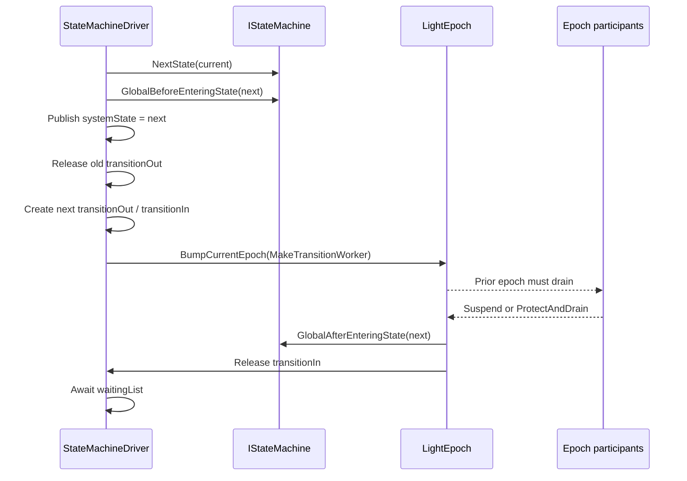

# Tsavorite state machine driver

Tsavorite uses `StateMachineDriver` to coordinate operations that require all
sessions to move through a sequence of globally visible phases. Checkpointing
and index growth use this mechanism to publish phase and version changes,
synchronize participating threads through `LightEpoch`, run phase-specific
actions, and wait for asynchronous work.

This page describes the current implementation. The principal files are under
`libs/storage/Tsavorite/cs/src/core/Index/Checkpointing/`.

## Concepts and types

The state machine has three layers:

| Layer | Responsibility |
|---|---|
| `IStateMachine` | Defines the phase graph through `NextState`. |
| `IStateMachineTask` | Performs work before and after each transition. |
| `StateMachineDriver` | Owns the current state, publishes transitions, coordinates the epoch barrier, and waits for phase work. |

`SystemState` stores the current `Phase` and `Version` in one 64-bit `Word`.
The high 8 bits contain the phase and the remaining bits contain the version.
The driver starts in `REST`, version 1.

`IStateMachine` extends `IStateMachineTask`:

```cs
public interface IStateMachine : IStateMachineTask
{
    SystemState NextState(SystemState currentState);
}
```

This gives every state machine three operations:

- `NextState(currentState)` returns the state that should be published next.
- `GlobalBeforeEnteringState(nextState, driver)` runs before `nextState` is
  published. Epoch participants still belong to the previous transition.
- `GlobalAfterEnteringState(nextState, driver)` runs after the state is
  published and holders of the prior epoch have advanced or suspended.

`StateMachineBase` composes an ordered array of `IStateMachineTask` instances.
It calls every task's before-transition method in array order, and later calls
every task's after-transition method in the same order. For example, a full
checkpoint is constructed with the index checkpoint task first and the hybrid
log backend second, so index work precedes hybrid-log work within each hook.

## Defining a state machine

A concrete state machine implements `NextState` as a phase graph. The base
version-change graph is:

```text
REST(v) -> PREPARE(v) -> IN_PROGRESS(v + 1) -> REST(v + 1)
```

Checkpoint and index-growth state machines extend or replace this graph:

| State machine | Phase sequence |
|---|---|
| `VersionChangeSM` | `REST -> PREPARE -> IN_PROGRESS -> REST` |
| `HybridLogCheckpointSM` | `REST -> PREPARE -> IN_PROGRESS -> WAIT_FLUSH -> PERSISTENCE_CALLBACK -> REST` |
| `FullCheckpointSM` | `REST -> PREPARE -> IN_PROGRESS -> WAIT_INDEX_CHECKPOINT -> WAIT_FLUSH -> PERSISTENCE_CALLBACK -> REST` |
| `IndexCheckpointSM` | `REST -> PREPARE -> WAIT_INDEX_CHECKPOINT -> WAIT_FLUSH -> PERSISTENCE_CALLBACK -> REST` |
| `StreamingSnapshotCheckpointSM` | `REST -> PREPARE -> IN_PROGRESS -> WAIT_FLUSH -> REST` |
| `IndexResizeSM` | `REST -> PREPARE_GROW -> IN_PROGRESS_GROW -> REST` |

`VersionChangeSM` increments the version when it returns `IN_PROGRESS`.
Derived checkpoint state machines retain that increment. Index-only
checkpointing and index growth do not increment the `SystemState` version.

The static `Checkpoint` factory creates the state machine and its ordered task
set:

- `Checkpoint.Full` combines `IndexCheckpointSMTask` with either
  `FoldOverSMTask` or `SnapshotCheckpointSMTask`.
- `Checkpoint.IndexOnly` creates an `IndexCheckpointSM` containing index
  checkpoint tasks.
- `Checkpoint.HybridLogOnly` creates a `HybridLogCheckpointSM` containing the
  selected hybrid-log backend.
- `Checkpoint.Streaming` creates a `StreamingSnapshotCheckpointSM` containing
  streaming snapshot tasks.

The factory assigns one checkpoint GUID to all tasks in the operation. Its
two-store overloads place both stores' tasks in the same state machine so they
advance through the same global phase sequence.

Index growth is constructed directly from `IndexResizeSMTask` and
`IndexResizeSM`.

## Launching a state machine

Checkpoint APIs first construct the state machine and then call
`StateMachineDriver.Register`:

```cs
var stateMachine = Checkpoint.Full(this, checkpointType, out token);
return stateMachineDriver.Register(stateMachine, cancellationToken);
```

`Register` uses `Interlocked.CompareExchange` to install the state machine only
if no other state machine is active. If another checkpoint, index checkpoint,
or index growth operation already owns the driver, `Register` returns `false`.
On success it:

1. Creates `stateMachineCompleted`, a
   `TaskCompletionSource<bool>` whose continuations run asynchronously.
2. Starts `RunStateMachine` on a thread-pool task.
3. Returns `true` as soon as the operation has been accepted.

The `TryInitiate*Checkpoint` APIs expose this non-blocking behavior.
`Take*CheckpointAsync` wraps it by calling `CompleteCheckpointAsync` when
registration succeeds.

`CompleteCheckpointAsync` delegates to `StateMachineDriver.CompleteAsync`,
which awaits `stateMachineCompleted`. It cannot be called while the caller
holds epoch protection. `CompleteCheckpointAsync` resets the index and
hybrid-log checkpoint structures if that wait throws or is canceled, then
rethrows.

`StateMachineDriver.RunAsync` uses the same compare-exchange ownership check
and the same driver loop, but directly awaits `RunStateMachine` rather than
launching it through `Task.Run`. Index growth uses this path. Direct
checkpoint consumers can use it as well; Garnet's `DatabaseManagerBase`, for
example, constructs a checkpoint state machine and passes it to `RunAsync`.
That direct path does not pass through `CompleteCheckpointAsync` and therefore
does not receive its catch/reset behavior.

The cancellation token passed to `CompleteAsync` is also registered to cancel
the shared completion source. Canceling a completion wait can therefore make
other completion waiters observe cancellation. If this token differs from the
token used to launch the driver, canceling the wait does not itself guarantee
that the driver has stopped before `CompleteCheckpointAsync` resets the
checkpoint structures.

## The driver loop

`RunStateMachine` repeats two operations:

```cs
do
{
    GlobalStateMachineStep(systemState);
    await ProcessWaitingListAsync(token).ConfigureAwait(false);
} while (systemState.Phase != Phase.REST);
```

`GlobalStateMachineStep` publishes one transition.
`ProcessWaitingListAsync` waits for that transition to finish and then waits
for asynchronous work registered for the phase. The next transition does not
begin until both operations complete.

## One state transition, step by step

The following sequence occurs for every transition.

### 1. Verify the expected state

`GlobalStateMachineStep` receives the state observed by the driver loop. It
compares that state with the live `systemState` and returns without doing
anything if they differ.

### 2. Calculate the next state

The driver calls:

```cs
var nextState = stateMachine.NextState(systemState);
```

Only the state machine defines the graph. The driver does not have
checkpoint-specific phase logic.

### 3. Run before-transition task hooks

The driver calls:

```cs
stateMachine.GlobalBeforeEnteringState(nextState, this);
```

For a `StateMachineBase`, this invokes each constituent
`IStateMachineTask.GlobalBeforeEnteringState` in construction order.
`nextState` is not yet globally visible.

These hooks currently initialize checkpoint state, capture addresses, publish
checkpoint-manager version-shift notifications, start I/O, and add already
created tasks to the driver's waiting list.

### 4. Run optional external callbacks

Callbacks installed through `UnsafeRegisterCallback` receive
`BeforeEnteringState(nextState)` after the state-machine tasks and before the
state is published. Registration is not safe concurrently with Tsavorite
operations, and expensive callback work delays the transition.

### 5. Publish the new state

The driver assigns:

```cs
systemState.Word = nextState.Word;
```

Sessions that subsequently refresh their local execution context can now
observe the new phase and version.

### 6. Release transition-out waiters

The driver releases the existing `waitForTransitionOut` semaphore. That
semaphore belongs to the state being exited, so its waiters can now observe
that the state has changed.

### 7. Create semaphores for the new state

The driver creates new zero-count `waitForTransitionOut` and
`waitForTransitionIn` semaphores. Once both assignments complete, they are
intended to describe the newly published state:

- the new `waitForTransitionOut` will be released when the driver publishes
  the following state;
- the new `waitForTransitionIn` will be released when the epoch transition
  into this state is complete.

### 8. Establish the epoch boundary

The state-machine driver temporarily resumes epoch protection and calls:

```cs
epoch.BumpCurrentEpoch(() => MakeTransitionWorker(nextState));
```

`BumpCurrentEpoch` associates `MakeTransitionWorker` with the prior epoch.
The action becomes eligible only after threads that still announce that prior
epoch have suspended or advanced through `ProtectAndDrain`.

The action may run synchronously from `BumpCurrentEpoch`, or later on any
thread that drains the epoch. It must not rely on thread-affine state.

This is a safe-point barrier, not a count of completed API calls. A participant
can advance its announced epoch at an explicit `ProtectAndDrain` point without
returning from the outer API call. Code after such a point must follow the
newly visible state or otherwise preserve the state machine's invariants.

### 9. Run after-transition task hooks

Once the prior epoch is safe, `MakeTransitionWorker` calls:

```cs
stateMachine.GlobalAfterEnteringState(nextState, this);
```

The current after-transition work includes:

- tracking transactions from the previous checkpoint version after entering
  `IN_PROGRESS`;
- tracking transactions before index growth proceeds;
- splitting all buckets after entering `IN_PROGRESS_GROW`.

An exception cannot be thrown directly from this callback because it may be
running on an unrelated epoch participant. `MakeTransitionWorker` stores it in
`waitForTransitionInException` and logs it.

### 10. Release transition-in waiters

In a `finally` block, `MakeTransitionWorker` releases
`waitForTransitionIn`. This occurs whether the after-transition hook succeeds
or fails, provided the worker runs before failure recovery clears the shared
transition fields. See [Completion, cancellation, and
failure](#completion-cancellation-and-failure) for the current cancellation
race.

### 11. Wait for the transition and phase tasks

`ProcessWaitingListAsync` first waits on `waitForTransitionIn`. It then:

1. rethrows any exception captured from the after-transition hook;
2. awaits every task in `waitingList` in insertion order;
3. logs and propagates any non-cancellation task failure;
4. clears the waiting list.

The tasks are normally already running before this method awaits them.
Sequential awaits therefore do not imply that the underlying I/O was issued
sequentially.



## Transition-out and transition-in waiters

The two semaphores answer different questions.

### `waitForTransitionOut`

`waitForTransitionOut` is intended to mean "the driver has published a state
different from this one." `WaitForStateChange` captures the current semaphore
and then checks that the caller's state is still current:

```cs
var transitionOut = waitForTransitionOut;
if (SystemState.Equal(currentState, systemState))
    await transitionOut.WaitAsync();
```

Capturing before checking avoids one missed-release race. However, the current
publisher writes `systemState` before releasing the old transition-out
semaphore and installing the new semaphores. During that window, a concurrent
caller can observe the new state with the previous semaphore (or with a null
semaphore during the first transition). These methods are therefore not a
linearizable state-wait API in the current implementation.

### `waitForTransitionIn`

`waitForTransitionIn` is intended to mean "the epoch callback and all
`GlobalAfterEnteringState` hooks for the published state have finished." It
does not mean that asynchronous checkpoint I/O in the waiting list has
finished.

`WaitForCompletion` first waits to leave the supplied state. It then samples
the newly current state and its transition-in semaphore, rechecks that the
state is unchanged, and waits for transition-in completion. It is subject to
the same publication window described above.

The driver itself also waits on `waitForTransitionIn` at the start of
`ProcessWaitingListAsync`.

## The waiting list

`waitingList` is a list of `(Task, StateMachineTaskType)` pairs. State-machine
tasks call `AddToWaitingList` after starting asynchronous work. The type is
used to identify failures in logs.

Current waiting-list entries are:

| Type | Work being awaited |
|---|---|
| `LastVersionTransactionsDone` | Transactions still active in the previous version |
| `IndexCheckpointSMTaskMainIndexCheckpoint` | Main hash-index checkpoint I/O |
| `IndexCheckpointSMTaskOverflowBucketsCheckpoint` | Overflow-bucket checkpoint I/O |
| `FoldOverSMTaskHybridLogFlushed` | Fold-over hybrid-log flush |
| `SnapshotCheckpointSMTaskHybridLogFlushed` | Snapshot hybrid-log flush |

A task can be added from a before-transition or after-transition hook. For
example, index checkpoint I/O starts during `PREPARE`, and its existing tasks
are added to the waiting list before entering `WAIT_INDEX_CHECKPOINT`.
Previous-version transaction tracking is added from the after-transition hook
for `IN_PROGRESS`.

In the current snapshot implementation,
`SnapshotCheckpointSMTask.GlobalBeforeEnteringState(WAIT_FLUSH)` creates and
initializes the snapshot devices, calls `AsyncFlushPagesForSnapshot`, and adds
the returned flush task to the list. Consequently, snapshot flush issuance
begins before `WAIT_FLUSH` is published; `ProcessWaitingListAsync` later waits
for its completion after transition-in.

## Session participation

Safe context operations call `UnsafeResumeThread` before entering Tsavorite
and `UnsafeSuspendThread` in a `finally` block. Resume acquires epoch
protection and calls `InternalRefresh`, which:

1. calls `epoch.ProtectAndDrain`;
2. copies the driver's `SystemState` into the session execution context;
3. applies phase-specific handling.

For example, after the global state enters `IN_PROGRESS`, an active
transaction whose version is still the previous version receives an effective
local state of `PREPARE` at that older version. `PREPARE_GROW` prevents
non-transactional sessions from proceeding until index growth reaches a phase
they can enter.

Unsafe contexts manage their epoch lifetime explicitly, but participate in the
same epoch transitions.

For more detail about acquisition, suspension, refresh, and drain actions, see
[Epoch Protection](epochprotection.md).

## Transaction tracking

Transactions may span individual context operations, so epoch participation
alone does not describe their full lifetime. `StateMachineDriver` therefore
tracks active transaction counts by version.

The transaction sequence is:

1. `AcquireTransactionVersion` reads the current system version and increments
   its active count.
2. The transaction acquires its key locks.
3. `VerifyTransactionVersion` checks whether a version transition occurred
   during lock acquisition. If so, it moves the active count to the new
   version.
4. `EndTransaction` decrements the final version's count.

After entering checkpoint `IN_PROGRESS`,
`HybridLogCheckpointSMTask.GlobalAfterEnteringState` calls
`TrackLastVersion`. If transactions remain in the old version, the driver
creates `lastVersionTransactionsDone` and adds it to the waiting list.
Therefore the driver does not proceed to `WAIT_FLUSH` until those transactions
finish. New-version transactions can continue.

Index growth uses the same mechanism but treats `PREPARE_GROW` as a full
barrier that prevents new transactions from starting.

## Current checkpoint phase work

The phase graph determines ordering, while tasks determine what each phase
does.

| Entering phase | Current checkpoint work |
|---|---|
| `PREPARE` | Initialize checkpoint state, record the start and begin addresses, initialize the index device where applicable, and start the fuzzy index checkpoint for index/full checkpoints. Snapshot and fold-over backends initialize hybrid-log metadata; snapshot log devices are not initialized until the `WAIT_FLUSH` before-hook. Streaming snapshot starts phase-one scanning. |
| `IN_PROGRESS` | Notify the checkpoint manager that the version shift is starting, issue the version-shift trigger, publish the incremented version, and then track transactions that remain in the old version. |
| `WAIT_INDEX_CHECKPOINT` | Add the already-running main-index and overflow-bucket checkpoint tasks to the waiting list. |
| `WAIT_FLUSH` | End the version shift, issue the flush-begin trigger, verify old-version transactions are drained, and capture the final fuzzy-region address. Snapshot starts copying pages to snapshot devices; fold-over shifts the read-only address and waits for its flush; streaming snapshot performs phase-two scanning. |
| `PERSISTENCE_CALLBACK` | Commit index and hybrid-log metadata, capture final object-log positions, and dispose snapshot devices. |
| `REST` | Clean old checkpoint artifacts, issue the checkpoint-completed trigger, dispose/reset checkpoint state, and advance the checkpoint completion chain. |

All task-specific work in this table is invoked from
`GlobalBeforeEnteringState` except old-version transaction tracking, which is
invoked from `GlobalAfterEnteringState(IN_PROGRESS)`. State publication itself
is performed by the driver between the before-transition and after-transition
hooks.

## Index growth phase work

Index growth uses a shorter graph:

1. Before entering `PREPARE_GROW`, capture the current version.
2. After entering `PREPARE_GROW`, track existing transactions. New
   transactions are prevented from starting in this phase.
3. Before entering `IN_PROGRESS_GROW`, verify both transaction-version counts
   are zero, allocate and publish the new hash-table version, and initialize
   split tracking.
4. After entering `IN_PROGRESS_GROW`, split all buckets.
5. Return to `REST`.

## Completion, cancellation, and failure

When the state machine reaches `REST`, `RunStateMachine` leaves its loop. Its
`finally` block:

- clears `stateMachineCompleted` from the driver;
- atomically releases ownership of the active `stateMachine`;
- completes the saved completion source successfully, as canceled, or with the
  captured exception.

The loop can exit abnormally in four ways:

- a before-transition hook throws directly from `GlobalStateMachineStep`;
- an after-transition hook stores its exception in
  `waitForTransitionInException`, which `ProcessWaitingListAsync` rethrows;
- a waiting-list task faults while `ProcessWaitingListAsync` awaits it.
- the driver token cancels the transition-in wait or a waiting-list task wait.

`RunStateMachine` catches these failures and calls
`FastForwardStateMachineToRest`. Fast-forwarding repeatedly calls
`NextState` and publishes only the resulting `SystemState.Word` values until
the phase is `REST`; it does not invoke the skipped before-transition or
after-transition hooks. It then resets old-version transaction tracking,
releases transition-out waiters, clears transition state and exceptions, and
clears the waiting list.

The original exception is logged, rethrown, and stored on the completion
source so a caller awaiting checkpoint completion observes the failure.

There is a current failure-ordering limitation when cancellation occurs while
`MakeTransitionWorker` is still queued in the epoch drain list.
`ProcessWaitingListAsync` can observe cancellation and fast-forward to `REST`,
which clears the shared `stateMachine` and `waitForTransitionIn` fields without
releasing transition-in. If the queued worker subsequently runs, it uses those
shared fields rather than captured stable references. Consequently, an
external transition-in waiter is not guaranteed to be released on this path,
and the delayed worker can encounter cleared state. Normal transition
completion and exceptions thrown directly by an executing after-transition
hook do release transition-in through the worker's `finally` block.

## Rules for state-machine task code

- Put work that must occur before a state becomes visible in
  `GlobalBeforeEnteringState`.
- Treat `GlobalAfterEnteringState` as an epoch drain action. It can run
  synchronously or on an arbitrary thread, so it must be thread-agnostic.
- Do not block while holding an epoch needed by the transition being awaited.
- Add only valid, already-created tasks to `waitingList`; a null task is
  ignored.
- Remember that the driver waits for transition-in before awaiting the waiting
  list, but the listed tasks may have started before state publication.
- Preserve task construction order when one task's phase work depends on
  another task.
- Ensure `NextState` always provides a path back to `REST`; failure recovery
  follows that graph without invoking task hooks.

## Related topics

- [Epoch Protection](epochprotection.md)
- [Locking](locking.md)
- [Store Functions](storefunctions.md)
